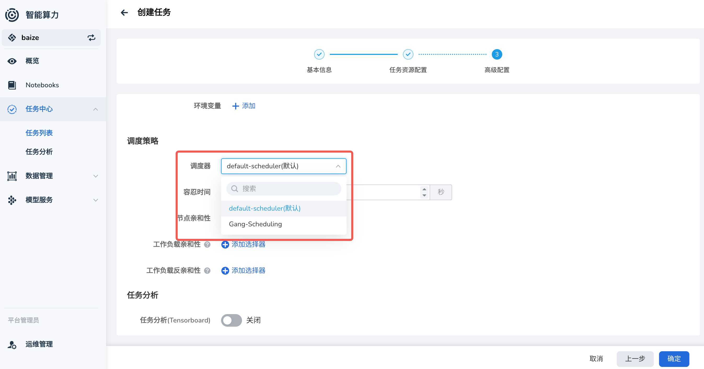

# 增加任务调度器

5.0 AI Lab 提供了任务调度器，可以帮助您更好地管理任务，除了提供基础的调度器之外，目前也支持用户自定义调度器。

## 任务调度器介绍

在 Kubernetes 中，任务调度器负责决定将 Pod 分配到哪个节点上运行。它考虑多种因素，如资源需求、硬件/软件约束、亲和性/反亲和性规则、数据局部性等。

默认调度器是 Kubernetes 集群中的一个核心组件，负责决定将 Pod 分配到哪个节点上运行。让我们深入了解它的工作原理、特性和配置方法。

### 调度器的工作流程

默认调度器的工作流程可以分为两个主要阶段：过滤（Filtering）和评分（Scoring）。

#### 过滤阶段

调度器会遍历所有节点，排除不满足 Pod 要求的节点，考虑的因素包括：

- 资源需求
- 节点选择器
- 节点亲和性
- 污点和容忍

以上参数，我们可以通过创建任务时的高级配置来设置，如下图所示：

#### 评分阶段

对通过过滤的节点进行打分，选择得分最高的节点来运行 Pod，考虑因素包括：

- 资源使用率
- Pod 亲和性/反亲和性
- 节点亲和性等。

## 调度器插件

除了基础的一些任务调度能力之外，我们还支持使用 `Scheduler Plugins：Kubernetes SIG Scheduling`
维护的一组调度器插件，包括 `Coscheduling (Gang Scheduling)` 等功能。

### 部署调度器插件

在工作集群中部署第二调度器插件，请参考[部署第二调度器插件](../../kpanda/clusters/cluster-scheduler-plugin.md)。

### 在 AI Lab 中启用调度器插件

!!! danger

    增加调度器插件若操作不当，可能会影响到整个集群的稳定性，建议在测试环境中进行测试；或者联系我们的技术支持团队。

注意，如果希望在训练任务中使用更多的调度器插件，需要事先手工在工作集群中成功安装，然后在集群中部署 `baize-agent` 时，增加对应的调度器插件配置。

通过容器管理提供的界面 **Helm 应用** 管理能力，可以方便地在集群中部署调度器插件，如下图所示：

然后，在右上角点击 **安装** ，（若已部署了 `baize-agent`，可以到 Helm 应用列表去更新），根据如下图所示的配置，增加调度器。

注意调度器的参数层级，添加完成后，点击 **确定** 即可。

> 注意以后在更新 `baize-agent` 时，不要遗漏这个配置。

## 在创建任务时指定调度器

当您在集群中成功部署了对应的调度器插件，并且在 `baize-agent` 也正确增加了对应的调度器配置后，可以在创建任务时，指定调度器。

一切正常的情况下，您可以在调度器下拉框中看到您部署的调度器插件。

以上，就是我们在 AI Lab 中，为任务增加调度器选项的配置使用说明。
