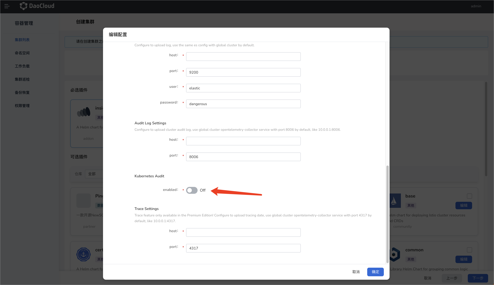
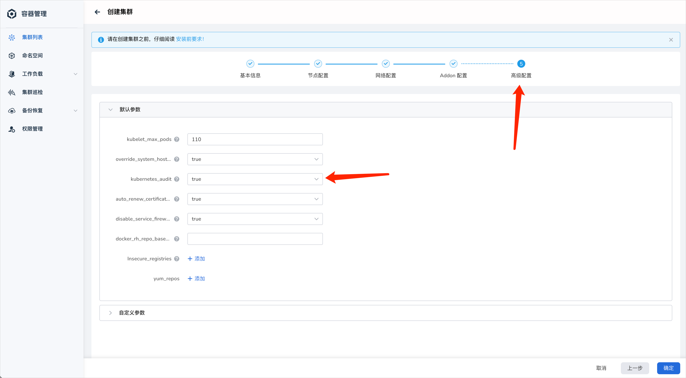
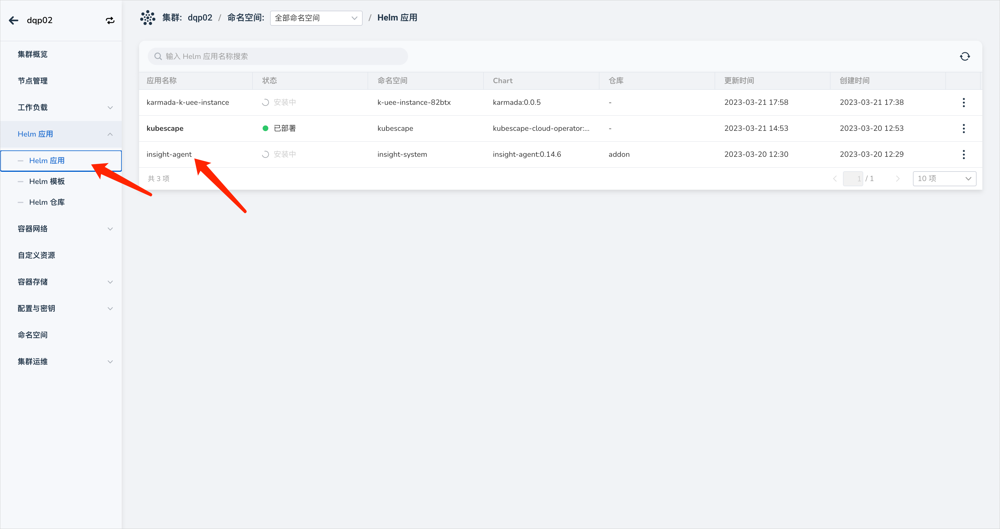
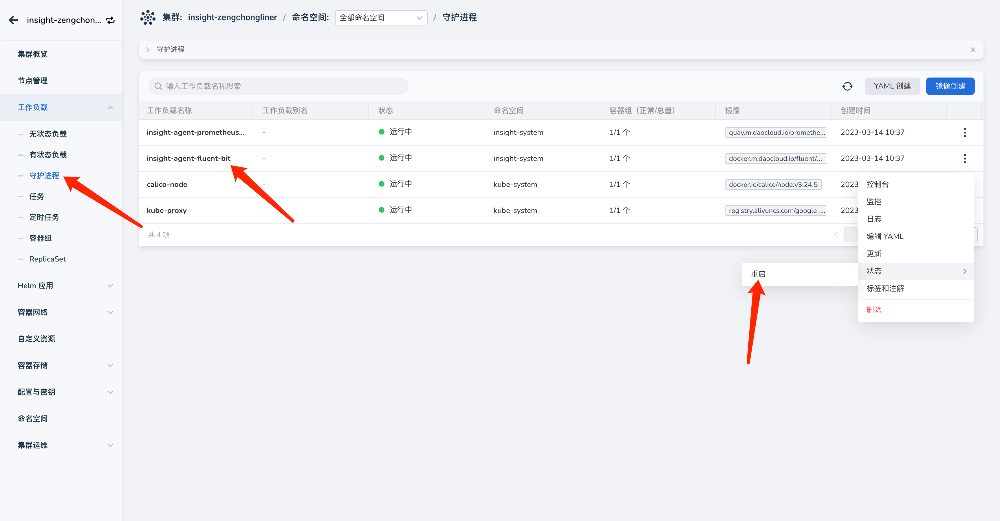

# 采集 K8s 审计日志

- 生成 K8s 审计日志：K8s 本身生成的审计日志，开启该功能后，会在指定目录下生成 K8s 审计日志的日志文件
- 采集 K8s 审计日志：通过 insight-agent 采集上述 ‘K8s 审计日志’的日志文件，’采集 K8s 审计日志‘ 的前提条件是：
    - 集群生成了 ‘K8s 审计日志‘
    - 日志输出开关已打开
    - 日志采集开关已打开

## 算丰 AI 算力平台安装完成时状态

- 管理集群的 K8s 审计日志开关默认开启
- 管理集群的采集 K8s 审计日志开关默认关闭
    - 默认设置不支持配置

## 管理集群采集 K8s 审计日志开关

### 确认是否开启了 K8s 审计日志

执行以下命令查看 __/var/log/kubernetes/audit__ 目录下是否有审计日志生成。
若有，则表示 K8s 审计日志成功开启。

```shell
ls /var/log/kubernetes/audit
```

若未开启，请参考[生成 K8s 审计日志](open-k8s-audit.md)。

### 开启采集 K8s 审计日志流程

1. 添加 chartmuseum 到 helm repo 中

    ```shell
    helm repo add chartmuseum http://10.5.14.30:8081
    ```

    这条命令中的 IP 需要修改为火种节点的 IP 地址。

    !!! note

        使用自建 Harbor 仓库的情况下，请修改第一步中的 chart repo 地址为自建仓库的 insight-agent chart 地址。

2. 保存当前 insight-agent helm value

    ```shell
    helm get values insight-agent -n insight-system -o yaml > insight-agent-values-bak.yaml
    ```

3. 获取当前版本号 ${insight_version_code}

    ```shell
    insight_version_code=`helm list -n insight-system |grep insight-agent | awk {'print $10'}`
    ```

4. 更新 helm value 配置

    ```shell
    helm upgrade --install --create-namespace --version ${insight_version_code} --cleanup-on-fail insight-agent chartmuseum/insight-agent -n insight-system -f insight-agent-values-bak.yaml --set global.exporters.auditLog.kubeAudit.enabled=true
    ```

5. 重启 insight-system 下的所有 fluentBit pod

    ```shell
    fluent_pod=`kubectl get pod -n insight-system | grep insight-agent-fluent-bit | awk {'print $1'} | xargs`
    kubectl delete pod ${fluent_pod} -n insight-system
    ```

### 关闭采集 K8s 审计日志

其余步骤和开启采集 K8s 审计日志一致，仅需修改上一节中第 4 步：更新 helm value 配置。

```shell
helm upgrade --install --create-namespace --version ${insight_version_code} --cleanup-on-fail insight-agent chartmuseum/insight-agent -n insight-system -f insight-agent-values-bak.yaml --set global.exporters.auditLog.kubeAudit.enabled=false
```

## 工作集群开关

各工作集群开关独立，按需开启。

### 创建集群时打开采集审计日志步骤

采集 K8s 审计日志功能默认为关闭状态。若需要开启，可以按照如下步骤：




将该按钮设置为启用状态，开启采集 K8s 审计日志功能。

通过算丰 AI 算力平台创建工作集群时，确认该集群的 K8s 审计日志选择 ‘true'，这样创建出来的工作集群 K8s 审计日志是开启的。



等待集群创建成功后，该工作集群的 K8s 审计日志将被采集。

### 接入的集群和创建完成后开关步骤

#### 确认开启 K8s 审计日志

执行以下命令查看 __/var/log/kubernetes/audit__ 目录下是否有审计日志生成，若有，则表示 K8s 审计日志成功开启。

```shell
ls /var/log/kubernetes/audit
```

若未开启，请参考[文档的开启关闭 K8s 审计日志](open-k8s-audit.md)

#### 开启采集 K8s 审计日志

采集 K8s 审计日志功能默认为关闭状态，若需要开启，可以按照如下步骤：

1. 选中已接入并且需要开启采集 K8s 审计日志功能的集群

    

2. 进入 helm 应用管理页面，更新 insight-agent 配置
   （若未安装 insight-agent，可以[安装 insight-agent](../../insight/quickstart/install/install-agent.md)）

    

3. 开启/关闭采集 K8s 审计日志按钮

    

4. 接入集群的情况下开关后仍需要重启 fluent-bit pod 才能生效

    
