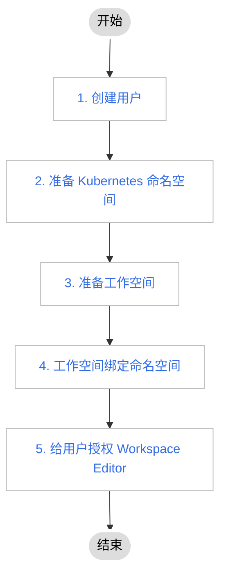

---
hide:
  - toc
---

# 普通用户授权规划

普通用户是指能够使用 AI 算力中心大部分产品模块及功能（管理功能除外），对权限范围内的资源有一定的操作权限，能够独立使用资源部署应用。

对这类用户的授权及资源规划流程如下图所示。

```mermaid
graph TB

    start([开始]) --> user[1. 创建用户]
    user --> ns[2. 准备 Kubernetes 命名空间]
    ns --> ws[3. 准备工作空间]
    ws --> ws-to-ns[4. 工作空间绑定命名空间]
    ws-to-ns --> authu[5. 给用户授权 Workspace Editor]
    authu --> complete([结束])

 classDef plain fill:#ddd,stroke:#fff,stroke-width:4px,color:#000;
 classDef k8s fill:#326ce5,stroke:#fff,stroke-width:4px,color:#fff;
 classDef cluster fill:#fff,stroke:#bbb,stroke-width:1px,color:#326ce5;
 class user,ns,ws,ws-to-ns,authu cluster;
 class start,complete plain;
```
