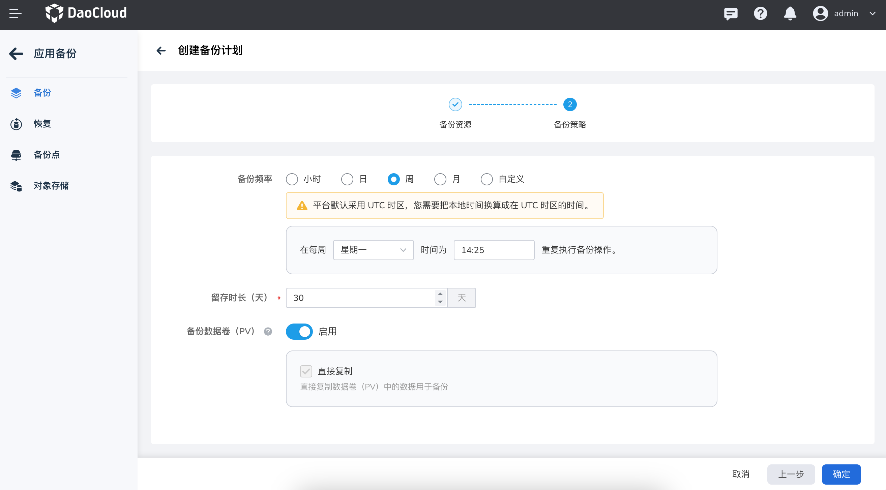

# 应用备份

本文介绍如何在算丰 AI 算力平台中为应用做备份，本教程中使用的演示应用名为 __dao-2048__ ，属于无状态工作负载。

## 前提条件

在对无状态工作负载进行备份前，需要满足以下前提条件：

- 在容器管理模块中[接入 Kubernetes 集群](../clusters/integrate-cluster.md)或者[创建 Kubernetes 集群](../clusters/create-cluster.md)，且能够访问集群的 UI 界面。

- 创建一个[命名空间](../namespaces/createns.md)和[用户](../../ghippo/access-control/user.md)。

- 当前操作用户应具有 [NS Editor](../permissions/permission-brief.md#ns-editor) 或更高权限，详情可参考[命名空间授权](../namespaces/createns.md)。

- [安装 velero 组件](install-velero.md)，且 velero 组件运行正常。

- [创建一个无状态工作负载](../workloads/create-deployment.md)（本教程中的负载名为 __dao-2048__ ），并为无状态工作负载打上 __app: dao-2048__ 的标签。

## 备份工作负载

参考以下步骤，备份无状态工作负载 __dao-2048__ 。

1. 在左侧导航栏， 点击 __容器管理__ -> __备份恢复__ 。

    

2. 进入 __应用备份__ 列表页面，从集群下拉列表中选择已安装了 velero 和 __dao-2048__ 的集群。
   点击右侧的 __创建备份计划__ 按钮。

    

3. 参考下方说明填写备份配置。

    

4. 参考下方说明设置备份执行频率，然后点击 __下一步__ 。

    - 备份频率：基于分钟、小时、天、周、月设置任务执行的时间周期。支持用数字和 `*` 自定义 Cron 表达式，**输入表达式后下方会提示当前表达式的含义**。有关详细的表达式语法规则，可参考 [Cron 时间表语法](https://kubernetes.io/zh-cn/docs/concepts/workloads/controllers/cron-jobs/#cron-schedule-syntax)。
    - 留存时长（天）：设置备份资源保存的时间，默认为 30 天，过期后将会被删除。
    - 备份数据卷（PV）：是否备份数据卷（PV）中的数据，支持直接复制和使用 CSI 快照两种方式。
        - 直接复制：直接复制数据卷（PV）中的数据用于备份；
        - 使用 CSI 快照：使用 CSI 快照来备份数据卷（PV）。需要集群中有可用于备份的 CSI 快照类型。

    

5. 点击 __确定__ ，页面会自动返回应用备份计划列表。您可以找到新建的 __dao-2048__ 备份计划，在右侧点击 __┇__ ，选择 __立即执行__ 开始备份。

    

6. 此时集群的 __上一次执行状态__ 将转变为 __备份中__ 。等待备份完成后可以点击备份计划的名称，查看备份计划详情。

    

!!! note

    如果 Job 类型的工作负载状态为 **执行完成** ，则不支持备份。
