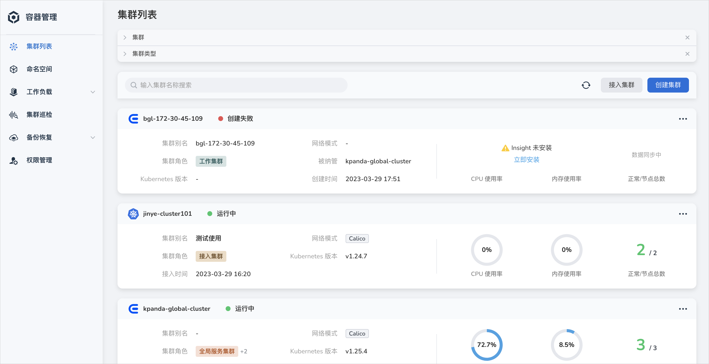
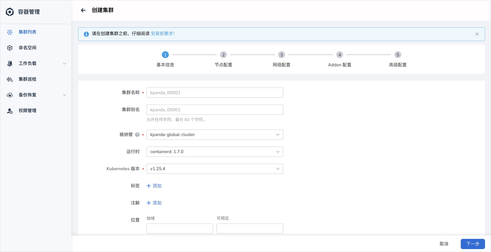
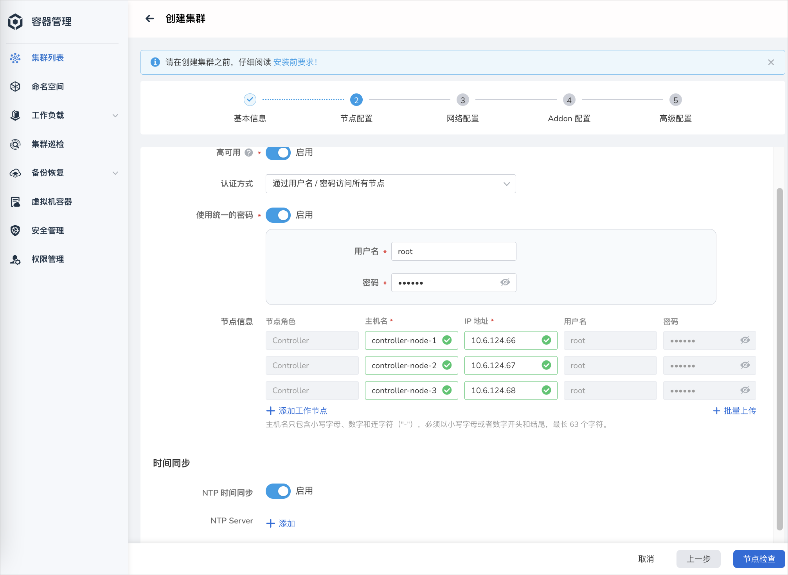
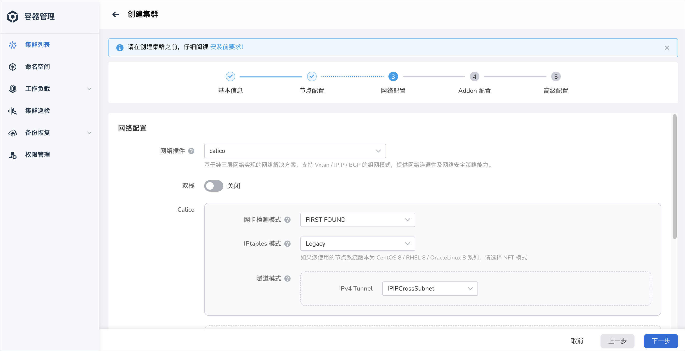
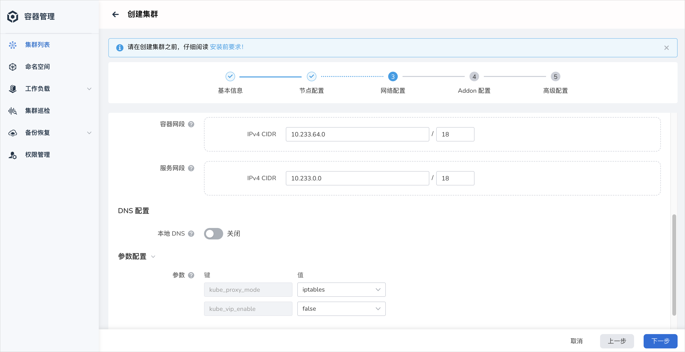
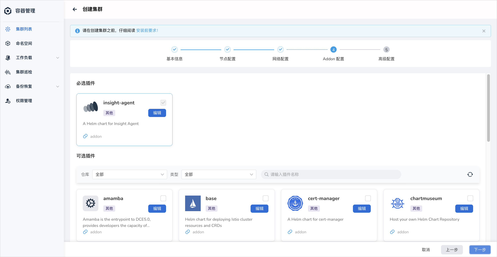
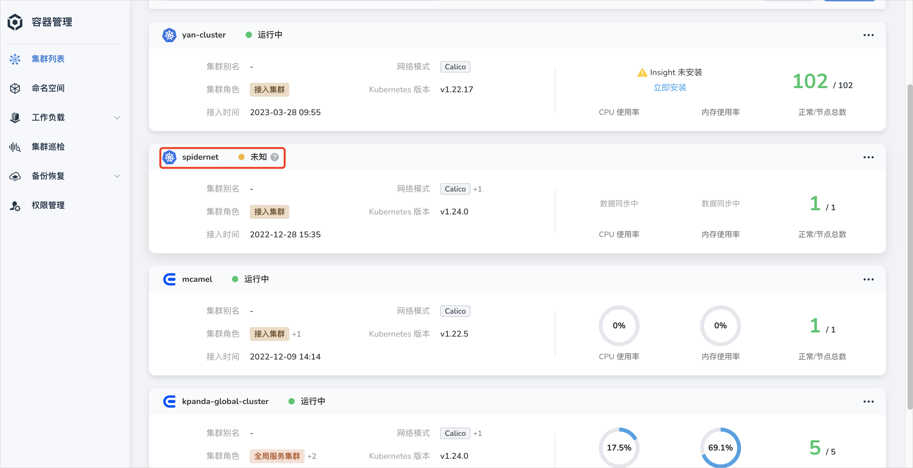

# 创建工作集群

在算丰 AI 算力平台容器管理模块中，[集群角色](cluster-role.md)分四类：全局服务集群、管理集群、工作集群、接入集群。
其中，接入集群只能从第三方厂商接入，参见[接入集群](./integrate-cluster.md)。

本页介绍如何创建工作集群，默认情况下，新建工作集群的工作节点 OS 类型和 CPU 架构需要与全局服务集群保持一致。
如需使用区别于全局服务集群 OS 或架构的节点创建集群，参阅[在 centos 管理平台上创建 ubuntu 工作集群](../best-practice/create-ubuntu-on-centos-platform.md)进行创建。

推荐使用 算丰 AI 算力平台支持的操作系统。
如您本地节点不在上述支持范围，可参考[在非主流操作系统上创建集群](../best-practice/use-otherlinux-create-custer.md)进行创建。

## 前提条件

创建集群之前需要满足一定的前提条件：

- 根据业务需求准备一定数量的节点，且节点 OS 类型和 CPU 架构一致。
- 推荐 Kubernetes 版本 1.29.5，具体版本范围，参阅 [算丰 AI 算力平台集群版本支持体系](./cluster-version.md)，
  目前算丰 AI 算力平台支持自建工作集群版本范围在 `v1.28.0-v1.30.2`。如需创建低版本的集群，请参考[集群版本支持范围](./cluster-version.md)、[部署与升级 Kubean 向下兼容版本](../best-practice/kubean-low-version.md)。
- 目标主机需要允许 IPv4 转发。如果 Pod 和 Service 使用的是 IPv6，则目标服务器需要允许 IPv6 转发。
- 算丰 AI 算力平台暂不提供对防火墙的管理功能，您需要预先自行定义目标主机防火墙规则。为了避免创建集群的过程中出现问题，建议禁用目标主机的防火墙。
- 参阅[节点可用性检查](../nodes/node-check.md)。

## 操作步骤

1. 在 __集群列表__ 页面中，点击 __创建集群__ 按钮。

    

2. 参考下列要求填写集群基本信息，并点击 __下一步__ 。

    - 集群名称：名称只包含小写字母、数字和连字符（"-"），必须以小写字母或者数字开头和结尾，最长 63 个字符。
    - 被纳管：选择由哪个集群来管理此集群，例如在集群生命周期中创建、升级、节点扩缩容、删除集群等。
    - 运行时：选择集群的运行时环境，目前支持 containerd 和 docker，[如何选择容器运行时](runtime.md)。
    - Kubernetes 版本：支持 3 个版本跨度，具体取决于被纳管集群所支持的版本。

    

3. 填写节点配置信息，并点击 __下一步__ 。

    - 高可用：开启后需要提供至少 3 个控制器节点。关闭后，只提供 1 个控制器节点即可。

        > 生产环境中建议使用高可用模式。

    - 认证方式：选择通过用户名/密码还是公私钥访问节点。

        > 如果使用公私钥方式访问节点，需要预先配置节点的 SSH 密钥。参阅[使用 SSH 密钥认证节点](../nodes/node-authentication.md)。

    - 使用统一的密码：开启后集群中所有节点的访问密码都相同，需要在下方输入访问所有节点的统一密码。如果关闭，则可以为每个节点设置单独的用户名和密码。

    - 节点信息：填写节点名称和 IP 地址。
    - 自定义参数：设置变量控制 Ansible 与远程主机交互。可设置变量参考[连接到主机：行为清单参数](https://docs.ansible.com/ansible/latest/inventory_guide/intro_inventory.html#connecting-to-hosts-behavioral-inventory-parameters)
    - NTP 时间同步：开启后会自动同步各个节点上的时间，需要提供 NTP 服务器地址。

    

4. 在页面底部点击节点检查。如果检查通过则继续下一步操作。如果检查未通过，则更新 __节点信息__ 并再次执行检查。

5. 填写网络配置信息，并点击 __下一步__ 。

    - 网络插件：负责为集群内的 Pod 提供网络服务，**创建集群后不可更改网络插件**。支持 cilium 和 calico。选择 __none__ 表示暂不安装网络插件。

    - 容器网段：集群下容器使用的网段，决定集群下容器的数量上限。创建后不可修改。
    - 服务网段：同一集群下容器互相访问时使用的 Service 资源的网段，决定 Service 资源的上限。创建后不可修改。

    
        
    

6. 填写插件配置信息，并点击 __下一步__ 。

    

7. 填写高级配置信息，并点击 __确定__ 。

    - __kubelet_max_pods__ ：设置每个节点的最大 Pod 数量，默认为 110 个。
    - __hostname_overide__ ：重置主机名，建议使用默认值，采用系统默认生成的名称作为主机名称。
    - __kubernetes_audit__ ：Kubernetes 的审计日志，默认开启。
    - __auto_renew_certificate__ ：在每月第一个星期一自动更新 Kubernetes 控制平面证书，默认开启。
    - __disable_firewalld&ufw__ ：禁用防火墙，避免节点在安装过程中无法被访问。
    - __Insecure_registries__ ：私有镜像仓库配置。使用私有镜像仓库创建集群时，为了避免证书问题导致容器引擎拒绝访问，需要在这里填写私有镜像仓库地址，以绕过容器引擎的证书认证而获取镜像。
    - __yum_repos__ ：填写 Yum 源仓库地址。离线环境下，默认给出的地址选项仅供参考，请根据实际情况填写。

    

!!! success

    - 填写正确信息并完成上述步骤后，页面会提示集群正在创建中。
    - 创建集群耗时较长，需要耐心等待。其间，可以点击 __返回集群列表__ 按钮让安装过程后台运行。
    - 如需查看当前状态，可点击 __实时日志__ 。

    

!!! note

    - 当集群出现未知状态时，表示当前集群已失联。
    - 系统展示数据为失联前缓存数据，不代表真实数据。
    - 同时失联状态下执行的任何操作都将不生效，请检查集群网络连通性或主机状态。

    
