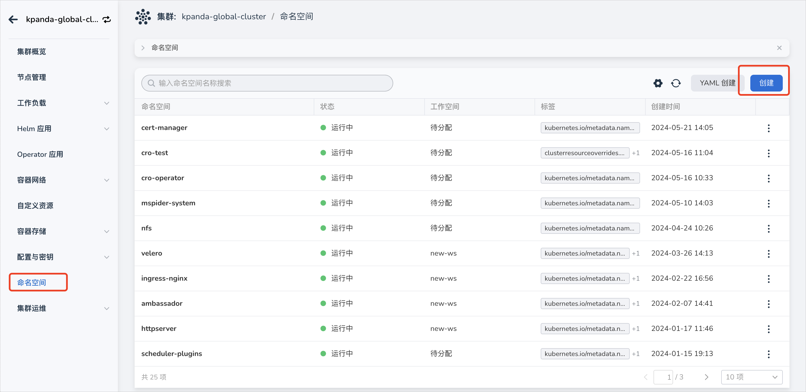
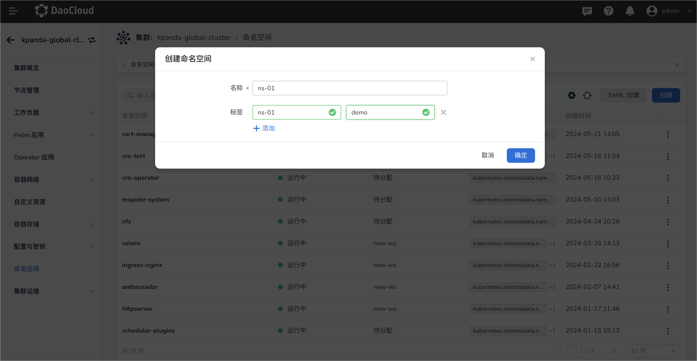
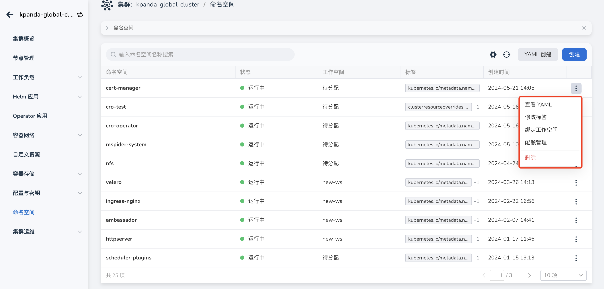
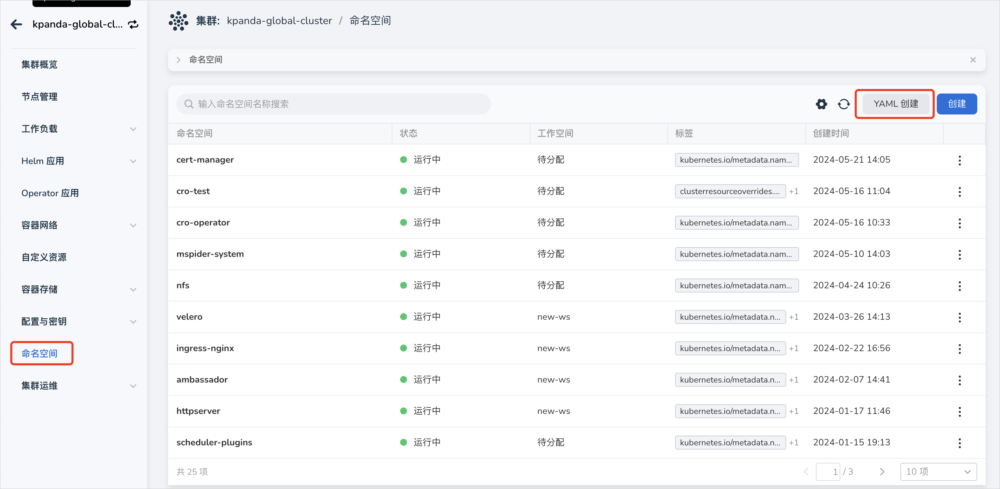
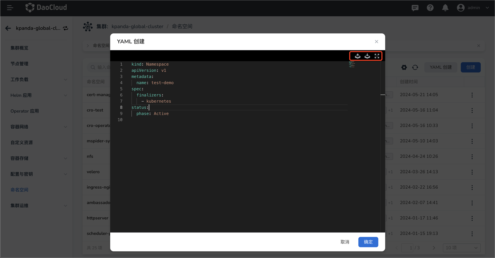

# 命名空间

命名空间是 Kubernetes 中用来进行资源隔离的一种抽象。一个集群下可以包含多个不重名的命名空间，每个命名空间中的资源相互隔离。有关命名空间的详细介绍，可参考[命名空间](https://kubernetes.io/zh-cn/docs/concepts/overview/working-with-objects/namespaces/)。

本文将介绍命名空间的相关操作。

## 创建命名空间

支持通过表单轻松创建命名空间，也支持通过编写或导入 YAML 文件快速创建命名空间。

!!! note

    - 在创建命名空间之前，需要在容器管理模块[接入 Kubernetes 集群](../clusters/integrate-cluster.md)或者[创建 Kubernetes 集群](../clusters/create-cluster.md)。
    - 集群初始化后通常会自动生成默认的命名空间 __default__ 。但对于生产集群而言，为便于管理，建议创建其他的命名空间，而非直接使用 __default__ 命名空间。

### 表单创建

1. 在 __集群列表__ 页面点击目标集群的名称。

    

2. 在左侧导航栏点击 __命名空间__ ，然后点击页面右侧的 __创建__ 按钮。

    

3. 填写命名空间的名称，配置工作空间和标签（可选设置），然后点击 __确定__ 。

    !!! info

        - 命名空间绑定工作空间之后，该命名空间的资源就会共享给所绑定的工作空间。有关工作空间的详细说明，可参考[工作空间与层级](../../ghippo/workspace/workspace.md)。

        - 命名空间创建完成后，仍然可以绑定/解绑工作空间。

    

4. 点击 __确定__ ，完成命名空间的创建。在命名空间列表右侧，点击 __┇__ ，可以从弹出菜单中选择查看 YAML、修改标签、绑定/解绑工作空间、配额管理、删除等更多操作。

    

### YAML 创建

1. 在 __集群列表__ 页面点击目标集群的名称。

    

2. 在左侧导航栏点击 __命名空间__ ，然后点击页面右侧的 __YAML 创建__ 按钮。

    

3. 输入或粘贴事先准备好的 YAML 内容，或者从本地直接导入已有的 YAML 文件。

    > 输入 YAML 内容后，点击 __下载__ 可以将该 YAML 文件保存到本地。

    

4. 最后在弹框右下角点击 __确定__ 即可。