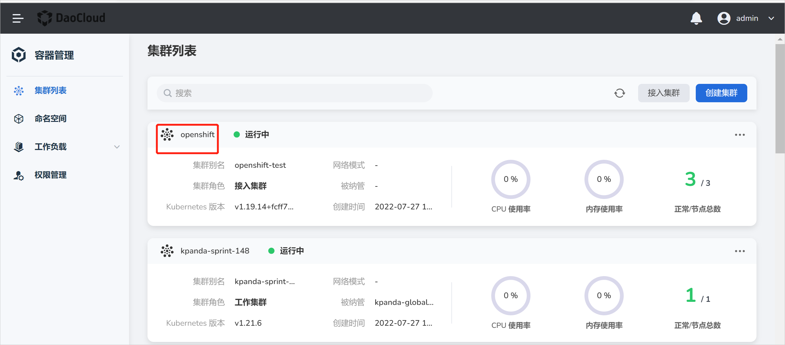

---
hide:
  - toc
---

# 节点污点管理

污点 (Taint) 能够使节点排斥某一类 Pod，避免 Pod 被调度到该节点上。
每个节点上可以应用一个或多个污点，不能容忍这些污点的 Pod 则不会被调度该节点上。

## 注意事项

1. 当前操作用户应具备 [NS Editor](../permissions/permission-brief.md#ns-editor) 角色授权或其他更高权限。
2. 为节点添加污点之后，只有能容忍该污点的 Pod 才能被调度到该节点。<!--有关如何为 Pod 设置容忍度，可参考-->

## 操作步骤

1. 在 __集群列表__ 页找到目标集群，点击集群名称，进入 __集群概览__ 页面。

    

2. 在左侧导航栏，点击 __节点管理__ ，找到需要修改污点的节点，点击右侧的 __┇__ 操作图标并点击 __修改污点__ 按钮。

    

3. 在弹框内输入污点的键值信息，选择污点效果，点击 __确定__ 。

    点击 __➕ 添加__ 可以为节点添加多个污点，点击污点效果右侧的 __X__ 可以删除污点。

    目前支持三种污点效果：

    - `NoSchedule`：新的 Pod 不会被调度到带有此污点的节点上，除非新的 Pod 具有相匹配的容忍度。当前正在节点上运行的 Pod **不会** 被驱逐。
    - `NoExecute`：这会影响已在节点上运行的 Pod：
        - 如果 Pod 不能容忍此污点，会马上被驱逐。
        - 如果 Pod 能够容忍此污点，但是在容忍度定义中没有指定 `tolerationSeconds`，则 Pod 还会一直在这个节点上运行。
        - 如果 Pod 能够容忍此污点而且指定了 `tolerationSeconds`，则 Pod 还能在这个节点上继续运行指定的时长。这段时间过去后，再从节点上驱除这些 Pod。
    - `PreferNoSchedule`：这是“软性”的 `NoSchedule`。控制平面将**尝试**避免将不容忍此污点的 Pod 调度到节点上，但不能保证完全避免。所以要尽量避免使用此污点。

    

有关污点的更多详情，请参阅 Kubernetes 官方文档：[污点和容忍度](https://kubernetes.io/zh-cn/docs/concepts/scheduling-eviction/taint-and-toleration/)。
