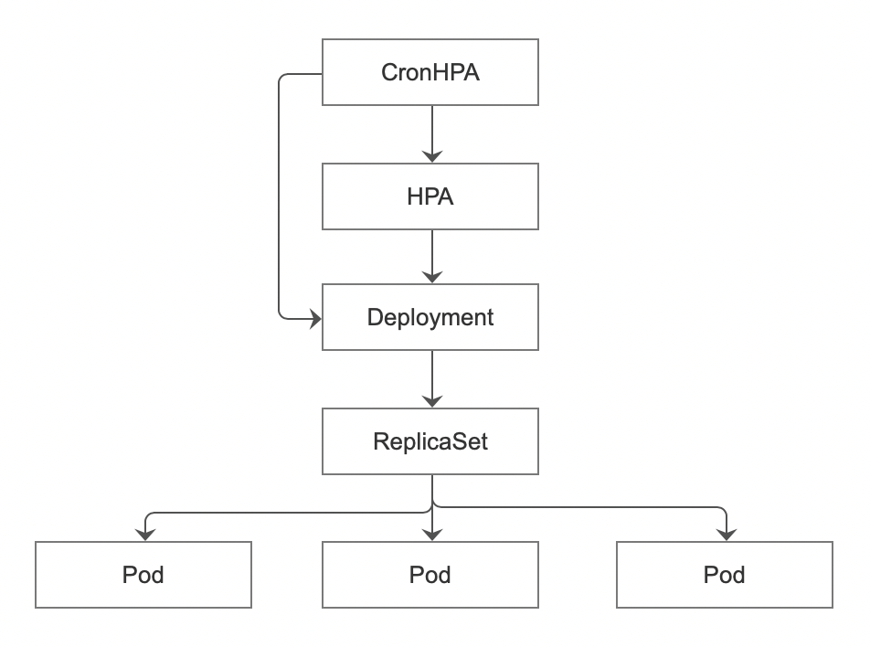

# HPA 和 CronHPA 兼容规则

HPA 全称为 HorizontalPodAutoscaler，即 Pod 水平自动伸缩。

CronHPA 全称为 Cron HorizontalPodAutoscaler，即 Pod 定时的水平自动伸缩。

## CronHPA 和 HPA 兼容冲突

定时伸缩 CronHPA 通过设置定时的方式触发容器的水平副本伸缩。为了防止突发的流量冲击等状况，
您可能已经配置 HPA 保障应用的正常运行。如果同时检测到了 HPA 和 CronHPA 的存在，
由于 CronHPA 和 HPA 相互独立无法感知，就会出现两个控制器各自工作，后执行的操作会覆盖先执行的操作。

对比 CronHPA 和 HPA 的定义模板，可以观察到以下几点：

- CronHPA 和 HPA 都是通过 scaleTargetRef 字段来获取伸缩对象。
- CronHPA 通过 jobs 的 crontab 规则定时伸缩副本数。
- HPA 通过资源利用率判断伸缩情况。

!!! note

    如果同时设置 CronHPA 和 HPA，会出现 CronHPA 和 HPA 同时操作一个 scaleTargetRef 的场景。

## CronHPA 和 HPA 兼容方案

从上文可知，CronHPA 和 HPA 同时使用会导致后执行的操作覆盖先执行操作的本质原因是两个控制器无法相互感知，
那么只需要让 CronHPA 感知 HPA 的当前状态就能解决冲突问题。

系统会将 HPA 作为定时伸缩 CronHPA 的扩缩容对象，从而实现对该 HPA 定义的 Deployment 对象的定时扩缩容。

HPA 的定义将 Deployment 配置在 scaleTargetRef 字段下，然后 Deployment 通过自身定义查找 ReplicaSet，最后通过 ReplicaSet 调整真实的副本数目。

算丰 AI 算力平台将 CronHPA 中的 scaleTargetRef 设置为 HPA 对象，然后通过 HPA 对象来寻找真实的 scaleTargetRef，从而让 CronHPA 感知 HPA 的当前状态。

CronHPA 会通过调整 HPA 的方式感知 HPA。CronHPA 通过识别要达到的副本数与当前副本数两者间的较大值，
判断是否需要扩缩容及修改 HPA 的上限；CronHPA 通过识别 CronHPA 要达到的副本数与 HPA 的配置间的较小值，判断是否需要修改 HPA 的下限。
