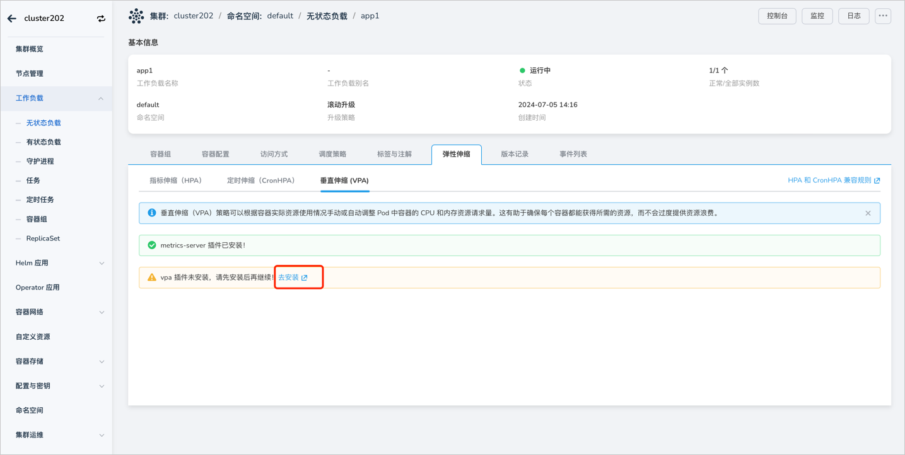
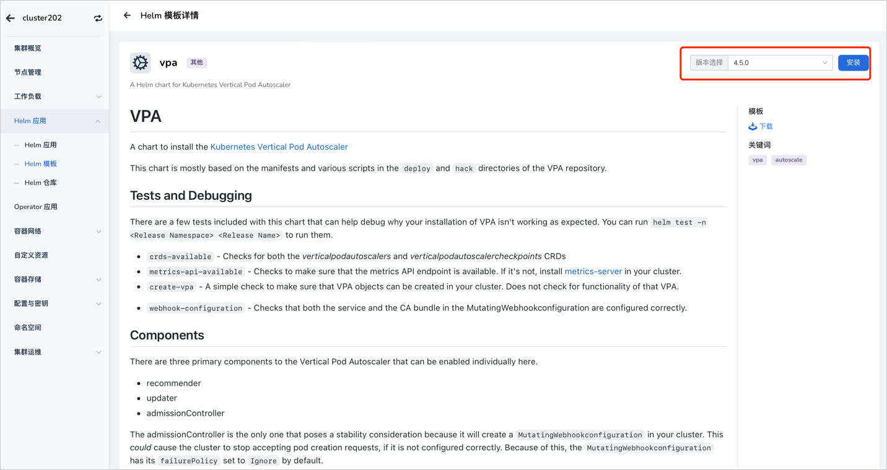
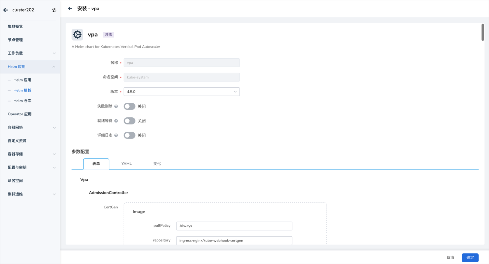
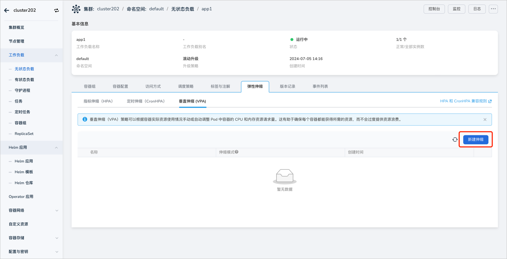

# 安装 vpa 插件

容器垂直扩缩容策略（Vertical Pod Autoscaler, VPA）能够让集群的资源配置更加合理，避免集群资源浪费。 __vpa__ 则是实现容器垂直扩缩容的关键组件。

本节介绍如何安装 __vpa__ 插件。

    为了使用 VPA 策略，不仅需要安装 __vpa__ 插件，还要[安装 __metrics-server__ 插件](install-metrics-server.md)。

## 前提条件

安装 __vpa__ 插件之前，需要满足以下前提条件：

- 在容器管理模块中[接入 Kubernetes 集群](../clusters/integrate-cluster.md)或者[创建 Kubernetes 集群](../clusters/create-cluster.md)，且能够访问集群的 UI 界面。

- 创建一个[命名空间](../namespaces/createns.md)。

- 当前操作用户应具有 [NS Editor](../permissions/permission-brief.md#ns-editor) 或更高权限，详情可参考[命名空间授权](../namespaces/createns.md)。

## 操作步骤

参考如下步骤为集群安装 __vpa__ 插件。

1. 在 __集群列表__ 页面找到需要安装此插件的目标集群，点击该集群的名称，然后在左侧点击 __工作负载__ -> __无状态工作负载__ ，点击目标工作负载的名称。

2. 在工作负载详情页面，点击 __弹性伸缩__ 页签，在 __VPA__ 右侧点击 __安装__ 。

    
3. 阅读该插件的相关介绍，选择版本后点击 __安装__ 按钮。推荐安装 __1.5.0__ 或更高版本。

    
4. 查看以下说明配置参数。

    
    - 名称：输入插件名称，请注意名称最长 63 个字符，只能包含小写字母、数字及分隔符（“-”），且必须以小写字母或数字开头及结尾，例如 kubernetes-cronhpa-controller。
    - 命名空间：选择将插件安装在哪个命名空间，此处以 __default__ 为例。
    - 版本：插件的版本，此处以 __4.5.0__ 版本为例。
    - 就绪等待：启用后，将等待应用下的所有关联资源都处于就绪状态，才会标记应用安装成功。
    - 失败删除：如果插件安装失败，则删除已经安装的关联资源。开启后，将默认同步开启 __就绪等待__ 。
    - 详情日志：开启后，将记录安装过程的详细日志。

    !!! note

        开启 __就绪等待__ 和/或 __失败删除__ 后，应用需要经过较长时间才会被标记为“运行中”状态。

5. 在页面右下角点击 __确定__ ，系统将自动跳转至 __Helm 应用__ 列表页面。稍等几分钟后刷新页面作，即可看到刚刚安装的应用。

    !!! warning

        如需删除 __vpa__ 插件，应在 __Helm 应用__ 列表页面才能将其彻底删除。

        如果在工作负载的 __弹性伸缩__ 页签下删除插件，这只是删除了该插件的工作负载副本，插件本身仍未删除，后续重新安装该插件时也会提示错误。

6. 回到工作负载详情页面下的 __弹性伸缩__ 页签，可以看到界面显示 __插件已安装__ 。现在可以开始[创建 VPA](create-vpa.md) 策略了。

    
