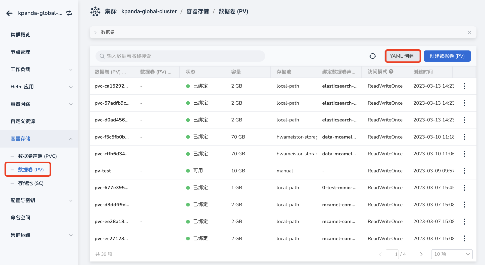
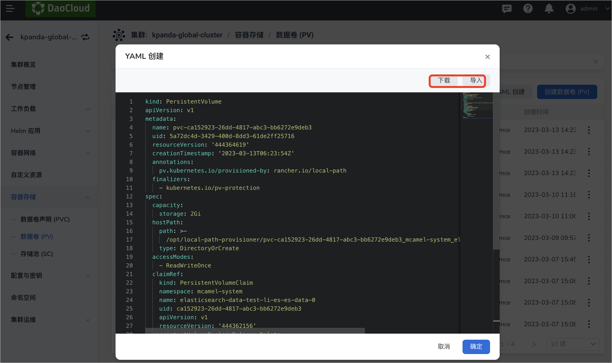
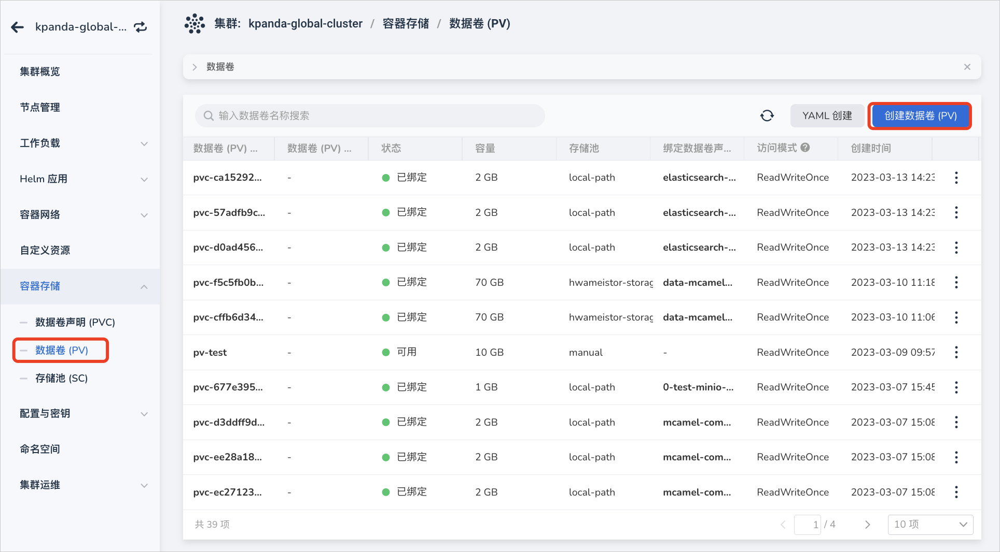
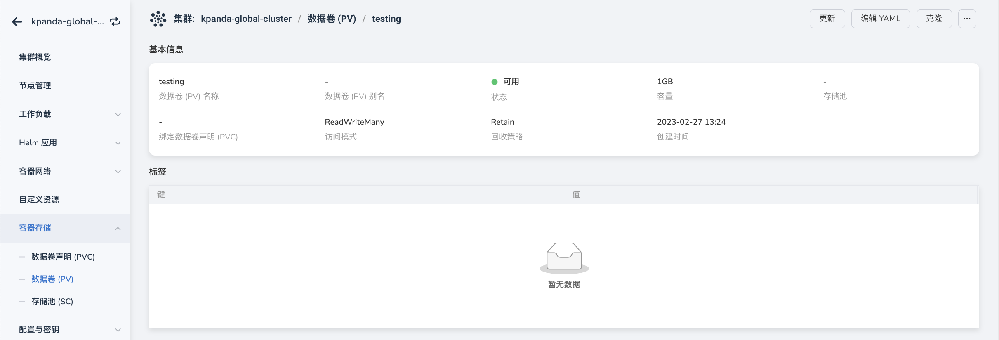
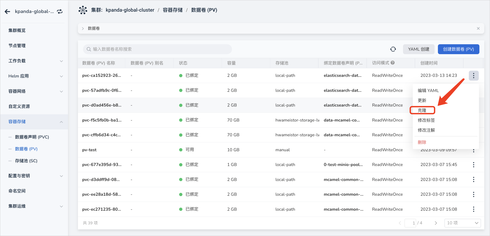
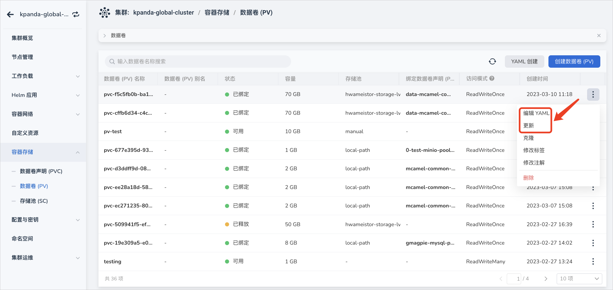
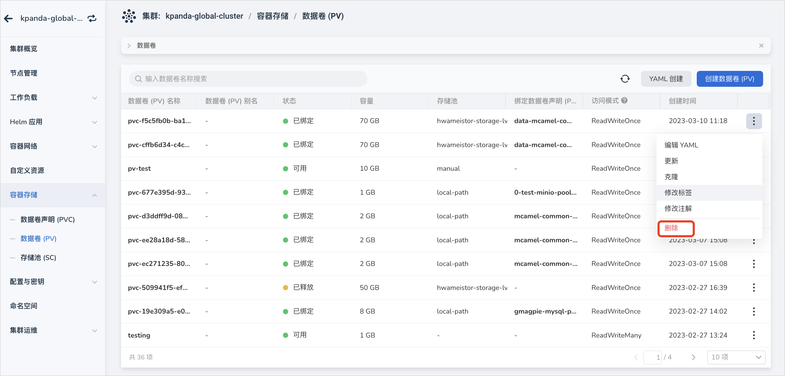

# 数据卷(PV)

数据卷（PersistentVolume，PV）是集群中的一块存储，可由管理员事先制备，或使用存储类（Storage Class）来动态制备。PV 是集群资源，但拥有独立的生命周期，不会随着 Pod 进程结束而被删除。将 PV 挂载到工作负载可以实现工作负载的数据持久化。PV 中保存了可被 Pod 中容器访问的数据目录。

## 创建数据卷

目前支持通过 YAML 和表单两种方式创建数据卷，这两种方式各有优劣，可以满足不同用户的使用需求。

- 通过 YAML 创建步骤更少、更高效，但门槛要求较高，需要熟悉数据卷的 YAML 文件配置。

- 通过表单创建更直观更简单，根据提示填写对应的值即可，但步骤更加繁琐。

### YAML 创建

1. 在集群列表中点击目标集群的名称，然后在左侧导航栏点击 __容器存储__ -> __数据卷(PV)__ -> __YAML 创建__ 。

    

2. 在弹框中输入或粘贴事先准备好的 YAML 文件，然后在弹框底部点击 __确定__ 。

    > 支持从本地导入 YAML 文件或将填写好的文件下载保存到本地。

    

### 表单创建

1. 在集群列表中点击目标集群的名称，然后在左侧导航栏点击 __容器存储__ -> __数据卷(PV)__ -> __创建数据卷(PV)__ 。

    

2. 填写基本信息。

    - 数据卷名称、数据卷类型、挂载路径、卷模式、节点亲和性在创建之后不可更改。
    - 数据卷类型：有关卷类型的详细介绍，可参考 Kubernetes 官方文档[卷](https://kubernetes.io/zh-cn/docs/concepts/storage/volumes/)。

      - Local：将 Node 节点的本地存储包装成 PVC 接口，容器直接使用 PVC 而无需关注底层的存储类型。Local 卷不支持动态配置数据卷，但支持配置节点亲和性，可以限制能从哪些节点上访问该数据卷。
      - HostPath：使用 Node 节点的文件系统上的文件或目录作为数据卷，不支持基于节点亲和性的 Pod 调度。

    - 挂载路径：将数据卷挂载到容器中的某个具体目录下。
    - 访问模式：

        - ReadWriteOnce：数据卷可以被一个节点以读写方式挂载。
        - ReadWriteMany：数据卷可以被多个节点以读写方式挂载。
        - ReadOnlyMany：数据卷可以被多个节点以只读方式挂载。
        - ReadWriteOncePod：数据卷可以被单个 Pod 以读写方式挂载。

    - 回收策略：

        - Retain：不删除 PV，仅将其状态变为 __released__ ，需要用户手动回收。有关如何手动回收，可参考[持久卷](https://kubernetes.io/zh-cn/docs/concepts/storage/persistent-volumes/#retain)。
        - Recycle：保留 PV 但清空其中的数据，执行基本的擦除操作（ __rm -rf /thevolume/*__ ）。
        - Delete：删除 PV 时及其中的数据。

    - 卷模式：

        - 文件系统：数据卷将被 Pod 挂载到某个目录。如果数据卷的存储来自某块设备而该设备目前为空，第一次挂载卷之前会在设备上创建文件系统。
        - 块：将数据卷作为原始块设备来使用。这类卷以块设备的方式交给 Pod 使用，其上没有任何文件系统，可以让 Pod 更快地访问数据卷。

    - 节点亲和性：

        

## 查看数据卷

在集群列表中点击目标集群的名称，然后在左侧导航栏点击 __容器存储__ -> __数据卷(PV)__ 。

- 该页面可以查看当前集群中的所有数据卷，以及各个数据卷的状态、容量、命名空间等信息。

- 支持按照数据卷的名称、状态、命名空间、创建时间进行顺序或逆序排序。

    

- 点击数据卷的名称，可以查看该数据卷的基本配置、存储池信息、标签、注解等信息。

    

## 克隆数据卷

通过克隆数据卷，可以基于被克隆数据卷的配置，重新创建一个新的数据卷。

1. 进入克隆页面

    - 在数据卷列表页面，找到需要克隆的数据卷，在右侧的操作栏下选择 __克隆__ 。

        > 也可以点击数据卷的名称，在详情页面的右上角点击操作按钮选择 __克隆__ 。

        

2. 直接使用原配置，或者按需进行修改，然后在页面底部点击 __确定__ 。

## 更新数据卷

有两种途径可以更新数据卷。支持通过表单或 YAML 文件更新数据卷。

!!! note

    仅支持更新数据卷的别名、容量、访问模式、回收策略、标签和注解。

- 在数据卷列表页面，找到需要更新的数据卷，在右侧的操作栏下选择 __更新__ 即可通过表单更新，选择 __编辑 YAML__ 即可通过 YAML 更新。

    

- 点击数据卷的名称，进入数据卷的详情页面后，在页面右上角选择 __更新__ 即可通过表单更新，选择 __编辑 YAML__ 即可通过 YAML 更新。

    

## 删除数据卷

在数据卷列表页面，找到需要删除的数据，在右侧的操作栏下选择 __删除__ 。

> 也可以点击数据卷的名称，在详情页面的右上角点击操作按钮选择 __删除__ 。

