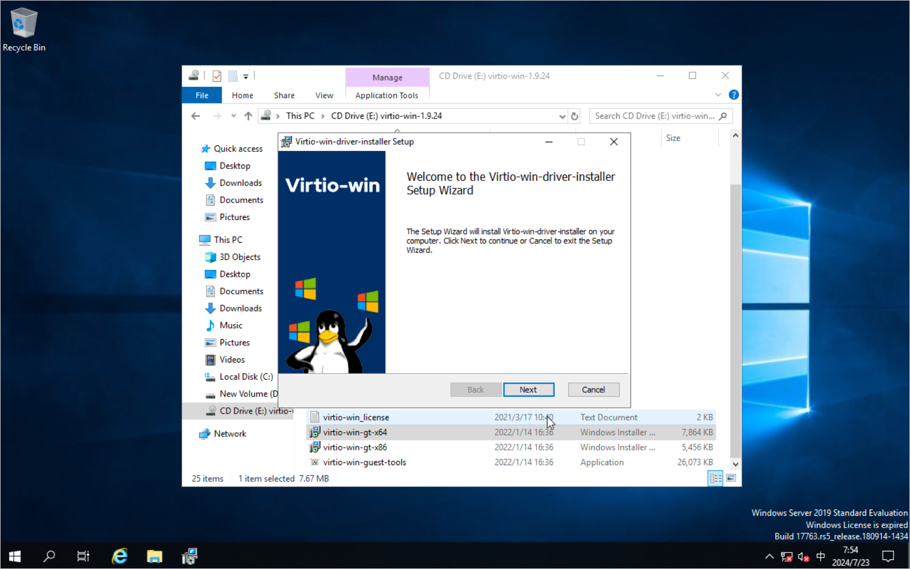
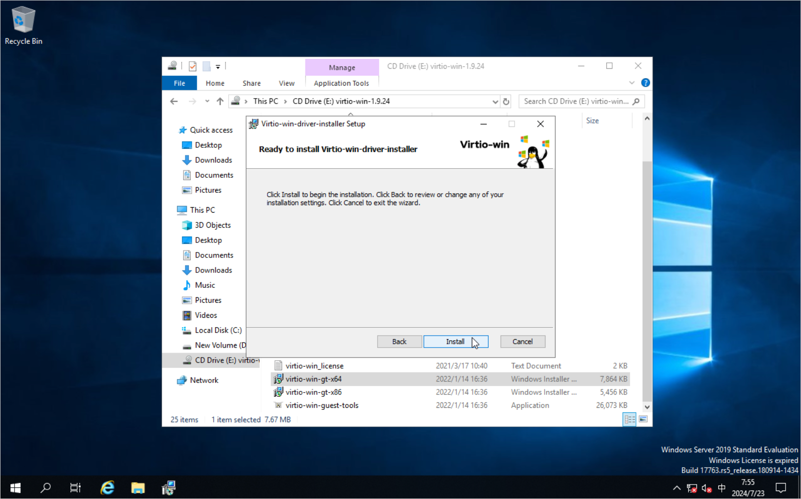
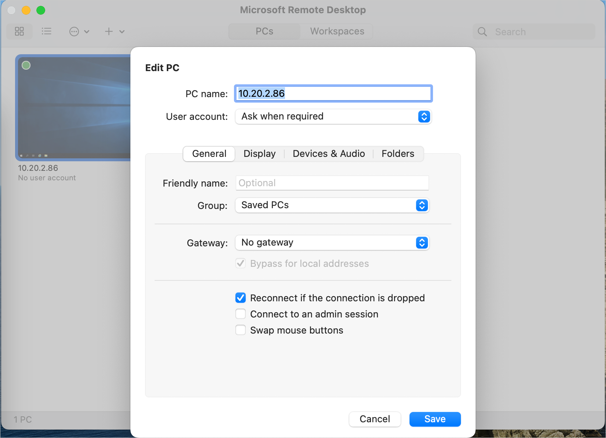
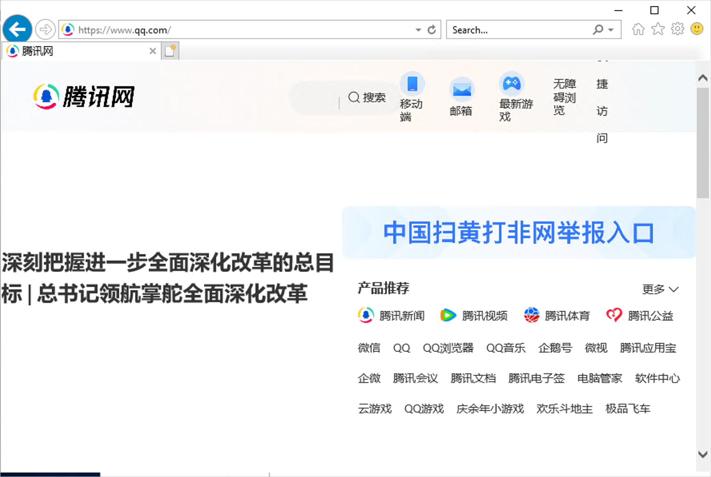
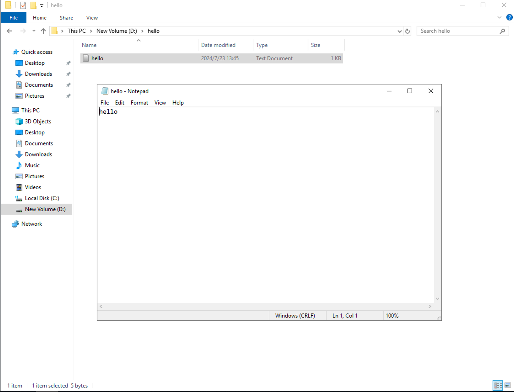

# 如何从 VMWare 导入传统 Windows 云主机到云原生云主机平台

本文将详细介绍如何通过命令行将外部平台 VMware 上的云主机导入到 AI 算力中心的云主机中。

!!! info

    本文档外部虚拟平台是 VMware vSphere Client，后续简写为 vSphere。
    技术上是依靠 kubevirt cdi 来实现的。操作前，vSphere 上被导入的云主机需要关机。
    以 Windows 操作系统的云主机为例。

## 环境准备

导入前，需要参考[网络配置](../vm/vm-network.md)准备环境。

### 获取 Windows 云主机的信息

与导入 Linux 操作系统的云主机类似，可参考[如何从 VMWare 导入传统 Linuxs 云主机到云原生云主机平台](import-ubuntu.md)获取以下信息：

- 获取 vSphere 账号密码
- 获取 vSphere 云主机信息

### 检查 Windows 的引导类型

将外部平台的云主机导入到 AI 算力中心的虚拟化平台中时，需要根据云主机的启动类型（BIOS 或 UEFI）进行相应的配置，以确保云主机能够正确启动和运行。

可以通过"系统信息"检查 Windows 是 BIOS 还是 UEFI 引导。如果是 UEFI 则需要在 YAML 文件中添加相关信息。


## 导入过程

准备 `window.yaml` 文件，注意以下配置项

- 引导 Virtio 驱动的 PVC
- 磁盘总线类型，根据引导类型设置为 sata 或 virtio
- 如果使用 UEFI，需要添加 UEFI 配置

<details>
<summary>点击查看 window.yaml 示例</summary>

```yaml title="window.yaml"
apiVersion: kubevirt.io/v1
kind: VirtualMachine
metadata:
  labels:
    virtnest.io/os-family: windows
    virtnest.io/os-version: "server2019"
  name: export-window-21
  namespace: default
spec:
  dataVolumeTemplates:
    - metadata:
        name: export-window-21-rootdisk
      spec:
        pvc:
          accessModes:
            - ReadWriteOnce
          resources:
            requests:
              storage: 22Gi
          storageClassName: local-path
        source:
          vddk:
            backingFile: "[A05-09-ShangPu-Local-DataStore] virtnest-export-window/virtnest-export-window.vmdk"
            url: "https://10.64.56.21"
            uuid: "421d40f2-21a2-cfeb-d5c9-e7f8abfc2faa"
            thumbprint: "D7:C4:22:E3:6F:69:DA:72:50:81:12:FA:42:18:3F:29:5C:7F:41:CA"
            secretRef: "vsphere21"
            initImageURL: "release.daocloud.io/virtnest/vddk:v8"
    - metadata:
        name: export-window-21-datadisk
      spec:
        pvc:
          accessModes:
            - ReadWriteOnce
          resources:
            requests:
              storage: 1Gi
          storageClassName: local-path
        source:
          vddk:
            backingFile: "[A05-09-ShangPu-Local-DataStore] virtnest-export-window/virtnest-export-window_1.vmdk"
            url: "https://10.64.56.21"
            uuid: "421d40f2-21a2-cfeb-d5c9-e7f8abfc2faa"
            thumbprint: "D7:C4:22:E3:6F:69:DA:72:50:81:12:FA:42:18:3F:29:5C:7F:41:CA"
            secretRef: "vsphere21"
            initImageURL: "release.daocloud.io/virtnest/vddk:v8"
    # <1>. 引导 virtio 驱动的 pvc
    # ↓↓↓↓↓↓↓↓↓↓↓↓↓↓↓↓↓↓↓↓↓↓
    - metadata:
        name: virtio-disk
      spec:
        pvc:
          accessModes:
            - ReadWriteOnce
          resources:
            requests:
              storage: 10Mi
          storageClassName: local-path
        source:
          blank: {}
          # ↑↑↑↑↑↑↑↑↑↑↑↑↑↑↑↑↑↑↑↑↑↑
  running: true
  template:
    metadata:
      annotations:
        ipam.spidernet.io/ippools: '[{"cleangateway":false,"ipv4":["test86"]}]'
    spec:
      dnsConfig:
        nameservers:
        - 223.5.5.5
      domain:
        cpu:
          cores: 2
        memory:
          guest: 4Gi
        devices:
          disks:
            - bootOrder: 1
              disk:
                bus: sata   # <2> 磁盘总线类型，根据引导类型设置为 sata 或 virtio
              name: rootdisk
            - bootOrder: 2
              disk:
                bus: sata   # <2> 磁盘总线类型，根据引导类型设置为 sata 或 virtio
              name: datadisk
            # <1>. 引导 virtio 驱动的 disk
            # ↓↓↓↓↓↓↓↓↓↓↓↓↓↓↓↓↓↓↓↓↓↓
            - bootOrder: 3
              disk:
                bus: virtio
              name: virtdisk
            - bootOrder: 4
              cdrom:
                bus: sata
              name: virtiocontainerdisk
            # ↑↑↑↑↑↑↑↑↑↑↑↑↑↑↑↑↑↑↑↑↑↑
          interfaces:
            - bridge: {}
              name: ovs-bridge0
        # <3> 在上文“查看 window 引导是 BIOS 还是 UEFI”
        # 如果使用了 UEFI 需要添加的信息
        # ↓↓↓↓↓↓↓↓↓↓↓↓↓↓↓↓↓↓↓↓↓↓
        features:
          smm:
            enabled: true
        firmware:
          bootloader:
            efi:
              secureBoot: false
        # ↑↑↑↑↑↑↑↑↑↑↑↑↑↑↑↑↑↑↑↑↑↑
        machine:
          type: q35
        resources:
          requests:
            memory: 4Gi
      networks:
        - multus:
            default: true
            networkName: kube-system/test1
          name: ovs-bridge0
      volumes:
        - dataVolume:
            name: export-window-21-rootdisk
          name: rootdisk
        - dataVolume:
            name: export-window-21-datadisk
          name: datadisk      
        # <1> 引导 virtio 驱动的 volumes
        # ↓↓↓↓↓↓↓↓↓↓↓↓↓↓↓↓↓↓↓↓↓↓
        - dataVolume:
            name: virtio-disk
          name: virtdisk
        - containerDisk:
            image: release-ci.daocloud.io/virtnest/kubevirt/virtio-win:v4.12.12-5
          name: virtiocontainerdisk
        # ↑↑↑↑↑↑↑↑↑↑↑↑↑↑↑↑↑↑↑↑↑↑
```

</details>

### 通过 VNC 安装 VirtIO 驱动

1. 通过 VNC 访问和连接到云主机。
2. 根据 Windows 版本下载并安装相应的 VirtIO 驱动程序。
3. 可以开启远程桌面（Remote Desktop），方便在后续通过远程桌面协议（RDP）连接到云主机。
4. 安装完成后，重启云主机后更新 YAML。






### 重启后更新 YAML 

<details>
<summary>点击查看修改后的 window.yaml 示例</summary>

```yaml title="window.yaml"
# 删除 标号 <1> 相关字段，修改标号 <2> 字段：sata 改成 virtio
apiVersion: kubevirt.io/v1
kind: VirtualMachine
metadata:
  labels:
    virtnest.io/os-family: windows
    virtnest.io/os-version: "server2019"
  name: export-window-21
  namespace: default
spec:
  dataVolumeTemplates:
    - metadata:
        name: export-window-21-rootdisk
      spec:
        pvc:
          accessModes:
            - ReadWriteOnce
          resources:
            requests:
              storage: 22Gi
          storageClassName: local-path
        source:
          vddk:
            backingFile: "[A05-09-ShangPu-Local-DataStore] virtnest-export-window/virtnest-export-window.vmdk"
            url: "https://10.64.56.21"
            uuid: "421d40f2-21a2-cfeb-d5c9-e7f8abfc2faa"
            thumbprint: "D7:C4:22:E3:6F:69:DA:72:50:81:12:FA:42:18:3F:29:5C:7F:41:CA"
            secretRef: "vsphere21"
            initImageURL: "release.daocloud.io/virtnest/vddk:v8"
    - metadata:
        name: export-window-21-datadisk
      spec:
        pvc:
          accessModes:
            - ReadWriteOnce
          resources:
            requests:
              storage: 1Gi
          storageClassName: local-path
        source:
          vddk:
            backingFile: "[A05-09-ShangPu-Local-DataStore] virtnest-export-window/virtnest-export-window_1.vmdk"
            url: "https://10.64.56.21"
            uuid: "421d40f2-21a2-cfeb-d5c9-e7f8abfc2faa"
            thumbprint: "D7:C4:22:E3:6F:69:DA:72:50:81:12:FA:42:18:3F:29:5C:7F:41:CA"
            secretRef: "vsphere21"
            initImageURL: "release.daocloud.io/virtnest/vddk:v8"
  running: true
  template:
    metadata:
      annotations:
        ipam.spidernet.io/ippools: '[{"cleangateway":false,"ipv4":["test86"]}]'
    spec:
      dnsConfig:
        nameservers:
        - 223.5.5.5
      domain:
        cpu:
          cores: 2
        memory:
          guest: 4Gi
        devices:
          disks:
            - bootOrder: 1
              disk:
                bus: virtio  # <2>
              name: rootdisk
            - bootOrder: 2
              disk:
                bus: virtio  # <2>
              name: datadisk
          interfaces:
            - bridge: {}
              name: ovs-bridge0
        # <3> 在上文“查看 window 引导是 BIOS 还是 UEFI”
        # 如果使用了 UEFI 需要添加的信息
        # ↓↓↓↓↓↓↓↓↓↓↓↓↓↓↓↓↓↓↓↓↓↓
        features:
          smm:
            enabled: true
        firmware:
          bootloader:
            efi:
              secureBoot: false
        # ↑↑↑↑↑↑↑↑↑↑↑↑↑↑↑↑↑↑↑↑↑↑
        machine:
          type: q35
        resources:
          requests:
            memory: 4Gi
      networks:
        - multus:
            default: true
            networkName: kube-system/test1
          name: ovs-bridge0
      volumes:
        - dataVolume:
            name: export-window-21-rootdisk
          name: rootdisk
        - dataVolume:
            name: export-window-21-datadisk
          name: datadisk
```

</details>

### RDP 访问和验证

- 使用 RDP 客户端连接到云主机。输入默认账号 `admin` 和密码 `dangerous!123` 进行登录。

    

- 验证网络访问和数据盘数据

    
    
    

## 对比导入 Linux 和 Windows 云主机的差异

- Windows 可能需要 UEFI 配置。
- Windows 通常需要安装 VirtIO 驱动。
- Windows 多磁盘导入通常不需要重新挂载磁盘。
