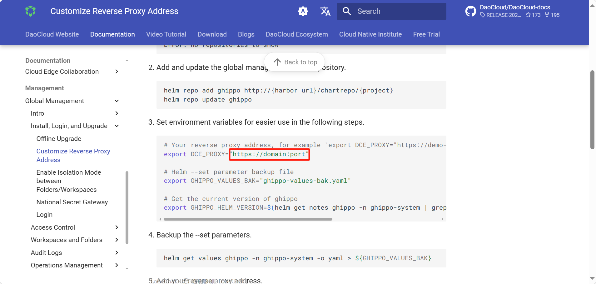

# Integrate AI platform into Customer System (OEM OUT)

OEM OUT refers to integrating AI platform as a sub-module into other products, appearing in their menus.
You can directly access AI platform without logging in again after logging into other products.
The OEM OUT integration involves 5 steps:

1. [Unify domain name](#unify-domain-name)
2. [User system integration](#user-system-integration)
3. [Navigation bar integration](#navigation-bar-integration)
4. [Customize appearance](#customizie-appearance)
5. [Permission system integration (optional)](#permission-system-integration-optional)

## Unify Domain Name

1. Deploy AI platform (Assuming the access address after deployment is `https://10.6.8.2:30343/`).

2. To achieve cross-domain access between the customer system and AI platform, you can use an nginx reverse proxy.
   Use the following example configuration in __vi /etc/nginx/conf.d/default.conf__ :

    ```nginx
    server {
        listen       80;
        server_name  localhost;
    
        location /dce5/ {
          proxy_pass https://10.6.8.2:30343/;
          proxy_http_version 1.1;
          proxy_read_timeout 300s; # This line is required for using kpanda cloudtty, otherwise it can be removed
          proxy_send_timeout 300s; # This line is required for using kpanda cloudtty, otherwise it can be removed
    
          proxy_set_header Host $host;
          proxy_set_header X-Real-IP $remote_addr;
          proxy_set_header X-Forwarded-For $proxy_add_x_forwarded_for;
    
          proxy_set_header Upgrade $http_upgrade; # This line is required for using kpanda cloudtty, otherwise it can be removed
          proxy_set_header Connection $connection_upgrade; # This line is required for using kpanda cloudtty, otherwise it can be removed
        }
        
        location / {
            proxy_pass https://10.6.165.50:30443/; # Assuming this is the customer system address (e.g., Yiyun)
            proxy_http_version 1.1;
    
            proxy_set_header Host $host;
            proxy_set_header X-Real-IP $remote_addr;
            proxy_set_header X-Forwarded-For $proxy_add_x_forwarded_for;
        }
    }
    ```

3. Assuming the nginx entry address is 10.6.165.50, follow the
   [Customize AI platform Reverse Proxy Server Address](../install/reverse-proxy.md) to
   set the AI_PROXY reverse proxy as `http://10.6.165.50/dce5`. Ensure that AI platform
   can be accessed via `http://10.6.165.50/dce5`. The customer system also needs
   to configure the reverse proxy based on its specific requirements.

    

## User System Integration

Integrate the customer system with AI platform using protocols like OIDC/OAUTH,
allowing users to access AI platform without logging in again after logging into
the customer system. Fill in the OIDC information of the customer system in
__Global Management__ -> __Access Control__ -> __Identity Provider__ .

After integration, the AI platform login page will display the OIDC (custom) option.
When accessing AI platform from the customer system for the first time,
select OIDC login, and subsequent logins will directly enter AI platform without needing to choose again.

## Navigation Bar Integration

Navigation bar integration means adding AI platform to the menu of the customer system.
You can directly access AI platform by clicking the proper menu item. The navigation bar
integration depends on the customer system and needs to be handled based on specific circumstances.

## Customizie Appearance

Use __Global Management__ -> __Settings__ -> __Appearance__ to customize
the platform's background color, logo, and name. For detailed instructions,
refer to [Appearance Customization](../platform-setting/appearance.md).

## Permission System Integration (optional)

Permission system integration is complex.
If you have such requirements, please contact the Global Management team.

## Reference

- [OEM IN](./oem-in.md)
