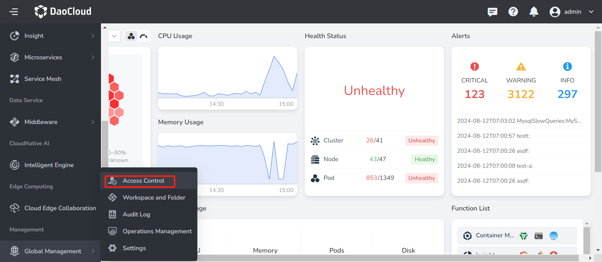
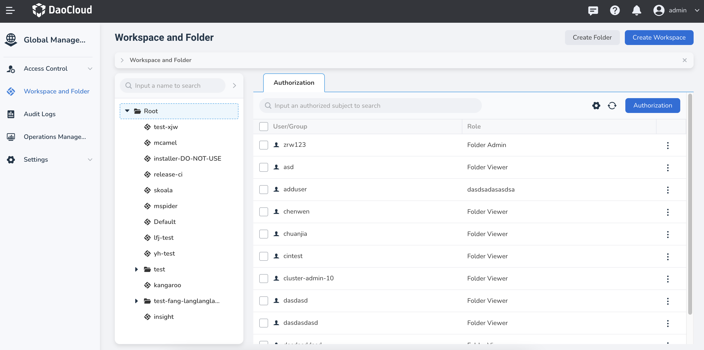

# Workspaces (tenants) bind namespaces across clusters

Namespaces from different clusters are bound under the workspace (tenant), which enables the workspace (tenant) to flexibly manage the Kubernetes Namespace under any cluster on the platform.
At the same time, the platform provides permission mapping capabilities, which can map the user's permissions in the workspace to the bound namespace.

When one or more cross-cluster namespaces are bound under the workspace (tenant), the administrator does not need to authorize the members in the workspace again.
The roles of members in the workspace will be automatically mapped according to the following mapping relationship to complete the authorization, avoiding repeated operations of multiple authorizations:

- Workspace Admin corresponds to Namespace Admin
- Workspace Editor corresponds to Namespace Editor
- Workspace Viewer corresponds to Namespace Viewer

Here is an example:

| User | Workspace | Role |
| ------ | ----------- | --------------- |
| User A | Workspace01 | Workspace Admin |

After binding a namespace to a workspace:

| User | Category | Role |
| ------ | ----------- | --------------- |
| User A | Workspace01 | Workspace Admin |
| | Namespace01 | Namespace Admin |

## Implementation plan

Bind different namespaces from different clusters to the same workspace (tenant), and use the process for members under the workspace (tenant) as shown in the figure.

```mermaid
graph TB

preparews[prepare workspace] --> preparens[prepare namespace]
--> judge([whether the namespace is bound to another workspace])
judge -.unbound.->nstows[bind namespace to workspace] -->wsperm[manage workspace access]
judge -.bound.->createns[Create a new namespace]

classDef plain fill:#ddd,stroke:#fff,stroke-width:1px,color:#000;
classDef k8s fill: #326ce5, stroke: #fff, stroke-width: 1px, color: #fff;
classDef cluster fill:#fff,stroke:#bbb,stroke-width:1px,color:#326ce5;

class preparews, preparens, createns, nstows, wsperm cluster;
class judge plain
```

!!! tip

    A namespace can only be bound by one workspace.

## Prepare workspace

In order to meet the multi-tenant  use cases, the workspace forms an isolated resource environment based on multiple resources such as clusters, cluster namespaces, meshs, mesh namespaces, multicloud, and multicloud namespaces.
Workspaces can be mapped to various concepts such as projects, tenants, enterprises, and suppliers.

1. Log in to AI platform as a user with the admin/folder admin role, and click __Global Management__ at the bottom of the left navigation bar.

    

1. Click __Workspace and Folder__ in the left navigation bar, and click the __Create Workspace__ button in the upper right corner.

    

1. After filling in the workspace name, folder and other information, click __OK__ to complete the creation of the workspace.

    

!!! tip

    If the created namespace already exists in the platform, click a workspace, and under the __Resource Group__ tab, click __Bind Resource__ to directly bind the namespace.

## Prepare the namespace

A namespace is a smaller unit of resource isolation that can be managed and used by members of a workspace after it is bound to a workspace.

Follow the steps below to prepare a namespace that is not yet bound to any workspace.

1. Click __Container Management__ at the bottom of the left navigation bar.

1. Click the name of the target cluster to enter __Cluster Details__ .

1. Click __Namespace__ on the left navigation bar to enter the namespace management page, and click the __Create__ button on the right side of the page.

1. Fill in the name of the namespace, configure the workspace and tags (optional settings), and click __OK__ .

    !!! info

        Workspaces are primarily used to divide groups of resources and grant users (groups of users) different access rights to that resource. For a detailed description of the workspace, please refer to [Workspace and Folder](../workspace/workspace.md).

    
1. Click __OK__ to complete the creation of the namespace. On the right side of the namespace list, click __┇__ , and you can select __Bind Workspace__ from the pop-up menu.

## Bind the namespace to the workspace

In addition to binding in the namespace list, you can also return to __global management__ , follow the steps below to bind the workspace.

1. Click __Global Management__ -> __Workspace and Folder__ -> __Resource Group__ , click a workspace name, and click the __Bind Resource__ button.

1. Select the workspace to be bound (multiple choices are allowed), and click __OK__ to complete the binding.

## Add members to the workspace and authorize

1. In __Workspace and Folder__ -> __Authorization__ , click the name of a workspace, and click the __Add Authorization__ button.

1. After selecting the __User/group__ and __Role__ to be authorized, click __OK__ to complete the authorization.

