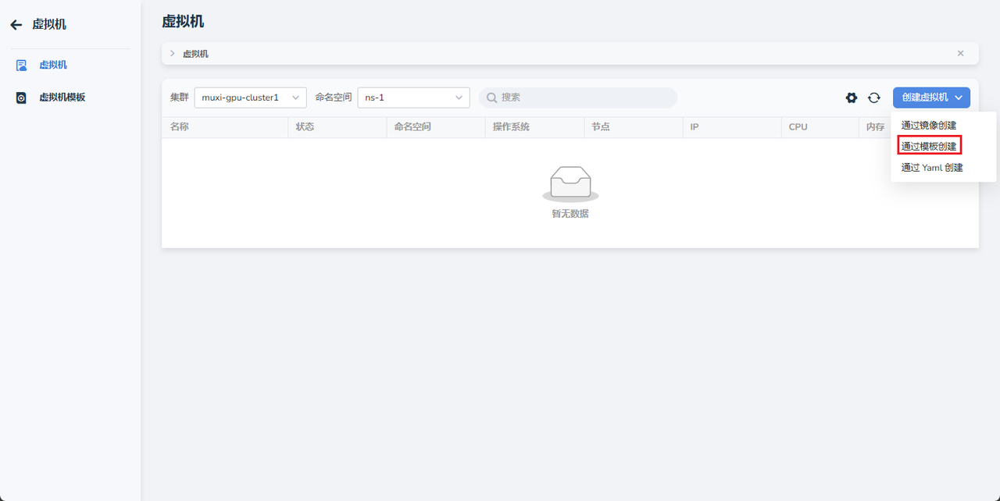
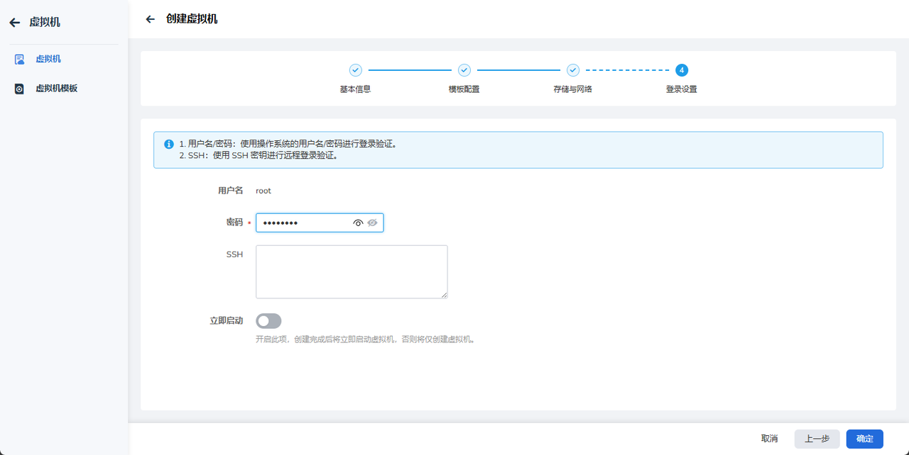
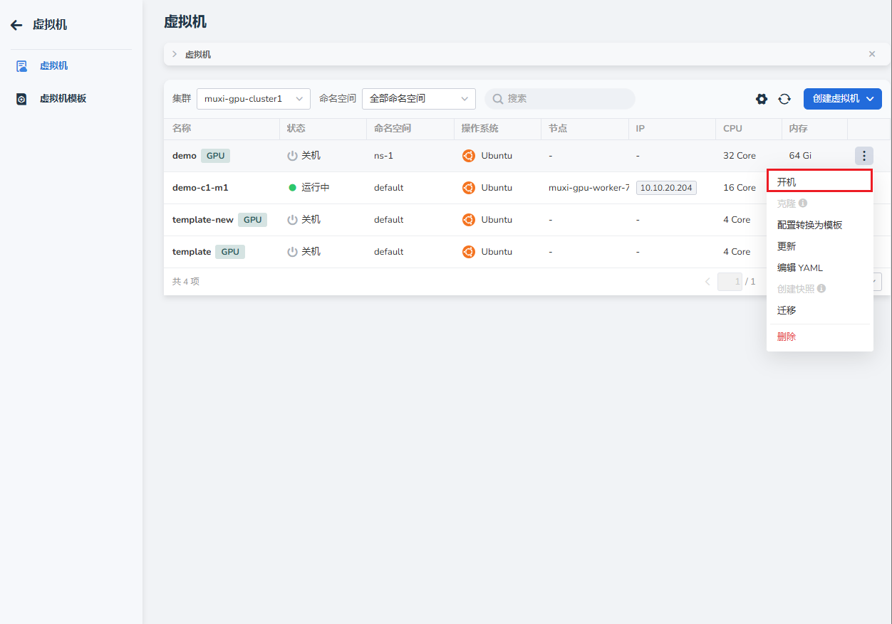

# Create and Start a Cloud Host

After the user completes registration and is assigned a workspace, namespace, and resources, they can create and start a cloud host.

## Prerequisites

- AI platform installed
- [User has successfully registered](../register/index.md)
- [Workspace has been bound to the user](../register/bindws.md)
- [Resources have been allocated to the workspace](../register/wsres.md)

## Steps

1. User logs into the AI platform.
2. Click **Create Cloud Host** -> **Create from Template**

    

3. After defining all configurations for the cloud host, click **Next**

    === "Basic Configuration"

        

    === "Template Configuration"

        

    === "Storage and Network"

        

4. After configuring the root password or SSH key, click **OK**

    

5. Return to the host list and wait for the status to change to **Running**.
   After that, you can start the host by clicking the **┇** on the right side.

    

Next step: [Use the Cloud Host](./usehost.md)
