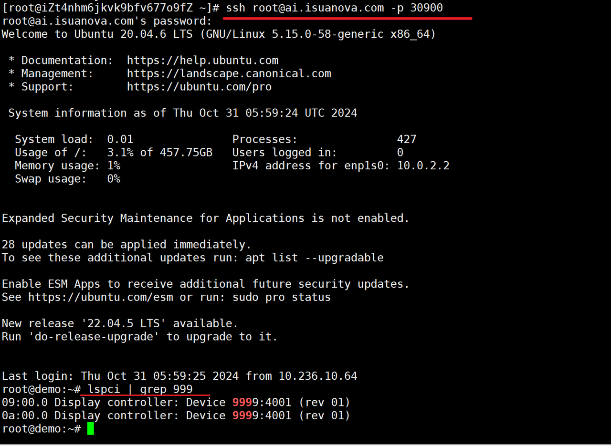

# Using Cloud Host

After creating and starting the cloud host, users can begin using it.

## Prerequisites

- AI platform is installed
- [User has created and started a cloud host](./createhost.md)

## Steps to Follow

1. Log in to the AI platform as an administrator.
2. Navigate to **Container Management** -> **Container Network** -> **Services**, click the service name to enter the service details page, and click **Update** at the top right corner.

3. Change the port range to 30900-30999, ensuring there are no conflicts.

4. Log in to the AI platform as an end user, navigate to the proper service, and check the access port.

5. Use an SSH client to log in to the cloud host from the external network.

    

6. At this point, you can perform various operations on the cloud host.

Next step: [Cloud Resource Sharing: Quota Management](../share/quota.md)
