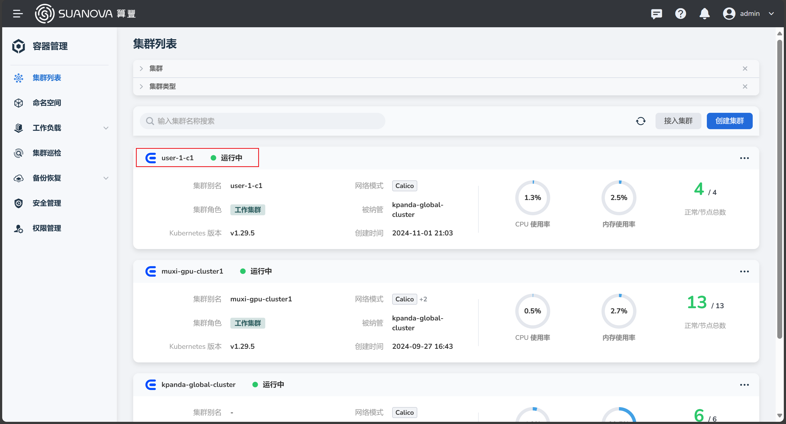
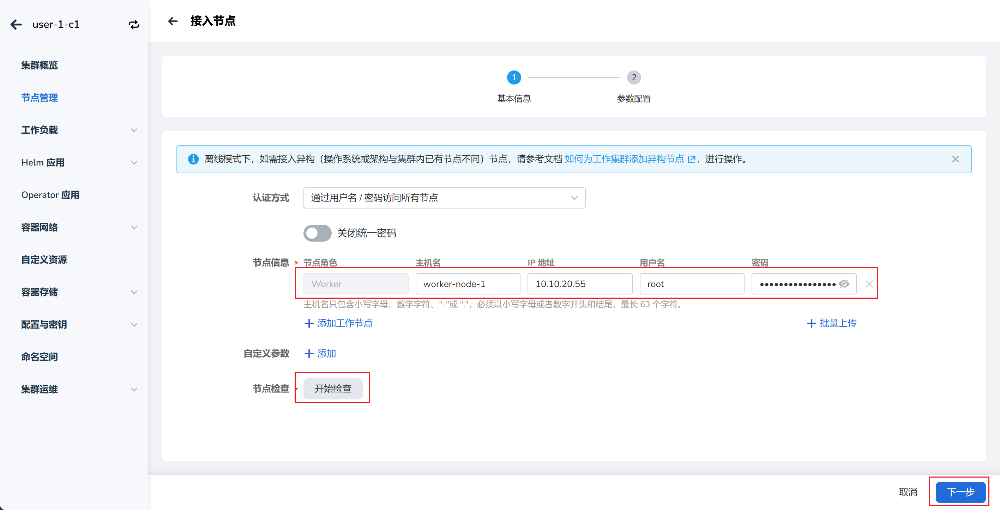

# Adding Worker Nodes

If there are not enough nodes, you can add more nodes to the cluster.

## Prerequisites

- AI platform is installed
- An administrator account is available
- [A cluster with GPU nodes has been created](./create-k8s.md)
- [A cloud host has been prepared](../host/createhost.md)

## Steps to Add Nodes

1. Log in to the AI platform as an **administrator**.
2. Navigate to **Container Management** -> **Clusters**, and click the name of the target cluster.

    

3. On the cluster overview page, click **Node Management**, and then click the **Add Node** button on the right side.

    

4. Follow the wizard, fill in the required parameters, and then click **OK**.

    === "Basic Information"

        

    === "Parameter Configuration"

        

5. Click **OK** in the popup window.

    

6. Return to the node list. The status of the newly added node will be **Pending**. After a few minutes, if the status changes to **Running**, it indicates that the node has been successfully added.

    

!!! tip

    For nodes that have just been successfully added, it may take an additional 2-3 minutes for the GPU to be recognized.
