# Creating a Kubernetes Cluster on the Cloud

Deploying a Kubernetes cluster is aimed at supporting efficient AI computing resource scheduling and management, achieving elastic scalability, providing high availability, and optimizing the model training and inference processes.

## Prerequisites

- An AI platform is installed
- An administrator account is available
- A physical machine with a GPU is prepared
- Two segments of IP addresses are allocated (Pod CIDR 18 bits, SVC CIDR 18 bits, must not conflict with existing network segments)

## Steps to Create the Cluster

1. Log in to the AI platform as an **administrator**.
2. [Create and launch 3 cloud hosts without GPUs](../host/createhost.md) to serve as the Master nodes for the cluster.

    - Configure resources: 16 CPU cores, 32 GB memory, 200 GB system disk (ReadWriteOnce)
    - Select **Bridge** network mode
    - Set the root password or add an SSH public key for SSH connection
    - Take note of the IP addresses of the 3 hosts

3. Navigate to **Container Management** -> **Clusters**, and click the **Create Cluster** button on the right side.
4. Follow the wizard to configure the various parameters of the cluster.

    === "Basic Information"

        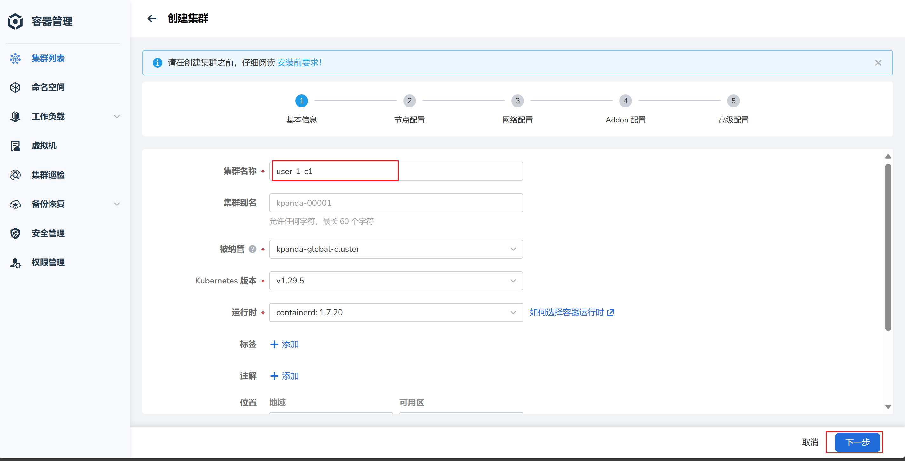

    === "Node Configuration"

        After configuring the node information, click **Start Check**.

        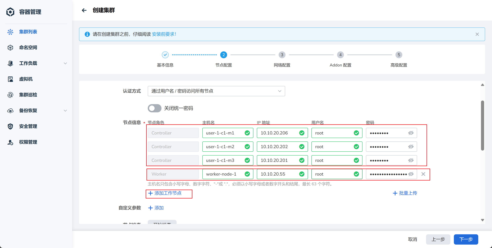
        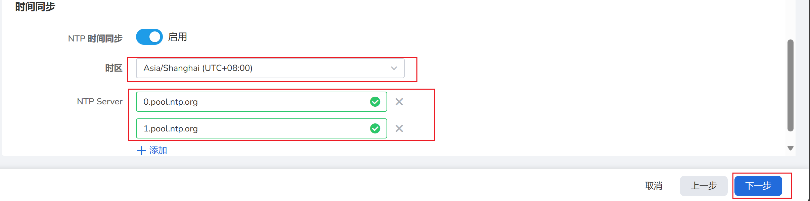

    === "Network Configuration"

        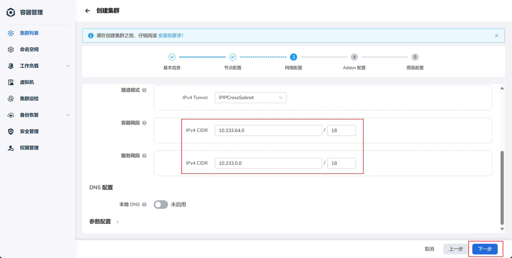

    === "Addon Configuration"

        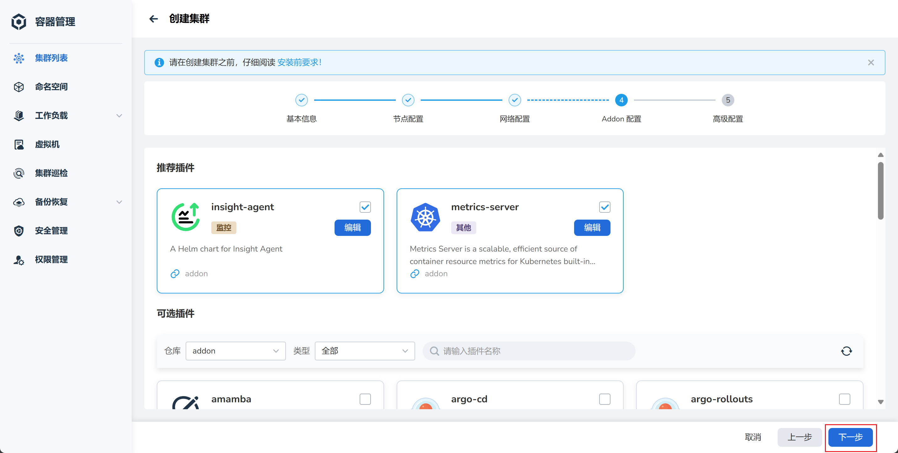

    === "Advanced Configuration"

        Each node can run a default of 110 Pods (container groups). If the node configuration is higher, it can be adjusted to 200 or 300 Pods.

        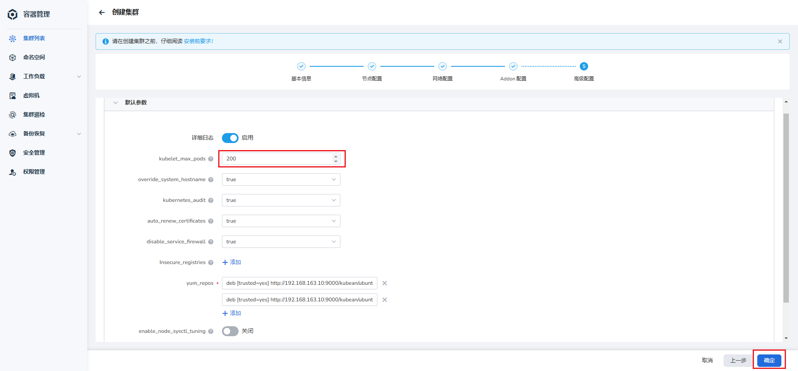

5. Wait for the cluster creation to complete.

    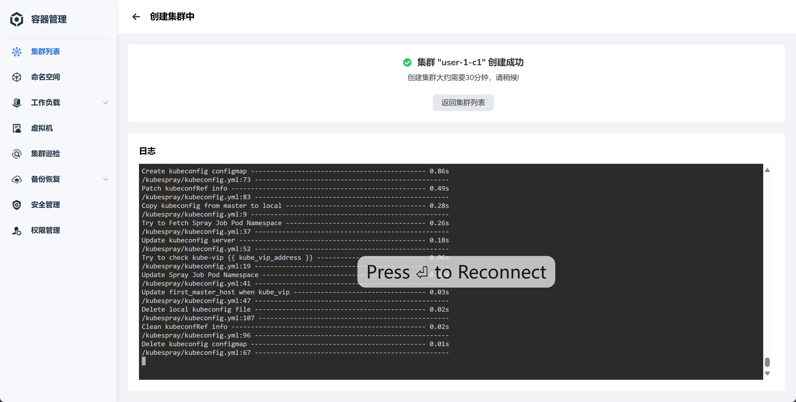

6. In the cluster list, find the newly created cluster, click the cluster name, navigate to **Helm Apps** -> **Helm Charts**, and search for `metax-gpu-extensions` in the search box, then click the card.

    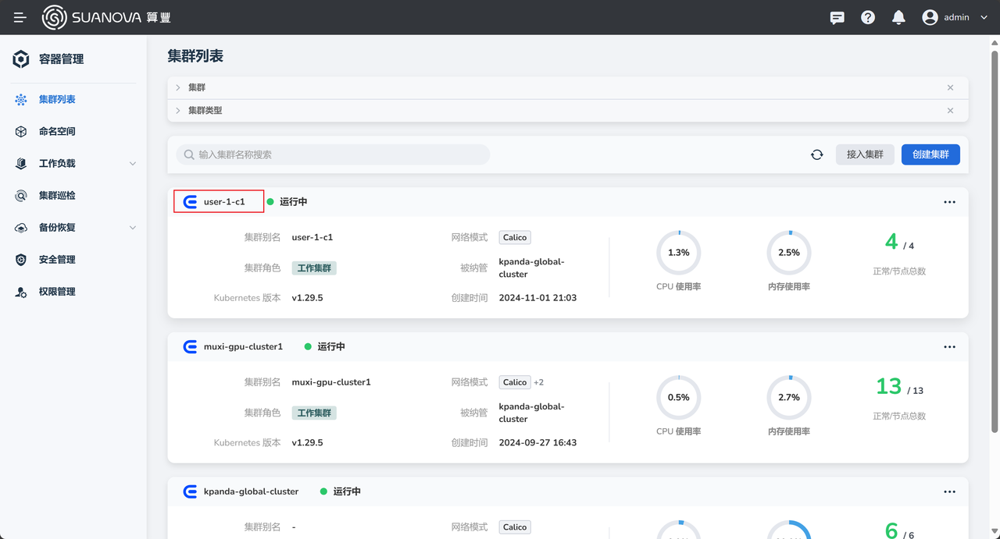

    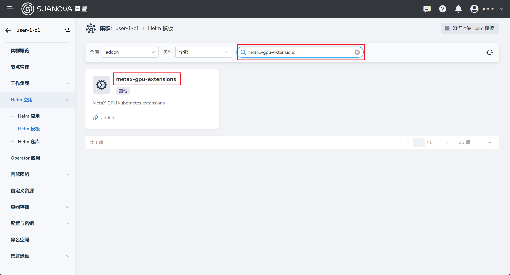

7. Click the **Install** button on the right to begin installing the GPU plugin.

    === "Application Settings"

        Enter a name, select a namespace, and modify the image address in the YAML:

        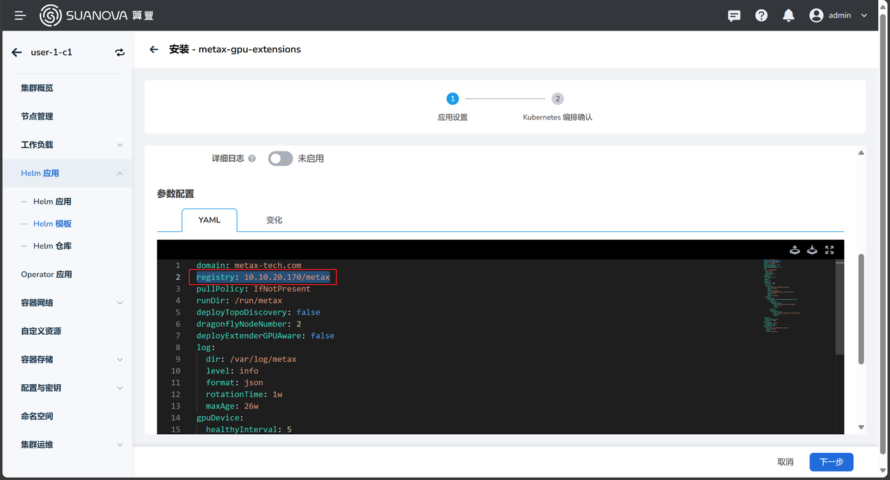

    === "Kubernetes Orchestration Confirmation"

        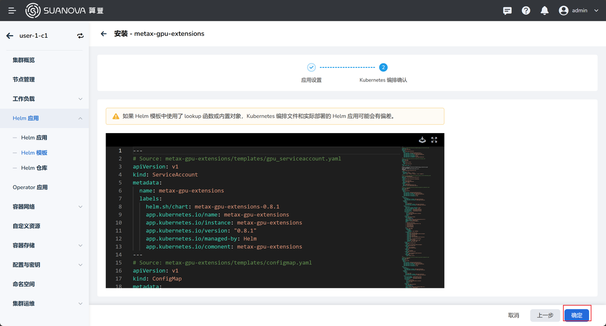

8. You will automatically return to the Helm App list. Wait for the status of `metax-gpu-extensions` to change to **Deployed**.

    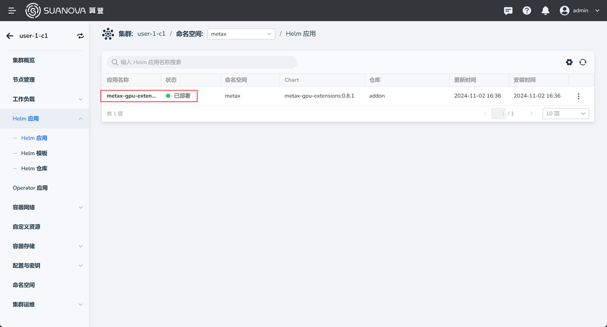

9. The cluster has been successfully created. You can now check the nodes included in the cluster. You can [create AI workloads and use the GPU](../share/workload.md).

    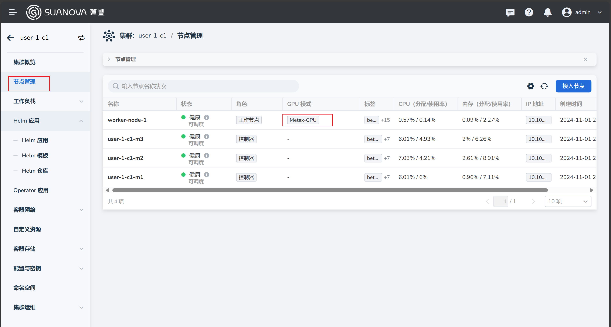

Next step: [Create AI Workloads](../share/workload.md)
