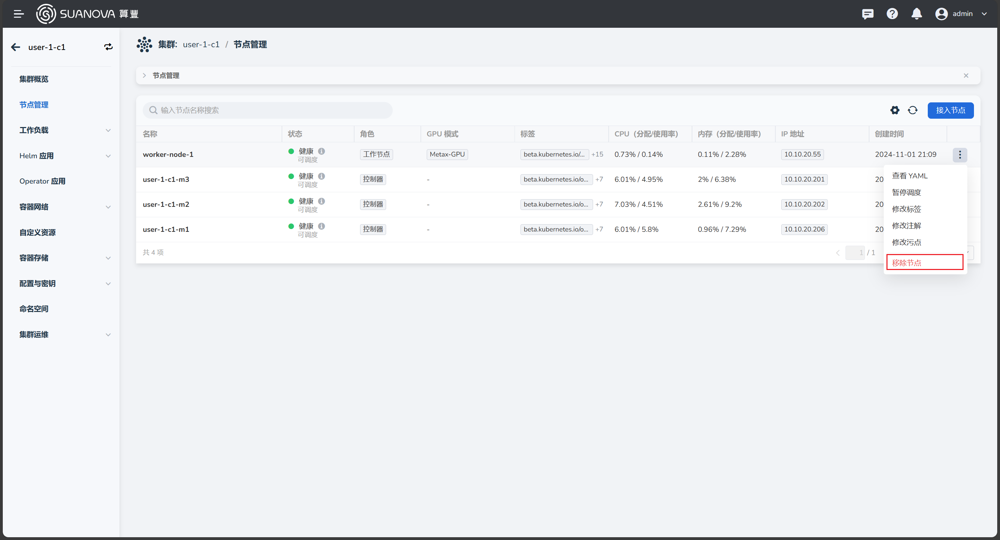
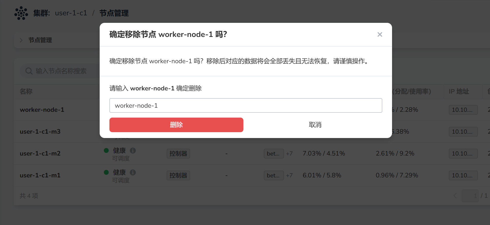
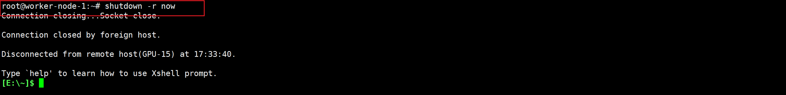

# Removing GPU Worker Nodes

The cost of GPU resources is relatively high. If you temporarily do not need a GPU, you can remove the worker nodes with GPUs. The following steps are also applicable for removing regular worker nodes.

## Prerequisites

- AI platform installed
- An administrator account
- [A cluster with GPU nodes created](./create-k8s.md)

## Removal Steps

1. Log in to the AI platform as an **administrator**.
2. Navigate to **Container Management** -> **Clusters**, and click the name of the target cluster.

    

3. On the cluster overview page, click **Nodes**, find the node you want to remove, click the __┇__ on the right side of the list, and select **Remove Node** from the pop-up menu.

    

4. In the pop-up window, enter the node name, and after confirming it is correct, click **Delete**.

    

5. You will automatically return to the node list, and the status will be **Removing**. After a few minutes, refresh the page; if the node is no longer there, it indicates that the node has been successfully removed.

    

6. After removing the node from the UI list and shutting it down, log in to the host of the removed node via SSH and execute the shutdown command.

    

!!! tip

    After removing the node from the UI and shutting it down, the data on the node is not immediately deleted; the node's data will be retained for a period of time.
