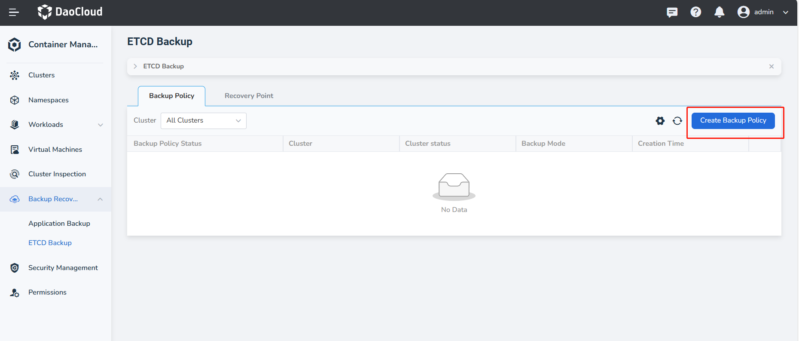
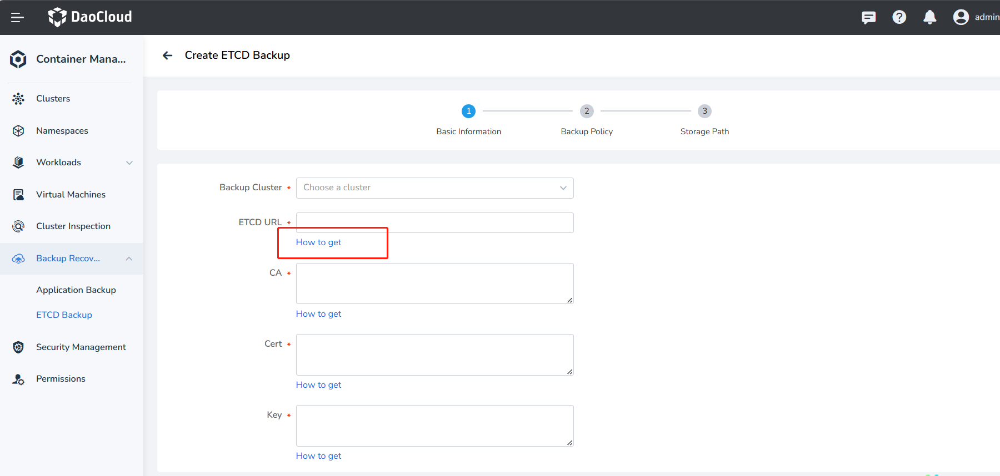

# etcd backup

etcd backup is based on cluster data as the core backup. In cases such as hardware device damage, development and test configuration errors, etc., the backup cluster data can be restored through etcd backup.

This section will introduce how to realize the etcd backup for clusters.
Also see [etcd Backup and Restore Best Practices](../../best-practice/etcd-backup.md).

## Prerequisites

- [Integrated the Kubernetes cluster](../clusters/integrate-cluster.md) or
  [created the Kubernetes cluster](../clusters/create-cluster.md),
  and you can access the UI interface of the cluster.

- Created a [namespace](../namespaces/createns.md),
  [user](../../../ghippo/access-control/user.md),
  and granted [`NS Admin`](../permissions/permission-brief.md#ns-admin) or higher permissions to the user.
  For details, refer to [Namespace Authorization](../permissions/cluster-ns-auth.md).

- Prepared a MinIO instance. It is recommended to create it through AI platform's MinIO middleware.
  For specific steps, refer to [MinIO Object Storage](../../../middleware/minio/user-guide/create.md).

## Create etcd backup

Follow the steps below to create an etcd backup.

1. Enter  __Container Management__ -> __Backup Recovery__ -> __etcd Backup__ page, you can see all the current 
   backup policies. Click __Create Backup Policy__ on the right.

    

2. Fill in the __Basic Information__. Then, click __Next__ to automatically verify the connectivity of etcd. If
   the verification passes, proceed to the next step.
   
    - First select the backup cluster and log in to the terminal
    - Enter etcd, and the format is `https://${NodeIP}:${Port}`.

        - In a standard Kubernetes cluster, the default port for etcd is __2379__.
        - In a Suanova 4.0 cluster, the default port for etcd is __12379__.
        - In a public cloud managed cluster, you need to contact the relevant developers to obtain the etcd port number.
          This is because the control plane components of public cloud clusters are maintained and managed by 
          the cloud service provider. Users cannot directly access or view these components, nor can they obtain 
          control plane port information through regular commands (such as kubectl).

        ??? note "Ways to obtain port number"  

            1. Find the etcd Pod in the __kube-system__ namespace

                ```shell
                kubectl get po -n kube-system | grep etcd
                ```

            2. Get the port number from the __listen-client-urls__ of the etcd Pod

                ```shell
                kubectl get po -n kube-system ${etcd_pod_name} -oyaml | grep listen-client-urls # (1)!
                ```

                1. Replace __etcd_pod_name__ with the actual Pod name

                The expected output is as follows, where the number after the node IP is the port number:

                ```shell
                - --listen-client-urls=https://127.0.0.1:2379,https://10.6.229.191:2379
                ```

    - Fill in the CA certificate, you can use the following command to view the certificate content.
      Then, copy and paste it to the proper location:

        === "Standard Kubernetes Cluster"

            ```shell
            cat /etc/kubernetes/ssl/etcd/ca.crt
            ```

        === "Suanova 4.0 Cluster"

            ```shell
            cat /etc/daocloud/dce/certs/ca.crt
            ```

    - Fill in the Cert certificate, you can use the following command to view the content of the certificate. Then, copy and paste it to the proper location:

        === "Standard Kubernetes Cluster"
        
            ```shell
            cat /etc/kubernetes/ssl/apiserver-etcd-client.crt
            ```

        === "Suanova 4.0 Cluster"
        
            ```shell
            cat /etc/daocloud/dce/certs/etcd/server.crt
            ```

    - Fill in the Key, you can use the following command to view the content of the certificate and copy and paste it to the proper location:

        === "Standard Kubernetes Cluster"

            ```shell
            cat /etc/kubernetes/ssl/apiserver-etcd-client.key
            ```

        === "Suanova 4.0 Cluster"

            ```shell
            cat /etc/daocloud/dce/certs/etcd/server.key
            ```

        

    !!! note

        Click __How to get__ below the input box to see how to obtain the proper information on the UI page.        

3. Refer to the following information to fill in the __Backup Policy__.

    - Backup Method: Choose either manual backup or scheduled backup

        - Manual Backup: Immediately perform a full backup of etcd data based on the backup configuration.
        - Scheduled Backup: Periodically perform full backups of etcd data according to the set backup frequency.

    - Backup Chain Length: the maximum number of backup data to retain. The default is 30.
    - Backup Frequency: it can be per hour, per day, per week or per month, and can also be customized.

4. Refer to the following information to fill in the __Storage Path__.

    - Storage Provider: Default is S3 storage
    - Object Storage Access Address: The access address of MinIO
    - Bucket: Create a Bucket in MinIO and fill in the Bucket name
    - Username: The login username for MinIO
    - Password: The login password for MinIO

5. After clicking __OK__ , the page will automatically redirect to the backup policy list, where you can 
   view all the currently created ones.

    - Click the __┇__ action button on the right side of the policy to view logs, view YAML, update the policy, stop the policy, or execute the policy immediately.
    - When the backup method is manual, you can click __Execute Now__ to perform the backup.
    - When the backup method is scheduled, the backup will be performed according to the configured time.

## View Backup Policy Logs

Click __Logs__ to view the log content. By default, 100 lines are displayed. If you want to see more log information or download the logs, you can follow the prompts above the logs to go to the observability module.

## View Backup POlicy Details

Go to __Container Management__ -> __Backup Recovery__ -> __etcd Backup__ , click the __Backup Policy__ tab, and then click the policy to view the details.

## View Recovery Point

1. Go to __Container Management__ -> __Backup Recovery__ -> __etcd Backup__, and click the __Recovery Point__ tab.
2. After selecting the target cluster, you can view all the backup information under that cluster.

    Each time a backup is executed, a corresponding recovery point is generated, which can be used to quickly restore
    the application from a successful recovery point.
