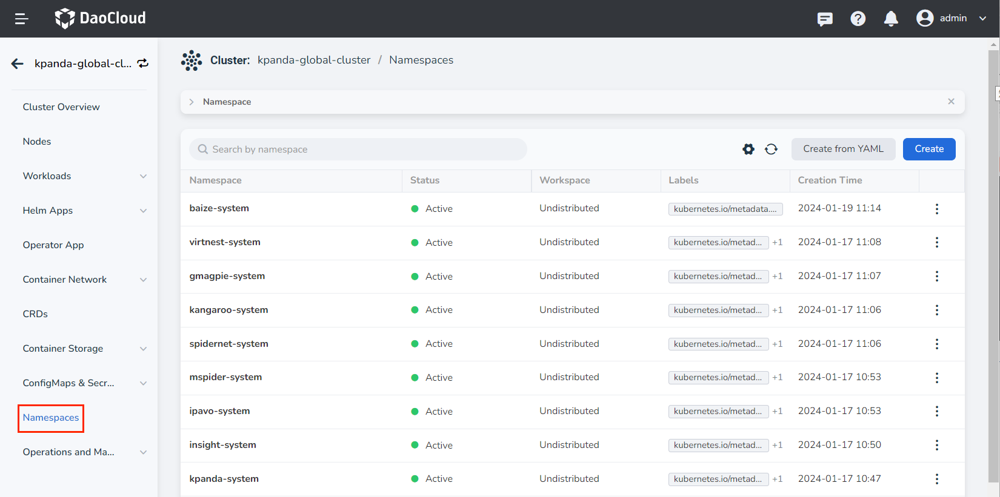
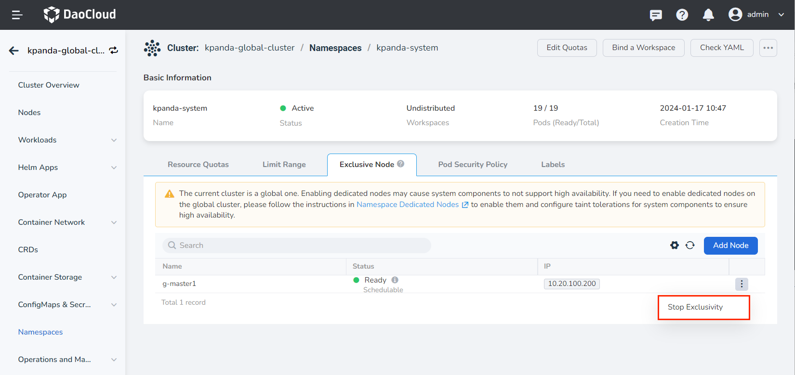
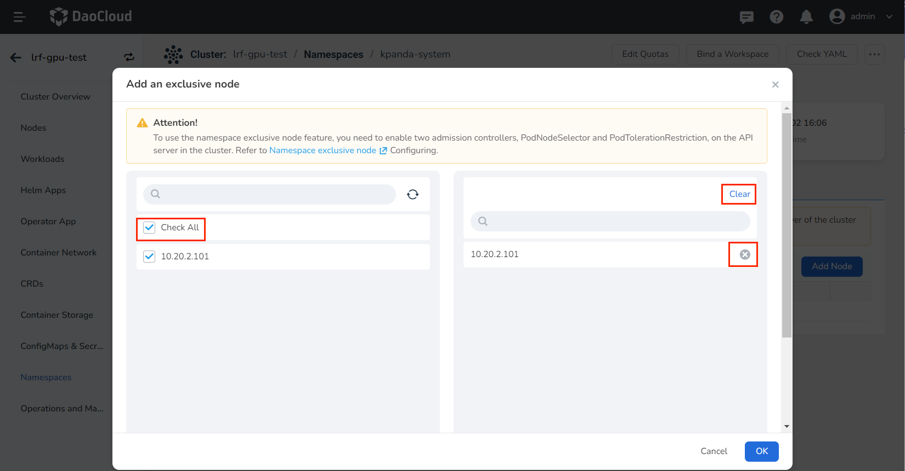
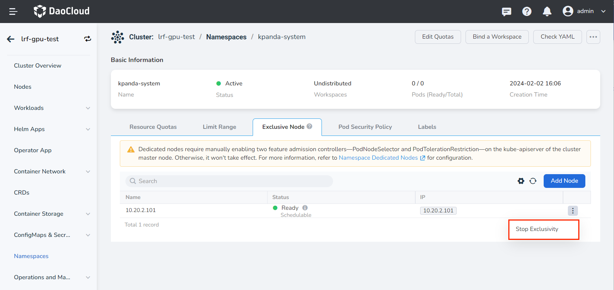

# Namespace Exclusive Nodes

Namespace exclusive nodes in a Kubernetes cluster allow a specific namespace to have exclusive access to one or more node's CPU, memory, and other resources through taints and tolerations. Once exclusive nodes are configured for a specific namespace, applications and services from other namespaces cannot run on the exclusive nodes. Using exclusive nodes allows important applications to have exclusive access to some computing resources, achieving physical isolation from other applications.

!!! note

    Applications and services running on a node before it is set to be an exclusive node will not be affected and will continue to run normally on that node. Only when these Pods are deleted or rebuilt will they be scheduled to other non-exclusive nodes.

## Preparation

Check whether the kube-apiserver of the current cluster has enabled the __PodNodeSelector__ and __PodTolerationRestriction__ admission controllers.

The use of namespace exclusive nodes requires users to enable the __PodNodeSelector__ and __PodTolerationRestriction__ admission controllers on the kube-apiserver. For more information about admission controllers, refer to [Kubernetes Admission Controllers Reference](https://kubernetes.io/docs/reference/access-authn-authz/admission-controllers/).

You can go to any Master node in the current cluster to check whether these two features are enabled in the __kube-apiserver.yaml__ file, or you can execute the following command on the Master node for a quick check:

```bash
[root@g-master1 ~]# cat /etc/kubernetes/manifests/kube-apiserver.yaml | grep  enable-admission-plugins

# The expected output is as follows:
- --enable-admission-plugins=NodeRestriction,PodNodeSelector,PodTolerationRestriction
```

## Enable Namespace Exclusive Nodes on Global Cluster

Since the Global cluster runs platform basic components such as kpanda, ghippo, and insight, enabling namespace exclusive nodes on Global may cause system components to not be scheduled to the exclusive nodes when they restart, affecting the overall high availability of the system. Therefore, **we generally do not recommend users to enable the namespace exclusive node feature on the Global cluster**.

If you do need to enable namespace exclusive nodes on the Global cluster, please follow the steps below:

1. Enable the __PodNodeSelector__ and __PodTolerationRestriction__ admission controllers for the kube-apiserver of the Global cluster

    !!! note

        If the cluster has already enabled the above two admission controllers, please skip this step and go directly to configure system component tolerations.

    Go to any Master node in the current cluster to modify the __kube-apiserver.yaml__ configuration file, or execute the following command on the Master node for configuration:

    ```bash
    [root@g-master1 ~]# vi /etc/kubernetes/manifests/kube-apiserver.yaml
    
    # The expected output is as follows:
    apiVersion: v1
    kind: Pod
    metadata:
        ......
    spec:
    containers:
    - command:
        - kube-apiserver
        ......
        - --default-not-ready-toleration-seconds=300
        - --default-unreachable-toleration-seconds=300
        - --enable-admission-plugins=NodeRestriction   #List of enabled admission controllers
        - --enable-aggregator-routing=False
        - --enable-bootstrap-token-auth=true
        - --endpoint-reconciler-type=lease
        - --etcd-cafile=/etc/kubernetes/ssl/etcd/ca.crt
        ......
    ```

    Find the __--enable-admission-plugins__ parameter and add the __PodNodeSelector__ and __PodTolerationRestriction__ admission controllers (separated by commas). Refer to the following:

    ```bash
    # Add __ ,PodNodeSelector,PodTolerationRestriction__ 
    - --enable-admission-plugins=NodeRestriction,PodNodeSelector,PodTolerationRestriction 
    ```

2. Add toleration annotations to the namespace where the platform components are located

    After enabling the admission controllers, you need to add toleration annotations to the namespace where the platform components are located to ensure the high availability of the platform components.

    The system component namespaces for AI platform are as follows:

    | Namespace            | System Components Included                                   |
    | ------------------- | ------------------------------------------------------------ |
    | kpanda-system       | kpanda                                                       |
    | hwameiStor-system   | hwameiStor                                                   |
    | istio-system        | istio                                                        |
    | metallb-system      | metallb                                                      |
    | cert-manager-system | cert-manager                                                 |
    | contour-system      | contour                                                      |
    | kubean-system       | kubean                                                       |
    | ghippo-system       | ghippo                                                       |
    | kcoral-system       | kcoral                                                       |
    | kcollie-system      | kcollie                                                      |
    | insight-system      | insight, insight-agent:                                      |
    | ipavo-system        | ipavo                                                        |
    | kairship-system     | kairship                                                     |
    | karmada-system      | karmada                                                      |
    | amamba-system       | amamba, jenkins                                              |
    | skoala-system       | skoala                                                       |
    | mspider-system      | mspider                                                      |
    | mcamel-system       | mcamel-rabbitmq, mcamel-elasticsearch, mcamel-mysql, mcamel-redis, mcamel-kafka, mcamel-minio, mcamel-postgresql |
    | spidernet-system    | spidernet                                                    |
    | kangaroo-system     | kangaroo                                                     |
    | gmagpie-system      | gmagpie                                                      |
    | dowl-system         | dowl                                                         |

    Check whether there are the above namespaces in the current cluster, execute the following command, and add the annotation: `scheduler.alpha.kubernetes.io/defaultTolerations:     '[{"operator": "Exists", "effect": "NoSchedule", "key": "ExclusiveNamespace"}]'` for each namespace.

    ```bash
    kubectl annotate ns <namespace-name> scheduler.alpha.kubernetes.io/defaultTolerations: '[{"operator": "Exists", "effect": 
    "NoSchedule", "key": "ExclusiveNamespace"}]'
    ```
    Make sure to replace `<namespace-name>` with the name of the platform namespace you want to add the annotation to.

3. Use the interface to set exclusive nodes for the namespace

    After confirming that the __PodNodeSelector__ and __PodTolerationRestriction__ admission controllers on the cluster API server have been enabled, please follow the steps below to use the AI platform UI management interface to set exclusive nodes for the namespace.

    1. Click the cluster name in the cluster list page, then click __Namespace__ in the left navigation bar.

        

    2. Click the namespace name, then click the __Exclusive Node__ tab, and click __Add Node__ on the bottom right.

        

    3. Select which nodes you want to be exclusive to this namespace on the left side of the page. On the right side, you can clear or delete a selected node. Finally, click __OK__ at the bottom.

        

    4. You can view the current exclusive nodes for this namespace in the list. You can choose to __Stop Exclusivity__ on the right side of the node.

        > After cancelling exclusivity, Pods from other namespaces can also be scheduled to this node.

        

## Enable Namespace Exclusive Nodes on Non-Global Clusters

To enable namespace exclusive nodes on non-Global clusters, please follow the steps below:

1. Enable the __PodNodeSelector__ and __PodTolerationRestriction__ admission controllers for the kube-apiserver of the current cluster

    !!! note

        If the cluster has already enabled the above two admission controllers, please skip this step and go directly to using the interface to set exclusive nodes for the namespace.

    Go to any Master node in the current cluster to modify the __kube-apiserver.yaml__ configuration file, or execute the following command on the Master node for configuration:

    ```bash
    [root@g-master1 ~]# vi /etc/kubernetes/manifests/kube-apiserver.yaml
    
    # The expected output is as follows:
    apiVersion: v1
    kind: Pod
    metadata:
        ......
    spec:
    containers:
    - command:
        - kube-apiserver
        ......
        - --default-not-ready-toleration-seconds=300
        - --default-unreachable-toleration-seconds=300
        - --enable-admission-plugins=NodeRestriction   #List of enabled admission controllers
        - --enable-aggregator-routing=False
        - --enable-bootstrap-token-auth=true
        - --endpoint-reconciler-type=lease
        - --etcd-cafile=/etc/kubernetes/ssl/etcd/ca.crt
        ......
    ```

    Find the __--enable-admission-plugins__ parameter and add the __PodNodeSelector__ and __PodTolerationRestriction__ admission controllers (separated by commas). Refer to the following:

    ```bash
    # Add __ ,PodNodeSelector,PodTolerationRestriction__ 
    - --enable-admission-plugins=NodeRestriction,PodNodeSelector,PodTolerationRestriction 
    ```

2. Use the interface to set exclusive nodes for the namespace

    After confirming that the __PodNodeSelector__ and __PodTolerationRestriction__ admission controllers on the cluster API server have been enabled, please follow the steps below to use the AI platform UI management interface to set exclusive nodes for the namespace.

    1. Click the cluster name in the cluster list page, then click __Namespace__ in the left navigation bar.

        

    2. Click the namespace name, then click the __Exclusive Node__ tab, and click __Add Node__ on the bottom right.

        

    3. Select which nodes you want to be exclusive to this namespace on the left side of the page. On the right side, you can clear or delete a selected node. Finally, click __OK__ at the bottom.

        

    4. You can view the current exclusive nodes for this namespace in the list. You can choose to __Stop Exclusivity__ on the right side of the node.

        > After cancelling exclusivity, Pods from other namespaces can also be scheduled to this node.

        

3. Add toleration annotations to the namespace where the components that need high availability are located (optional)

    Execute the following command to add the annotation: `scheduler.alpha.kubernetes.io/defaultTolerations: '[{"operator": "Exists", "effect":
    "NoSchedule", "key": "ExclusiveNamespace"}]'` to the namespace where the components that need high availability are located.

    ```bash
    kubectl annotate ns <namespace-name> scheduler.alpha.kubernetes.io/defaultTolerations: '[{"operator": "Exists", "effect": 
    "NoSchedule", "key": "ExclusiveNamespace"}]'
    ```

    Make sure to replace `<namespace-name>` with the name of the platform namespace you want to add the annotation to.
