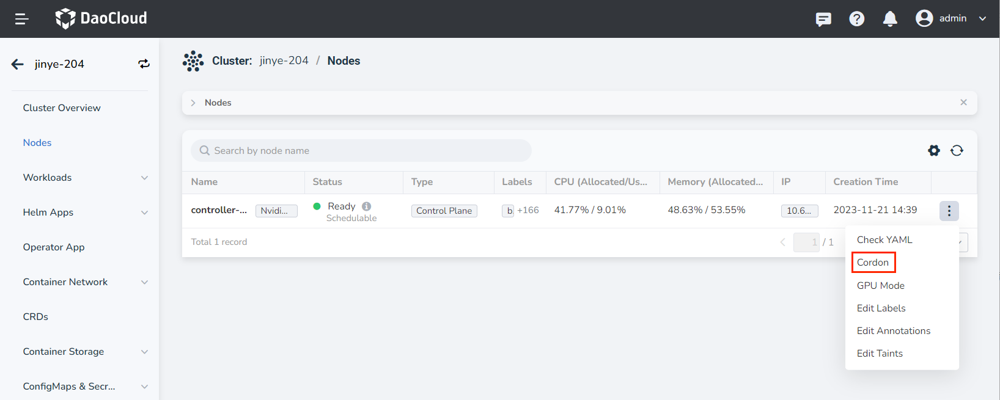
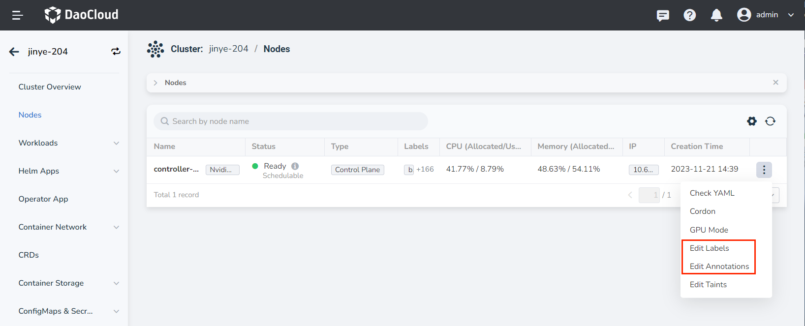
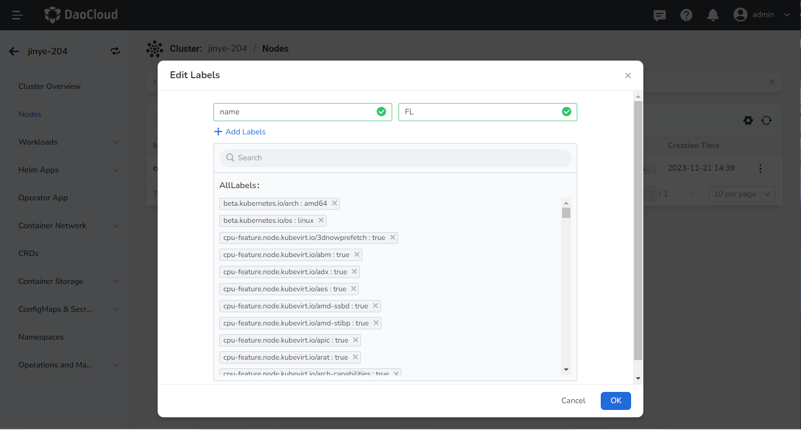

---
hide:
  - toc
MTPE: FanLin
Date: 2024-02-27
---

# Labels and Annotations

Labels are identifying key-value pairs added to Kubernetes objects such as Pods, nodes, and clusters, which can be combined with label selectors to find and filter Kubernetes objects that meet certain conditions. Each key must be unique for a given object.

Annotations, like tags, are key/value pairs, but they do not have identification or filtering features.
Annotations can be used to add arbitrary metadata to nodes.
Annotation keys usually use the format __prefix(optional)/name(required)__ , for example __nfd.node.kubernetes.io/extended-resources__ .
If the prefix is ​​omitted, it means that the annotation key is private to the user.

For more information about labels and annotations, refer to the official Kubernetes documentation [labels and selectors](https://kubernetes.io/docs/concepts/overview/working-with-objects/labels/) Or [Annotations](https://kubernetes.io/docs/concepts/overview/working-with-objects/annotations/).

The steps to add/delete tags and annotations are as follows:

1. On the __Clusters__ page, click the name of the target cluster.

    

2. Click __Nodes__ on the left navigation bar, click the __┇__ operation icon on the right side of the node, and click __Edit Labels__ or __Edit Annotations__ .

    

3. Click __➕ Add__ to add tags or annotations, click __X__ to delete tags or annotations, and finally click __OK__ .

    
