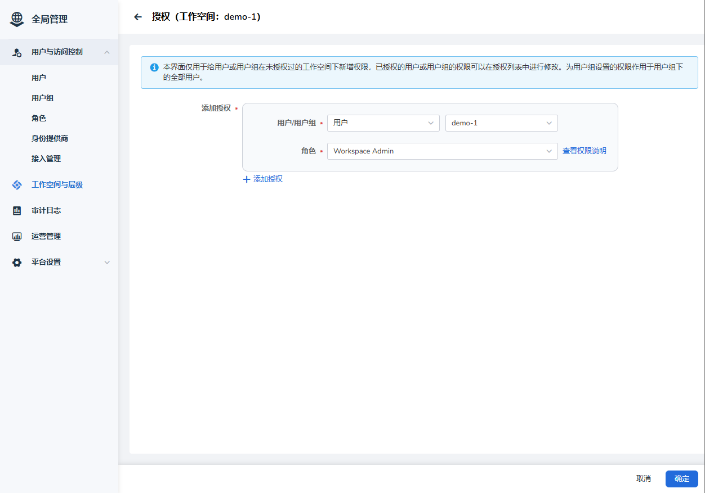

# Binding a Workspace for the User

After a user successfully registers, a workspace needs to be bound to them.

## Prerequisites

- AI platform installed
- [User has successfully registered](index.md)
- An available administrator account

## Steps to Follow

1. Log in to the AI platform as an administrator.
2. Navigate to **Global Management** -> **Workspace and Folder**, and click **Create Workspace**.

    

3. Enter the workspace name, select a folder, and click **OK** to create a workspace.

    

4. Bind resources to the workspace.

    

    On this interface, you can click **Create Namespace** to create a namespace.

5. Add authorization: Assign the user to the workspace.

    
    

6. The user logs in to the AI platform to check if they have permissions for the workspace and namespace. 
   The administrator can perform more actions through the **┇** on the right side.

    

Next step: [Allocate Resources for the Workspace](./wsres.md)
