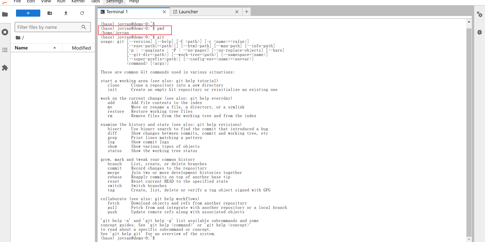
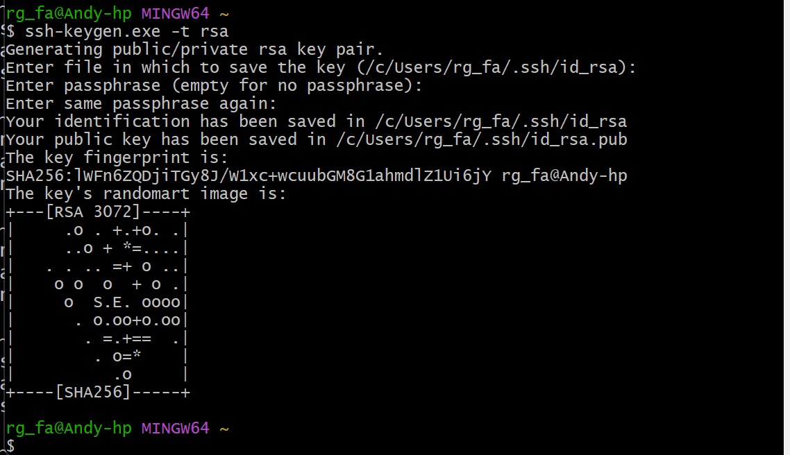
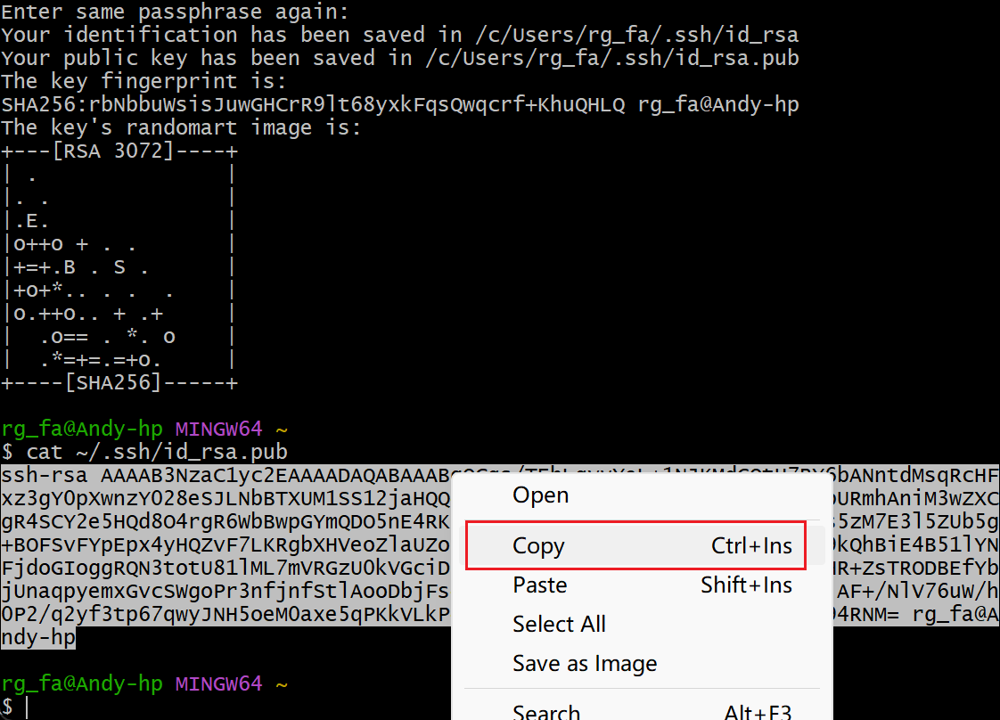
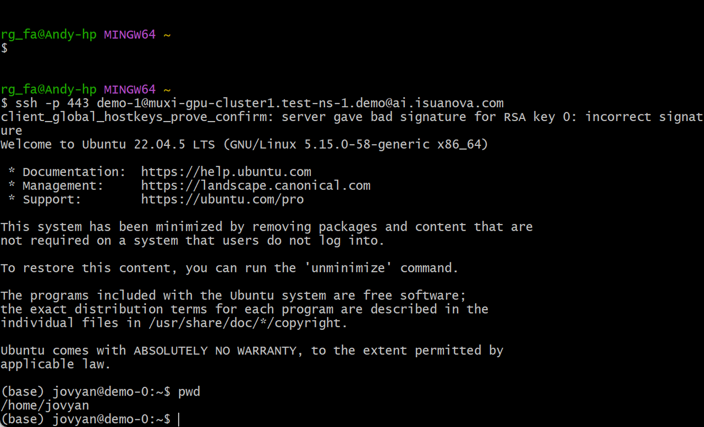

# Using Notebook

Notebook typically refers to Jupyter Notebook or similar interactive computing environments. This is a very popular tool widely used in fields such as data science, machine learning, and deep learning. This page explains how to use Notebook on the Canfeng AI platform.

## Prerequisites

- The AI platform is installed
- [The user has successfully registered](../register/index.md)
- [The administrator has assigned a workspace to the user](../register/bindws.md)
- A dataset (code, data, etc.) is prepared

## Creating and Using Notebook Instances

1. Log in to the AI platform as an **Administrator**.
2. Navigate to **AI Lab** -> **Queue Management**, and click the **Create** button on the right.

 

3. After entering a name, selecting a cluster, workspace, and quota, click **OK**.

  

4. Log in to the AI platform as a **User**, navigate to **AI Lab** -> **Notebook**, and click the **Create** button on the right.

5. After configuring the parameters, click **OK**.

    === "Basic Information"

        Enter a name, select a cluster, namespace, choose the newly created queue, and click **One-click Initialization**.

     

    === "Resource Configuration"

        Select Notebook type, configure memory and CPU, enable GPU, create and configure PVC:

       

    === "Advanced Configuration"

        Enable SSH external access:

       

6. You will be automatically redirected to the Notebook instance list; click the instance name.

7. Enter the Notebook instance details page and click the **Open** button in the upper right corner.

  

8. You will enter the Notebook development environment, where a persistent volume is mounted in the `/home/jovyan` directory. You can clone code using git and upload data after connecting via SSH, etc.

    

## Accessing Notebook Instances via SSH

1. Generate an SSH key pair on your own computer.

    Open the command line on your computer, for example, open git bash on Windows, and enter `ssh-keygen.exe -t rsa`, then press enter until completion.

    

2. Use commands like `cat ~/.ssh/id_rsa.pub` to view and copy the public key.

    

3. Log in to the AI platform as a user, click **Personal Center** in the upper right corner -> **SSH Public Key** -> **Import SSH Public Key**.

4. Go to the details page of the Notebook instance and copy the SSH link.

5. Use SSH to access the Notebook instance from the client.

    

Next step: [Create Training Jobs](../baize/developer/jobs/create.md)
