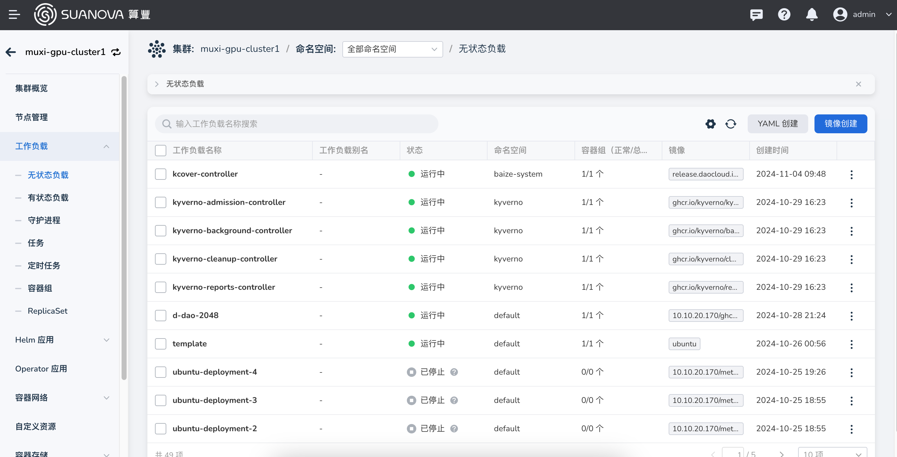
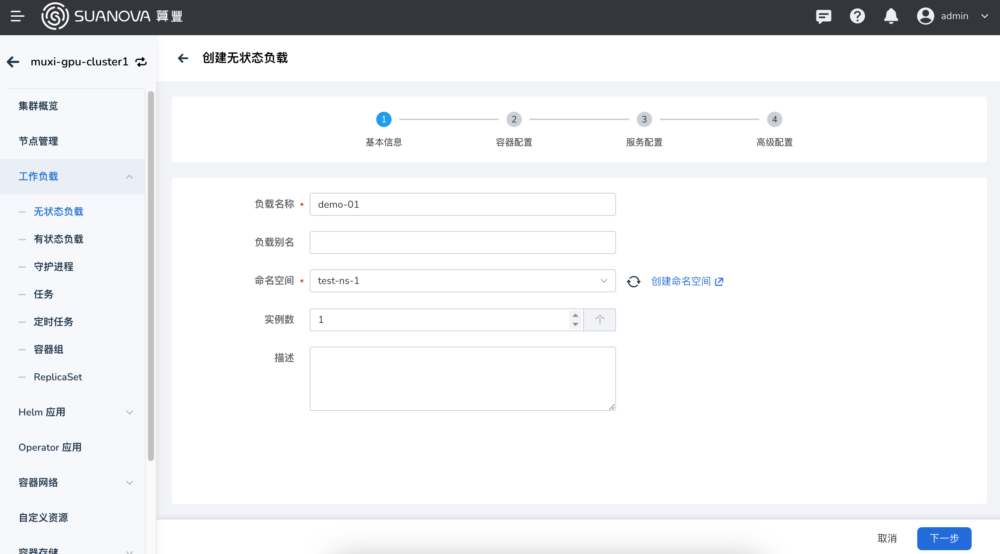
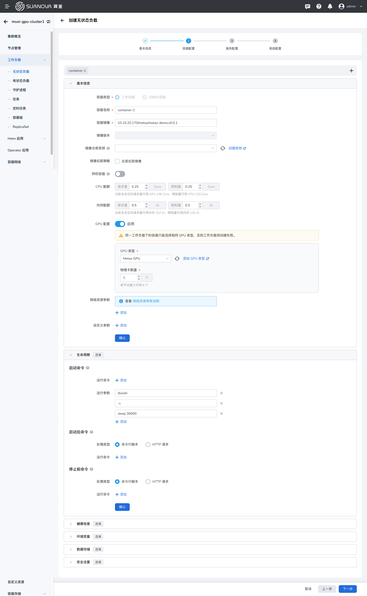
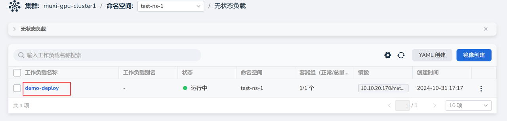
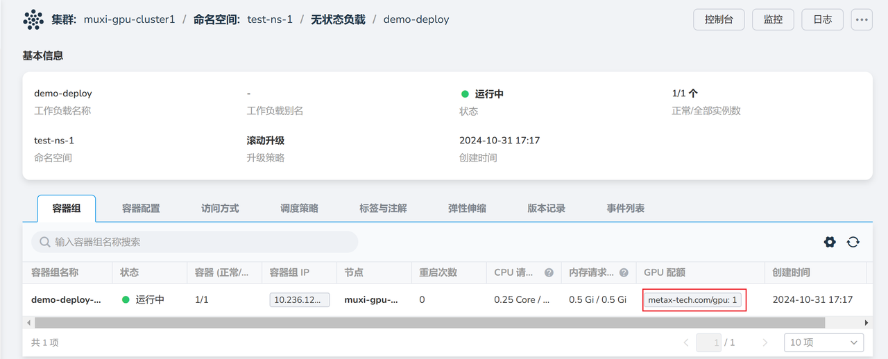

# Creating AI Workloads Using GPU Resources

After the administrator allocates resource quotas for the workspace, users can create AI workloads to utilize GPU computing resources.

## Prerequisites

- The AI platform is installed
- [User has successfully registered](../register/index.md)
- [Administrator has assigned a workspace to the user](../register/bindws.md)
- [Resource quotas have been set for the workspace](./quota.md)
- [A cluster has been created](../k8s/create-k8s.md)

## Steps to Create AI Workloads

1. Log in to the AI platform as a **User**.
2. Navigate to **Container Management**, select a namespace, then click **Workloads** -> **Deployments**, and then click the **Create from Image** button on the right.

    

3. After configuring the parameters, click **OK**.

    === "Basic Information"

        Select your own namespace.

        

    === "Container Configuration"

        Set the image, configure resources such as CPU, memory, and GPU, and set the startup command.

        

    === "Others"

        Service configuration and advanced settings can use default configurations.

4. Automatically return to the stateless workload list and click the workload name.

    

5. Enter the details page to view the GPU quota.

    

6. You can also enter the console and run the `mx-smi` command to check the GPU resources.

    

Next step: [Using Notebook](./notebook.md)
