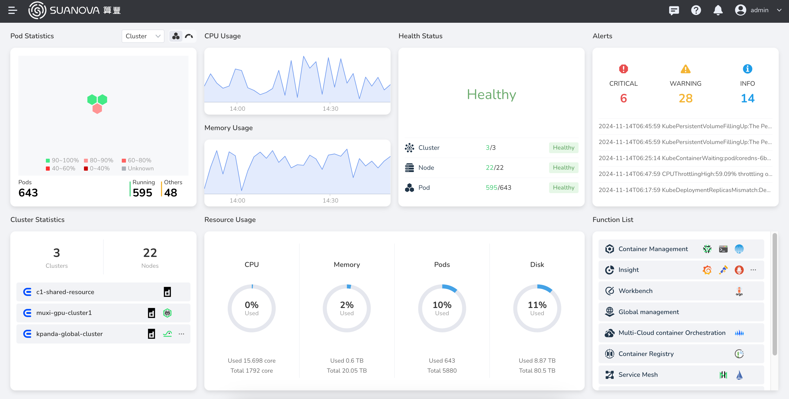

---
hide:
  - toc
---

# Suanova AI Platform - Administrator

This is the operation and maintenance documentation for the Suanova AI Platform aimed at administrators.

- :octicons-fiscal-host-16:{ .lg .middle } __Cloud Host__

    ---

    A cloud host is a virtual machine deployed in the cloud.

    - [Manage Cloud Hosts](./virtnest/vm/create-secret.md)
    - [Cloud Host vGPU](./virtnest/gpu/vm-vgpu.md)
    - [Cloud Host Templates](./virtnest/template/index.md)
    - [Import Cloud Hosts from VMWare](./virtnest/best-practice/import-ubuntu.md)

- :simple-kubernetes:{ .lg .middle } __Container Management__

    ---

    Manage K8s clusters, nodes, applications, resources, and permissions.

    - [Create Cluster](k8s/create-k8s.md)
    - [Add Worker Nodes](k8s/add-node.md)
    - [Manage Helm Apps](./kpanda/helm/README.md)
    - [HPA Horizontal Scaling](./kpanda/scale/create-hpa.md)

- :simple-smart:{ .lg .middle } __AI Lab__

    ---

    Manage AI resources and queues.

    - [Manage Resources](./baize/oam/resource.md)
    - [Manage Queues](./baize/oam/queue/create.md)
    - [Best Practices for AI Training and Deployment](./baize/best-practice/deploy-nfs-in-worker.md)
    - [AI Lab Troubleshooting](./baize/troubleshoot/index.md)

- :fontawesome-solid-diagram-project:{ .lg .middle } __Insight__

    ---

    Understand Insight resources, configuration, and troubleshooting.

    - [Resource Planning Deployment](./insight/quickstart/res-plan/prometheus-res.md)
    - [Install and Upgrade](./insight/quickstart/install/index.md)
    - [Compatibility Test](./insight/compati-test/k8s-compatibility.md)
    - [Frequently Asked Questions](./insight/faq/traceclockskew.md)

- :fontawesome-solid-user:{ .lg .middle } __Global Management__

    ---

    Control access permissions for users, user groups, workspaces, resources, etc.

    - [Bind Workspace](register/bindws.md)
    - [Allocate Resources to Workspaces](register/wsres.md)
    - [Audit Logs](./ghippo/audit/open-audit.md)
    - [Platform Settings](./ghippo/platform-setting/security.md)

