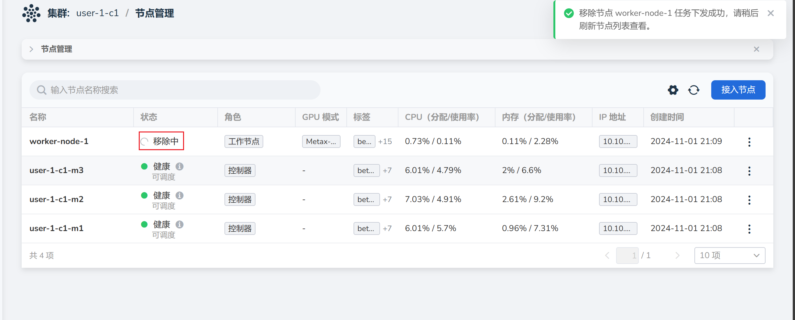

# 移除 GPU 工作节点

GPU 资源的成本相对较高，如果暂时用不到 GPU，可以将带 GPU 的工作节点移除。
以下步骤也同样适用于移除普通工作节点。

## 前置条件

- 已安装 AI 算力平台
- 有一个管理员帐号
- [已创建带 GPU 节点的集群](./create-k8s.md)

## 移除步骤

1. 以 **管理员身份** 登录 AI 算力平台
1. 导航至 **容器管理** -> **集群列表** ，点击目标集群的名称

    

1. 进入集群概览页，点击 **节点管理** ，找到要移除的节点，点击列表右侧的 __┇__ ，在弹出菜单中选择 **移除节点**

    

1. 在弹框中输入节点名称，确认无误后点击 **删除**

    

1. 自动返回节点列表，状态为 **移除中** ，几分钟后刷新页面，节点不在了，说明节点被成功移除

    

1. 从 UI 列表移除节点后，通过 SSH 登录到已移除的节点主机，执行关机命令。

    

!!! tip

    在 UI 上移除节点并将其关机后，节点上的数据并未被立即删除，节点数据会被保留一段时间。
