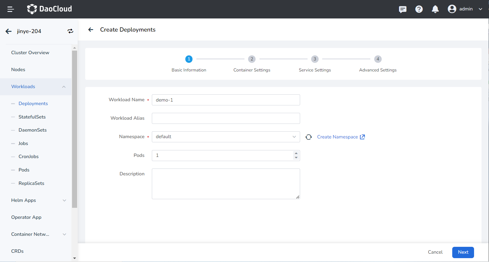
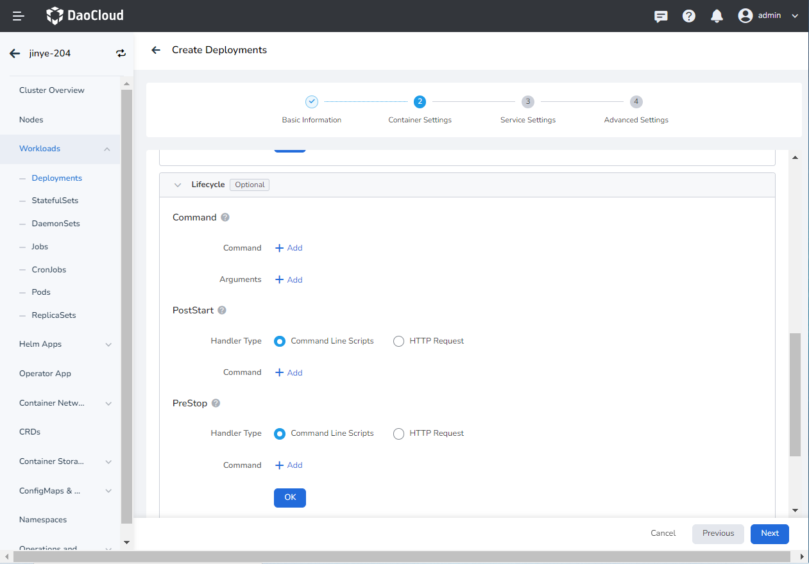
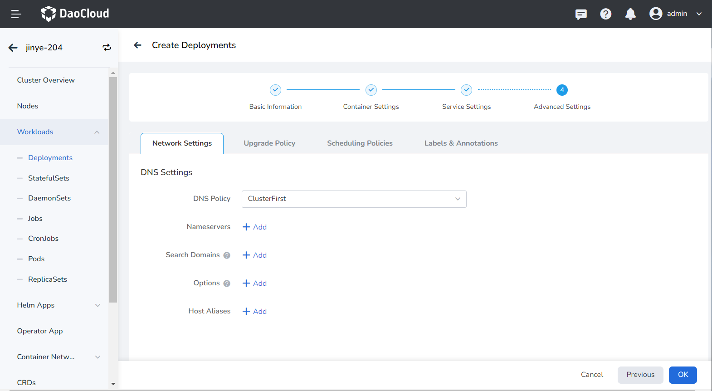
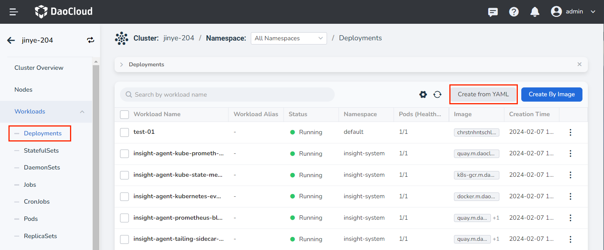

# Create Deployment

This page describes how to create deployments through images and YAML files.

[Deployment](https://kubernetes.io/docs/concepts/workloads/controllers/deployment/) is a common resource in Kubernetes, mainly [Pod](https://kubernetes.io/docs/concepts/workloads/pods/) and [ReplicaSet](https://kubernetes.io/docs/concepts/workloads/controllers/replicaset/) provide declarative updates, support elastic scaling, rolling upgrades, and version rollbacks features. Declare the desired Pod state in the Deployment, and the Deployment Controller will modify the current state through the ReplicaSet to make it reach the pre-declared desired state. Deployment is stateless and does not support data persistence. It is suitable for deploying stateless applications that do not need to save data and can be restarted and rolled back at any time.

Through the container management module of [AI platform](../../../dce/index.md), workloads on multicloud and multiclusters can be easily managed based on corresponding role permissions, including the creation of deployments, Full life cycle management such as update, deletion, elastic scaling, restart, and version rollback.

## Prerequisites

Before using image to create deployments, the following prerequisites need to be met:

- In the [Container Management](../../intro/index.md) module [Access Kubernetes Cluster](../clusters/integrate-cluster.md) or [Create Kubernetes Cluster](../clusters/create-cluster.md), and can access the cluster UI interface.

- Create a [namespace](../namespaces/createns.md) and a [user](../../../ghippo/access-control/user.md).

- The current operating user should have [NS Editor](../permissions/permission-brief.md#ns-editor) or higher permissions, for details, refer to [Namespace Authorization](../namespaces/createns.md).

- When there are multiple containers in a single instance, please make sure that the ports used by the containers do not conflict, otherwise the deployment will fail.

## Create by image

Follow the steps below to create a deployment by image.

1. Click __Clusters__ on the left navigation bar, and then click the name of the target cluster to enter the Cluster Details page.

    

2. On the cluster details page, click __Workloads__ -> __Deployments__ in the left navigation bar, and then click the __Create by Image__ button in the upper right corner of the page.

    

3. Fill in [Basic Information](create-deployment.md#basic-information), [Container Setting](create-deployment.md#container-settings), [Service Setting](create-deployment.md#service-settings), [Advanced Setting](create-deployment.md#advanced-settings) in turn, click __OK__ in the lower right corner of the page to complete the creation.

    The system will automatically return the list of __Deployments__ . Click __┇__ on the right side of the list to perform operations such as update, delete, elastic scaling, restart, and version rollback on the load. If the workload status is abnormal, please check the specific abnormal information, refer to [Workload Status](../workloads/pod-config/workload-status.md).

    

### Basic information

- Workload Name: can contain up to 63 characters, can only contain lowercase letters, numbers, and a separator ("-"), and must start and end with a lowercase letter or number, such as deployment-01. The name of the same type of workload in the same namespace cannot be repeated, and the name of the workload cannot be changed after the workload is created.
- Namespace: Select the namespace where the newly created payload will be deployed. The default namespace is used by default. If you can't find the desired namespace, you can go to [Create a new namespace](../namespaces/createns.md) according to the prompt on the page.
- Pods: Enter the number of Pod instances for the load, and one Pod instance is created by default.
- Description: Enter the description information of the payload and customize the content. The number of characters cannot exceed 512.



### Container settings

Container setting is divided into six parts: basic information, life cycle, health check, environment variables, data storage, and security settings. Click the tab below to view the requirements of each part.

> Container setting is only configured for a single container. To add multiple containers to a pod, click __+__ on the right to add multiple containers.

=== "Basic Information (Required)"

    When configuring container-related parameters, it is essential to correctly fill in the container name and image parameters; 
    otherwise, you will not be able to proceed to the next step. 
    After filling in the configuration according to the following requirements, click __OK__.

    
    
    - Container Type: The default is `Work Container`. For information on init containers, see the [K8s Official Documentation]
     (https://kubernetes.io/docs/concepts/workloads/pods/init-containers/).
    - Container Name: No more than 63 characters, supporting lowercase letters, numbers, and separators ("-"). 
      It must start and end with a lowercase letter or number, for example, nginx-01.
    - Image:
        - Image: Select an appropriate image from the list. When entering the image name, the default is to pull the image 
         from the official [DockerHub](https://hub.docker.com/).
          After integrating the [Image Repository](../../../kangaroo/intro/index.md) module of AI platform, 
          you can click the __Choose an image__ button on the right to choose an image.
        - Image Version: Select an appropriate version from the dropdown list.
        - Image Pull Policy: By checking __Always pull the image__, the image will be pulled from the repository each time 
          the workload restarts/upgrades.
          If unchecked, it will only pull the local image, and will pull from the repository only if the image does not exist locally.
          For more details, refer to [Image Pull Policy](https://kubernetes.io/docs/concepts/containers/images/#image-pull-policy).
        - Registry Secret: Optional. If the target repository requires a Secret to access, you need to [create secret](../configmaps-secrets/create-secret.md) first.
    - Privileged Container: By default, the container cannot access any device on the host. After enabling the privileged container, 
      the container can access all devices on the host and has all the privileges of running processes on the host.
    - CPU/Memory Request: The request value (the minimum resource needed) and the limit value (the maximum resource allowed) 
      for CPU/memory resources. Configure resources for the container as needed to avoid resource waste and system failures 
      caused by container resource overages. Default values are shown in the figure.
    - GPU Configuration: Configure GPU usage for the container, supporting only positive integers. 
      The GPU quota setting supports configuring the container to exclusively use an entire GPU card or part of a vGPU.
      For example, for a GPU card with 8 cores, entering the number __8__ means the container exclusively uses the entire card, 
      and entering the number __1__ means configuring 1 core of the vGPU for the container.
    
    > Before setting the GPU, the administrator needs to pre-install the GPU card and driver plugin on the cluster node 
      and enable the GPU feature in the [Cluster Settings](../clusterops/cluster-settings.md).

=== "Lifecycle (optional)"

    Set the commands that need to be executed when the container starts, after starting, and before stopping. For details, refer to [Container Lifecycle Setting](pod-config/lifecycle.md).

    

=== "Health Check (optional)"

    It is used to judge the health status of containers and applications, which helps to improve the availability of applications. For details, refer to [Container Health Check Setting](pod-config/health-check.md).
    
        

=== "Environment variables (optional)"

    Configure container parameters within the Pod, add environment variables or pass setting to the Pod, etc. For details, refer to [Container environment variable setting](pod-config/env-variables.md).

    

=== "Data storage (optional)"

    Configure the settings for container mounting data volumes and data persistence. For details, refer to [Container Data Storage Setting](pod-config/env-variables.md).

    

=== "Security settings (optional)"

    Containers are securely isolated through Linux's built-in account authority isolation mechanism. You can limit container permissions by using account UIDs (digital identity tokens) with different permissions. For example, enter __0__ to use the privileges of the root account.
    
    

### Service settings

Configure [Service](../network/create-services.md) for the deployment, so that the deployment can be accessed externally.

1. Click the __Create Service__ button.

    

2. Refer to [Create Service](../network/create-services.md) to configure service parameters.

    

3. Click __OK__ and click __Next__ .

### Advanced settings

Advanced setting includes four parts: Network Settings, Upgrade Policy, Scheduling Policies, Labels and Annotations. You can click the tabs below to view the setting requirements of each part.

=== "Network Settings"

    1. For container NIC setting, refer to [Workload Usage IP Pool](../../../network/config/use-ippool/usage.md)
    2. DNS setting

    In some cases, the application will have redundant DNS queries. Kubernetes provides DNS-related setting options for applications, which can effectively reduce redundant DNS queries and increase business concurrency in certain cases.
    
    - DNS Policy
    
        - Default: Make container use kubelet's __-The domain name resolution file pointed to by the -resolv-conf__ parameter. This setting can only resolve external domain names registered on the Internet, but cannot resolve cluster internal domain names, and there is no invalid DNS query.
        - ClusterFirstWithHostNet: The domain name file of the host to which the application is connected.
        - ClusterFirst: application docking with Kube-DNS/CoreDNS.
        - None: New option value introduced in Kubernetes v1.9 (Beta in v1.10). After setting to None, dnsConfig must be set. At this time, the domain name resolution file of the container will be completely generated through the setting of dnsConfig.
    
    - Nameservers: fill in the address of the domain name server, such as __10.6.175.20__ .
    - Search domains: DNS search domain list for domain name query. When specified, the provided search domain list will be merged into the search field of the domain name resolution file generated based on dnsPolicy, and duplicate domain names will be deleted. Kubernetes allows up to 6 search domains.
    - Options: Setting options for DNS, where each object can have a name attribute (required) and a value attribute (optional). The content in this field will be merged into the options field of the domain name resolution file generated based on dnsPolicy. If some options of dnsConfig options conflict with the options of the domain name resolution file generated based on dnsPolicy, they will be overwritten by dnsConfig.
    - Host Alias: the alias set for the host.

    

=== "Upgrade Policy"

    - Upgrade Mode: __Rolling upgrade__ refers to gradually replacing instances of the old version with instances of the new version. During the upgrade process, business traffic will be load-balanced to the old and new instances at the same time, so the business will not be interrupted. __Rebuild and upgrade__ refers to deleting the workload instance of the old version first, and then installing the specified new version. During the upgrade process, the business will be interrupted.
    - Max Unavailable: Specify the maximum value or ratio of unavailable pods during the workload update process, the default is 25%. If it is equal to the number of instances, there is a risk of service interruption.
    - Max Surge: The maximum or ratio of the total number of Pods exceeding the desired replica count of Pods during a Pod update. Default is 25%.
    - Revision History Limit: Set the number of old versions retained when the version is rolled back. The default is 10.
    - Minimum Ready: The minimum time for a Pod to be ready. Only after this time is the Pod considered available. The default is 0 seconds.
    - Upgrade Max Duration: If the deployment is not successful after the set time, the workload will be marked as failed. Default is 600 seconds.
    - Graceful Period: The execution period (0-9,999 seconds) of the command before the workload stops, the default is 30 seconds.

    

=== "Scheduling Policies"

    - Toleration time: When the node where the workload instance is located is unavailable, the time for rescheduling the workload instance to other available nodes, the default is 300 seconds.
    - Node Affinity: According to the label on the node, constrain which nodes the Pod can be scheduled on.
    - Workload Affinity: Constrains which nodes a Pod can be scheduled to based on the labels of the Pods already running on the node.
    - Workload Anti-affinity: Constrains which nodes a Pod cannot be scheduled to based on the labels of Pods already running on the node.
    
    > For details, refer to [Scheduling Policy](pod-config/scheduling-policy.md).

    

=== "Labels and Annotations"

    You can click the __Add__ button to add tags and annotations to workloads and pods.
    
    

## Create from YAML

In addition to image, you can also create deployments more quickly through YAML files.

1. Click __Clusters__ on the left navigation bar, and then click the name of the target cluster to enter the Cluster Details page.

    

2. On the cluster details page, click __Workloads__ -> __Deployments__ in the left navigation bar, and then click the __Create from YAML__ button in the upper right corner of the page.

    

3. Enter or paste the YAML file prepared in advance, click __OK__ to complete the creation.

    

??? note "Click to see an example YAML for creating a deployment"

    ```yaml
     apiVersion: apps/v1
     kind: Deployment
     metadata:
       name: nginx-deployment
     spec:
       selector:
         matchLabels:
           app: nginx
       replicas: 2 # (1)!
       template:
         metadata:
           labels:
             app: nginx
         spec:
           containers:
           -name: nginx
             image: nginx:1.14.2
             ports:
             - containerPort: 80
    ```

    1. Tell the Deployment to run 2 Pods that match this template
