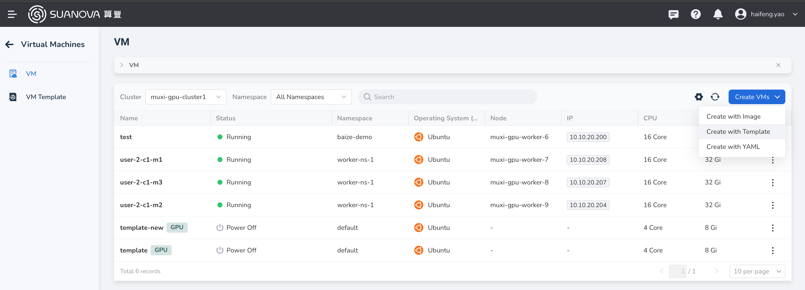
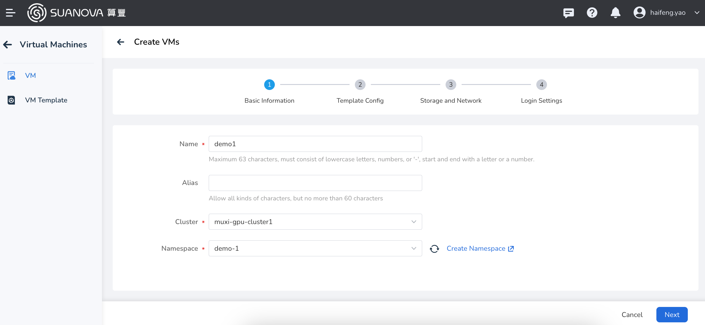
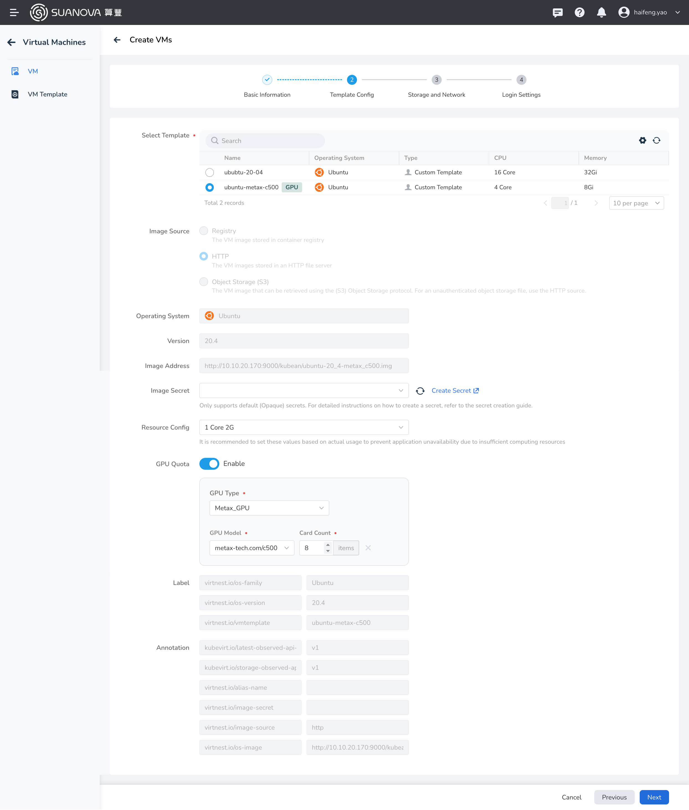
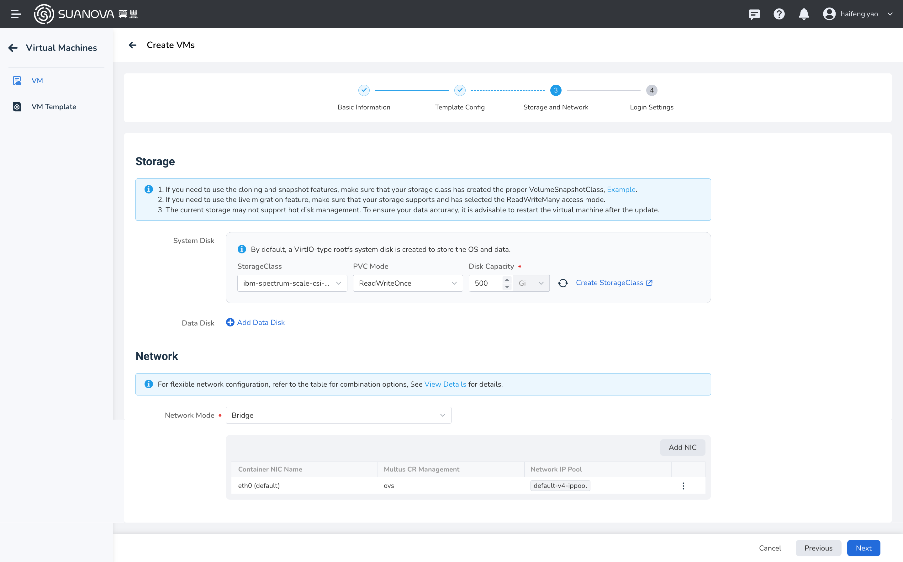
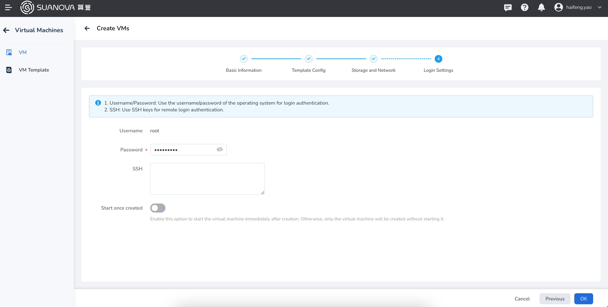

# Creating and Starting a Cloud Host

Once the user completes registration and is assigned a workspace, namespace, and resources, they can create and start a cloud host.

## Prerequisites

- The AI platform is installed
- [User has successfully registered](../register/index.md)
- Administrator has bound the workspace to the user
- Administrator has allocated resources for the workspace

## Steps to Operate

1. User logs into the AI platform.
2. Click **Create Cloud Host** -> **Create from Template**.

    

3. After defining the configurations for the cloud host, click **Next**.

    === "Basic Configuration"

        

    === "Template Configuration"

        

    === "Storage and Network"

        

4. After configuring the root password or SSH key, click **OK**.

    

5. Return to the host list and wait for the status to change to **Running**. Then, you can start the host using the **┇** button on the right.

    

Next step: [Using the Cloud Host](./usehost.md)
