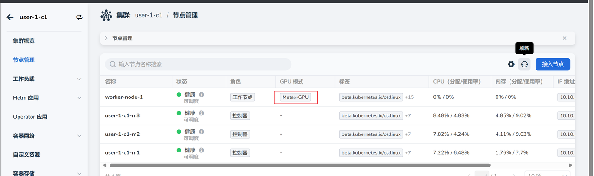

# Adding Worker Nodes

If there are not enough nodes, you can add more nodes to the cluster.

## Prerequisites

- The AI platform is installed
- An administrator account is available
- [A cluster with GPU nodes has been created](./create-k8s.md)
- [A cloud host has been prepared](../host/createhost.md)

## Steps to Add Nodes

1. Log into the AI platform as an **administrator**.
2. Navigate to **Container Management** -> **Clusters**, and click on the name of the target cluster.

    

3. On the cluster overview page, click on **Nodes**, then click the **Add Node** button on the right.

    

4. Follow the wizard to fill in the parameters and click **OK**.

    === "Basic Information"

        

    === "Parameter Configuration"

        

5. In the pop-up window, click **OK**.

    

6. Return to the node list; the status of the newly added node will be **Connecting**. After a few minutes, when the status changes to **Running**, it indicates that the connection was successful.

    

!!! tip

    For newly connected nodes, it may take an additional 2-3 minutes to recognize the GPU.
