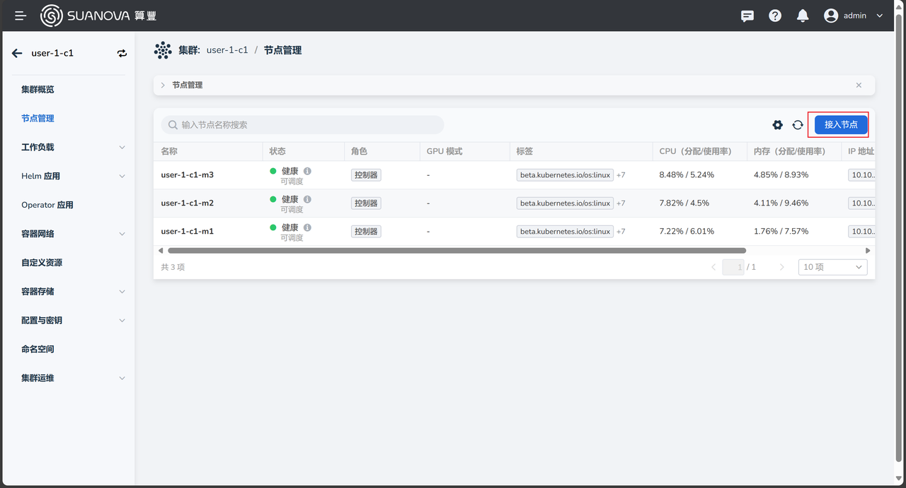
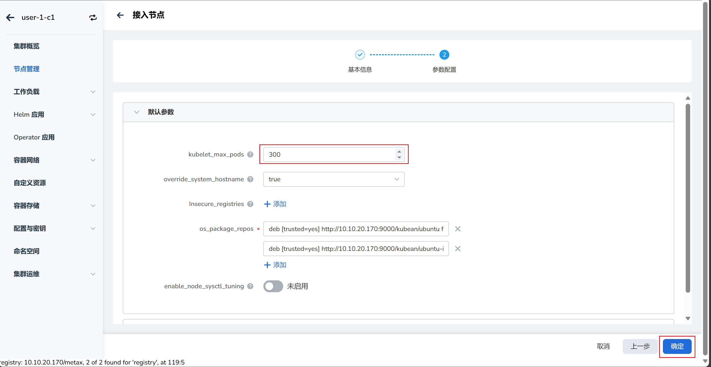
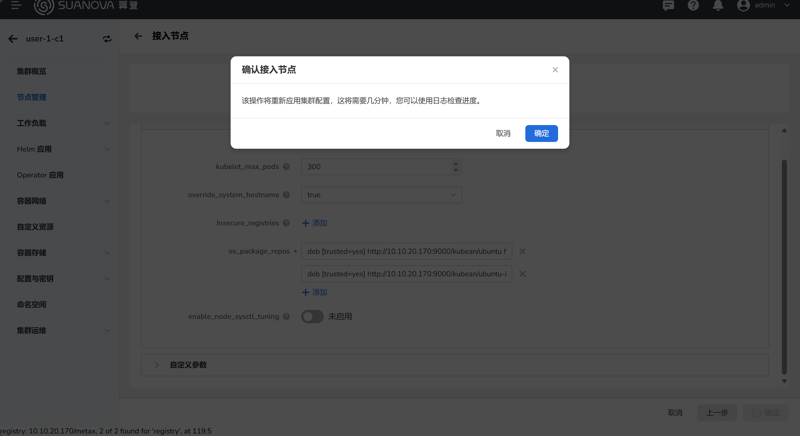

# 添加工作节点

如果节点不够用了，可以添加更多节点到集群中。

## 前置条件

- 已安装 AI 算力平台
- 有一个管理员帐号
- [已创建带 GPU 节点的集群](./create-k8s.md)
- [准备一台云主机](../host/createhost.md)

## 添加步骤

1. 以 **管理员身份** 登录 AI 算力平台
1. 导航至 **容器管理** -> **集群列表** ，点击目标集群的名称

    

1. 进入集群概览页，点击 **节点管理** ，点击右侧的 **接入节点** 按钮

    

1. 按照向导，填写各项参数后点击 **确定**

    === "基本信息"

        

    === "参数配置"

        

1. 在弹窗中点击 **确定**

    

1. 返回节点列表，新接入的节点状态为 **接入中** ，等待几分钟后状态变为 **健康** 则表示接入成功。

    

!!! tip

    对于刚接入成功的节点，可能还要等 2-3 分钟才能识别出 GPU。
