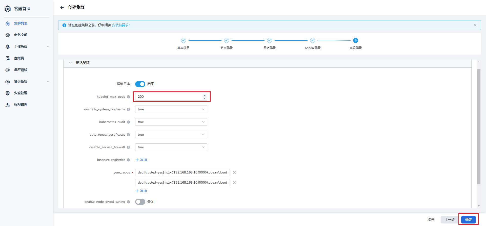
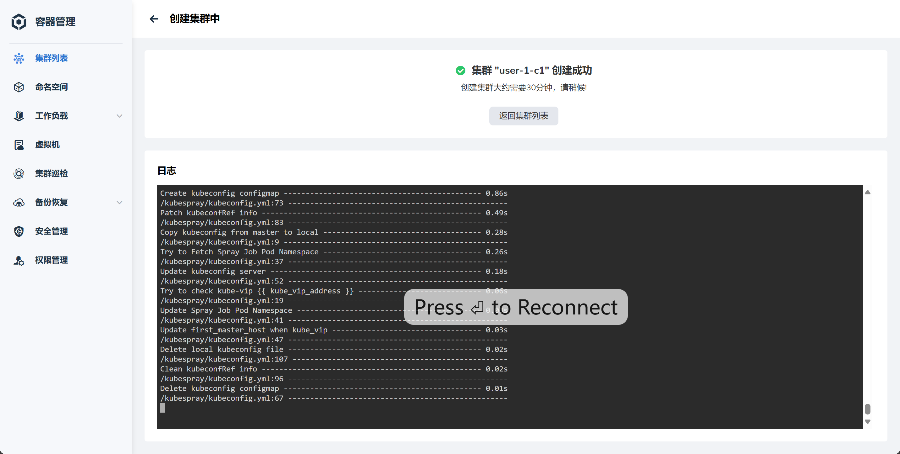
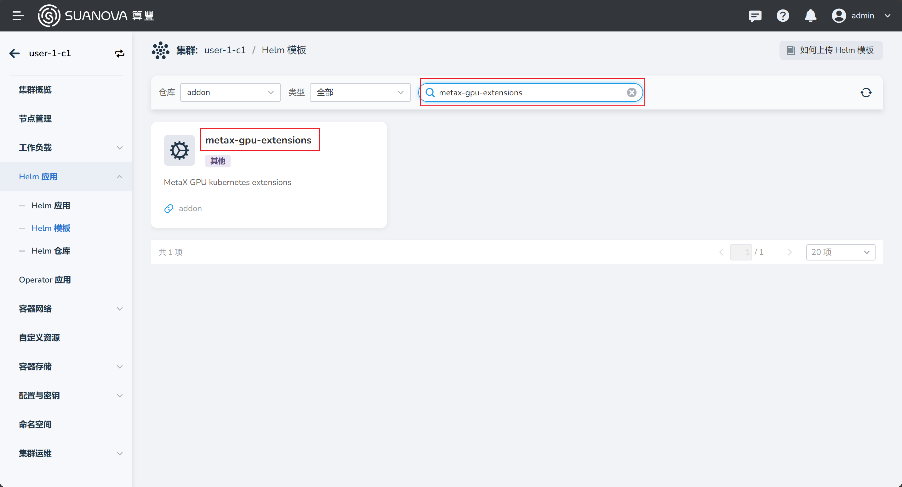
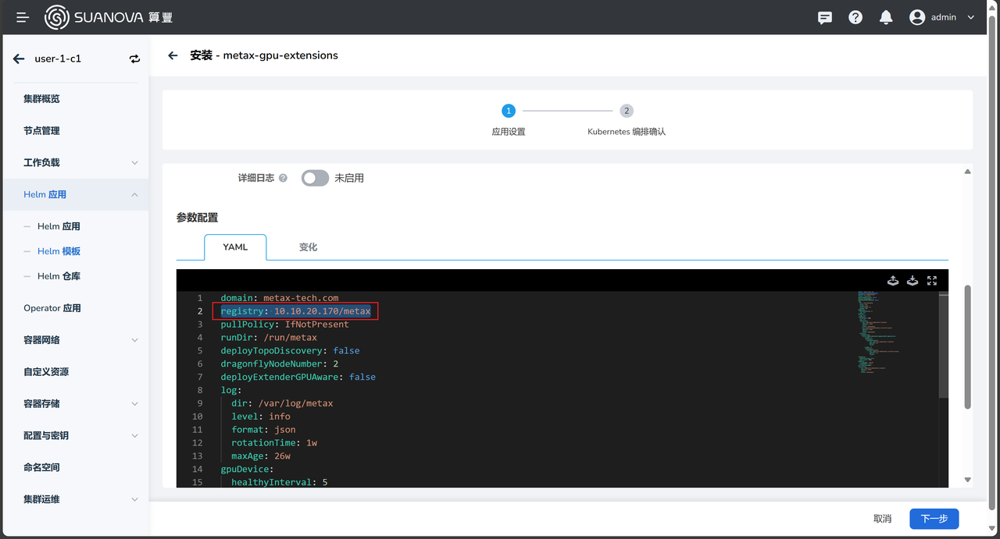
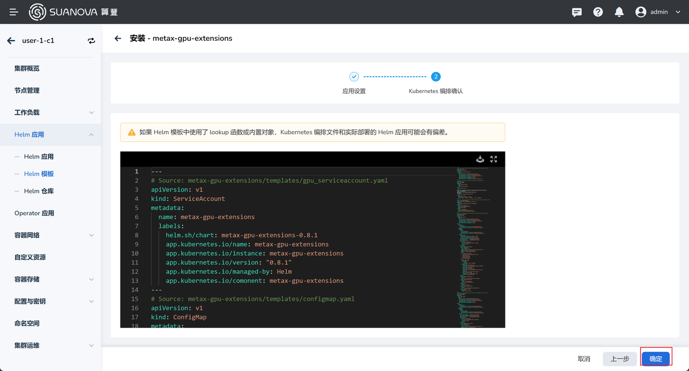
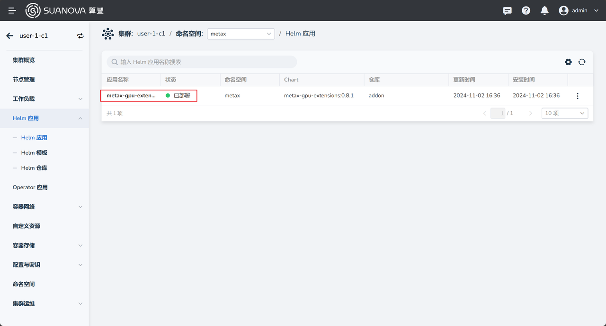
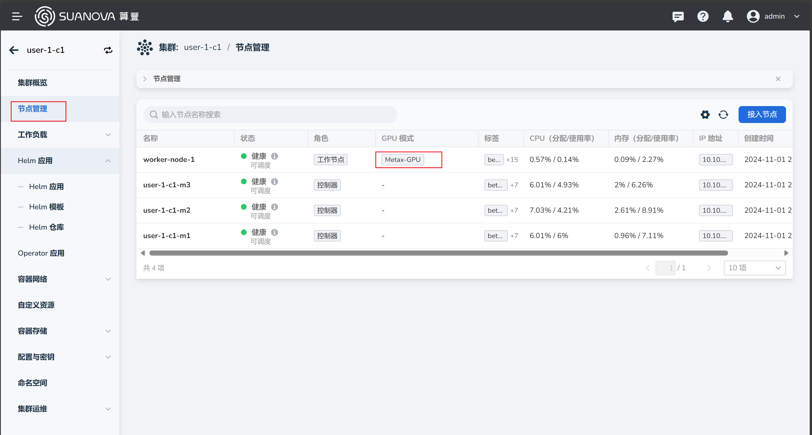

# Creating a Kubernetes Cluster in the Cloud

Deploying a Kubernetes cluster is aimed at supporting efficient AI computing resource scheduling and management, achieving elastic scaling, providing high availability, and optimizing the model training and inference processes.

## Prerequisites

- The AI platform is installed
- An administrator account is available
- A physical machine with a GPU is prepared
- Two segments of IP addresses are allocated (Pod CIDR 18 bits, SVC CIDR 18 bits, must not conflict with existing networks)

## Steps to Create

1. Log into the AI platform as an **administrator**.
2. [Create and launch 3 cloud hosts without GPU](../host/createhost.md) to serve as Master nodes for the cluster.

    - Configure resources: 16 CPU cores, 32 GB RAM, 200 GB system disk (ReadWriteOnce)
    - Select **Bridge** network mode
    - Set the root password or add an SSH public key for SSH connection
    - Record the IPs of the 3 hosts

3. Navigate to **Container Management** -> **Clusters**, and click the **Create Cluster** button on the right.
4. Follow the wizard to configure various parameters of the cluster.

    === "Basic Information"

        

    === "Node Configuration"

        After configuring the node information, click **Start Check**.

        

        

    === "Network Configuration"

        

    === "Addon Configuration"

        

    === "Advanced Configuration"

        Each node can run 110 Pods (container groups) by default. If the node configuration is higher, it can be adjusted to 200 or 300 Pods.

        

5. Wait for the cluster creation to complete.

    

6. In the cluster list, find the newly created cluster, click on the cluster name, navigate to **Helm Apps** -> **Helm Charts**, and search for metax-gpu-extensions in the search box, then click the card.

    

    

7. Click the **Install** button on the right to start installing the GPU plugin.

    === "Application Settings"

        Enter a name, select a namespace, and modify the image address in the YAML:

        

    === "Kubernetes Orchestration Confirmation"

        

8. Automatically return to the Helm application list and wait for the status of metax-gpu-extensions to change to **Deployed**.

    

9. At this point, the cluster has been successfully created. You can check the nodes included in the cluster. You can now [create AI workloads and use GPUs](../share/workload.md).

    

Next step: [Create AI Workloads](../share/workload.md)
