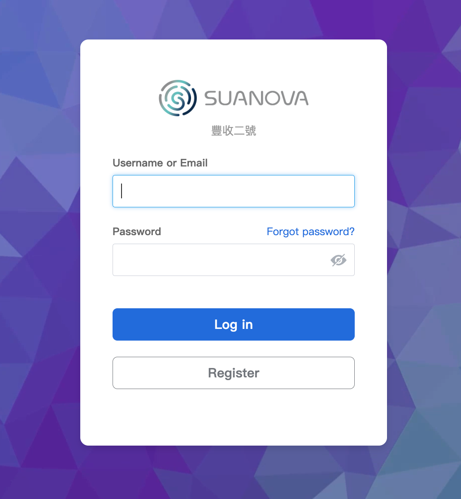
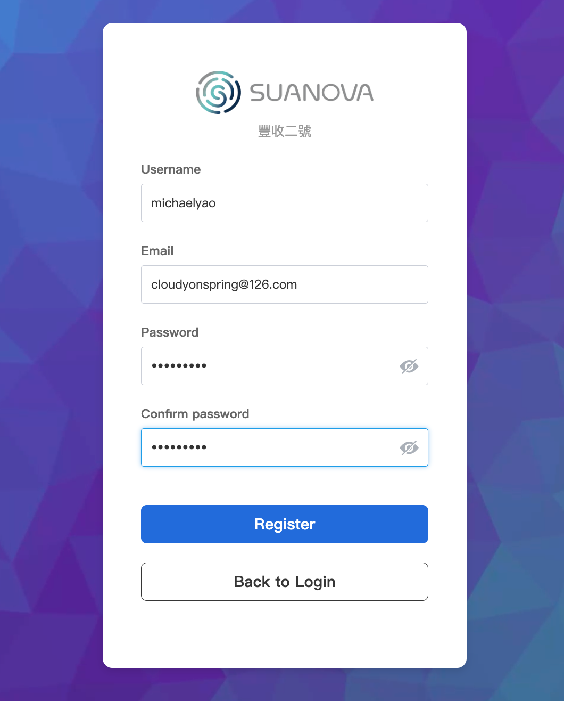
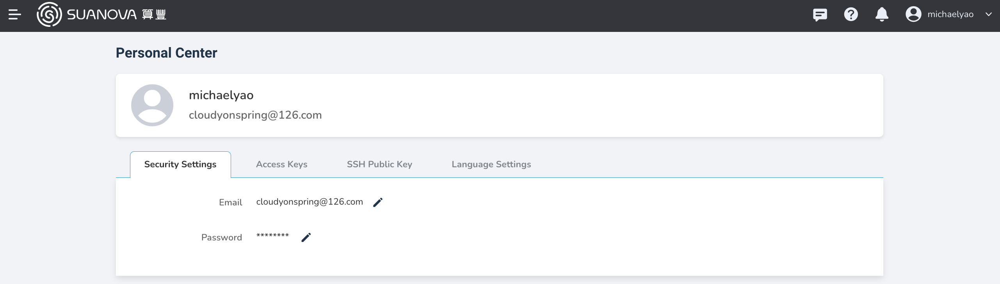

# User Registration

New users need to register when using the AI platform for the first time.

## Prerequisites

- The AI platform is installed
- Email registration functionality is enabled
- An available email address

## Email Registration Steps

1. Open the AI platform homepage at <https://ai.isuanova.com/> and click **Register**.

    

2. Enter your username, password, and email, then click **Register**.

    

3. The system will prompt that an email has been sent to your inbox.

    

4. Log into your email, find the email, and click the link.

    

5. Congratulations, you have successfully accessed the AI platform and can now start your AI journey.

    
