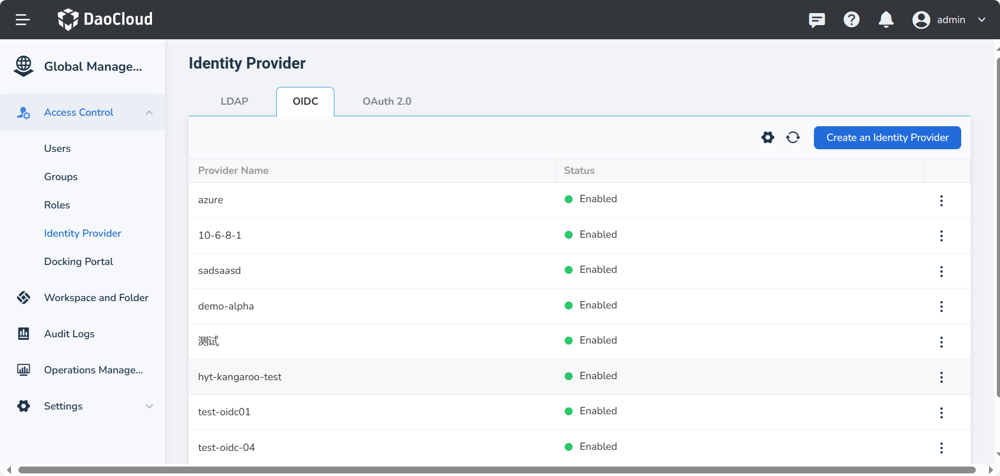
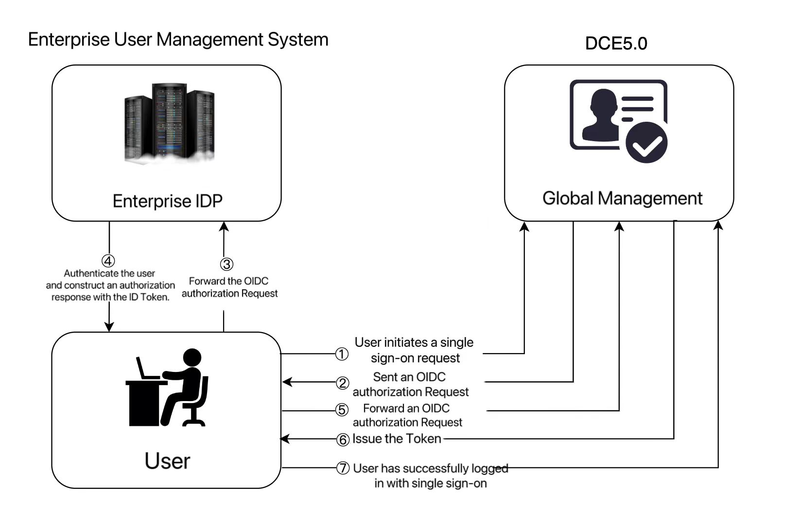

# Create and Manage OIDC

OIDC (OpenID Connect) is an identity layer based on OAuth 2.0 and an identity authentication standard protocol based on the OAuth2 protocol.

If your enterprise or organization already has its own account system, and your enterprise user
management system supports the OIDC protocol, you can use the OIDC protocol-based identity provider
feature provided by the Global Management instead of creating usernames/passwords for each member in AI platform.
You can grant permissions to use AI platform resources to these external user identities.

The specific operation steps are as follows.

1. Log in to AI platform as a user with __admin__ role. Click __Global Management__ -> __Access Control__ at the bottom of the left navigation bar.

    

2. On the left nav bar select __Identity Provider__ , click __OIDC__ -> __Create an Identity Provider__

    

3. After completing the form fields and establishing a trust relationship with the identity provider, click __Save__ .

    

    | Fields | Descriptions |
    | ------ | ------------ |
    | Provider Name | displayed on the login page and is the entry point for the identity provider |
    | Authentication Method | Client authentication method. If the JWT is signed with a private key, select __JWT signed with private key__ from the dropdown. For details, refer to [Client Authentication](https://openid.net/specs/openid-connect-core-1_0.html#ClientAuthentication). |
    | Client ID | Client ID |
    | Client Secret | Client Secret |
    | Client URL | One-click access to login URL, Token URL, user information URL and logout URL through the identity provider's well-known interface |
    | Auto-associate | After it is turned on, when the identity provider username/email is duplicated with the AI platform username/email, the two will be automatically associated |

!!! note

    1. After the user completes the first login to AI platform through the enterprise user management system,
       the user information will be synchronized to __Access Control__ -> __User List__ of AI platform.
    1. Users who log in for the first time will not be given any default permissions and need to be authorized
       by an administrator (the administrator can be a platform administrator, submodule administrator 
       or resource administrator).
    1. For practical tutorials, please refer to [OIDC Operation Video Tutorials](../../../videos/ghippo.md#oidc),
       or refer to [Azure OpenID Connect (OIDC) Access Process](https://learn.microsoft.com/en-us/azure/active-directory/develop/v2-protocols-oidc).

## User identity authentication interaction process

The interactive process of user authentication is as follows:

1. Use a browser to initiate a single sign-on request for AI platform.
1. According to the information carried in the login link, AI platform searches for the proper configuration information
   in __Global Management__ -> __Access Control__ -> __Identity Provider__ , constructs an OIDC
   authorization Request, and sends it to the browser.
1. After the browser receives the request, it forwards the OIDC authorization Request to the enterprise IdP.
1. Enter the username and password on the login page of the enterprise IdP. The enterprise IdP verifies
   the provided identity information, constructs an ID token carrying user information, and sends an
   OIDC authorization response to the browser.
1. After the browser responds, it forwards the OIDC authorization Response to AI platform.
1. AI platform takes the ID Token from the OIDC Authorization Response, maps it to a specific user list
   according to the configured identity conversion rules, and issues the Token.
1. Complete single sign-on to access AI platform.
