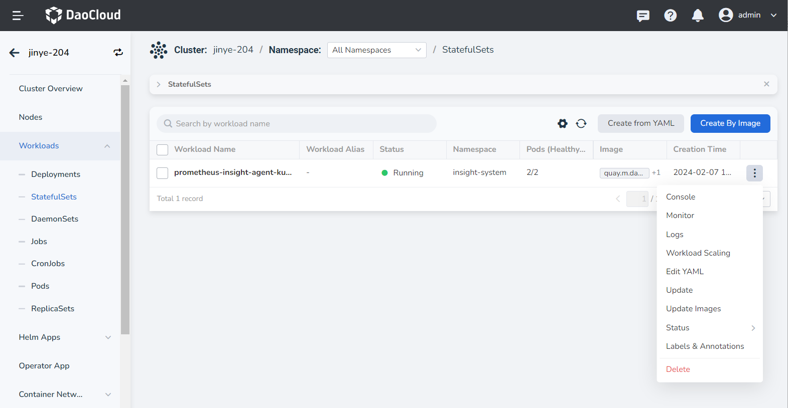
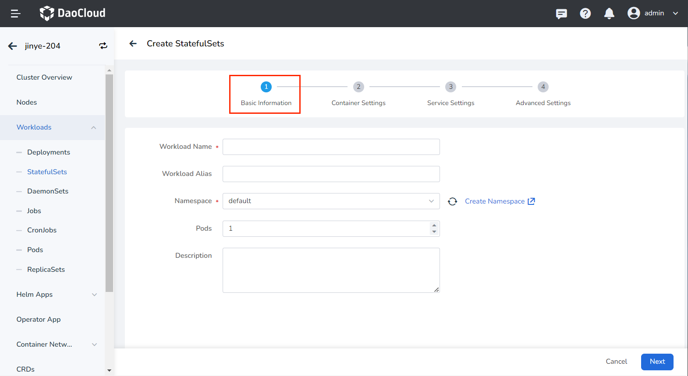
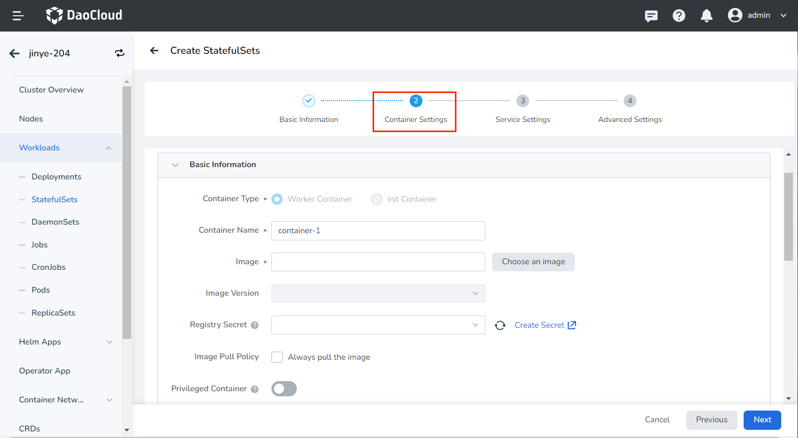
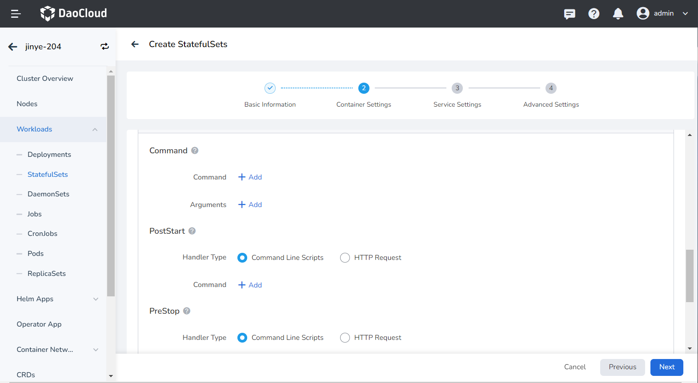
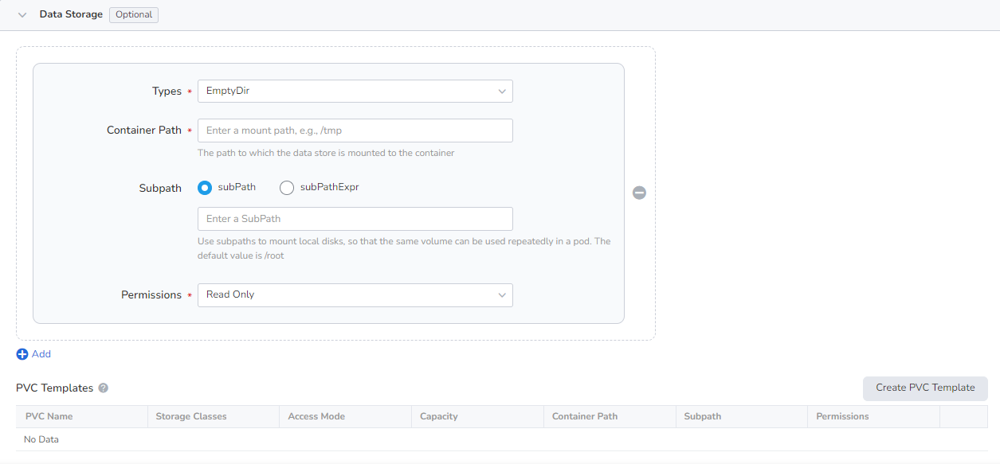
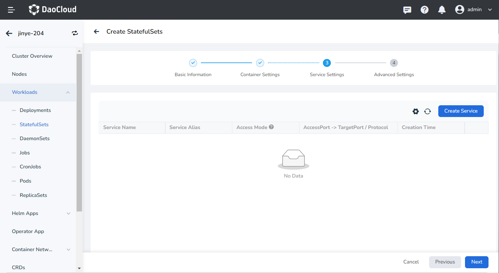
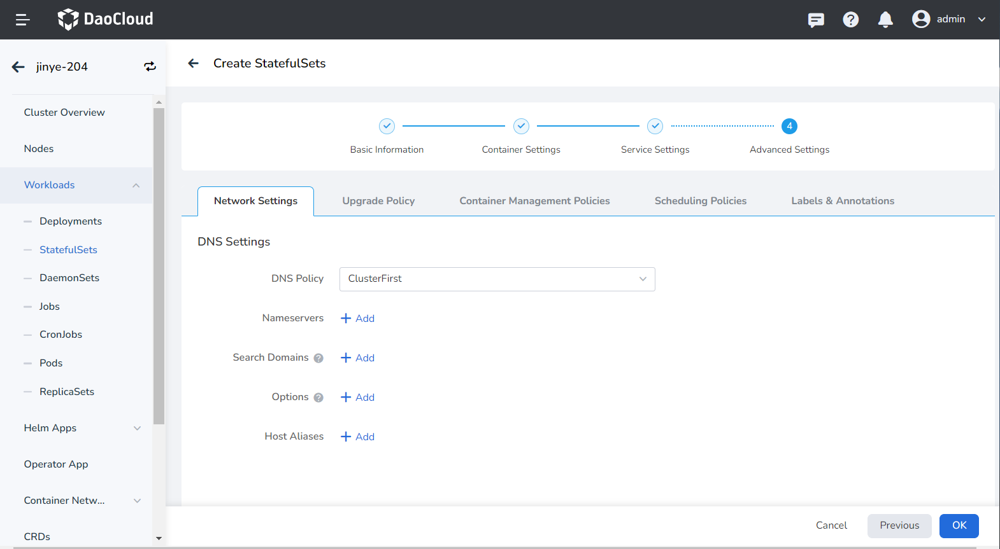
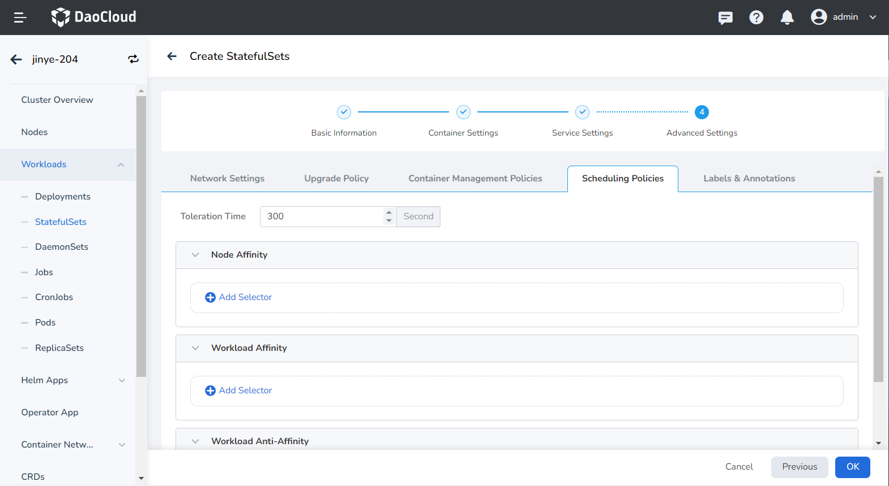
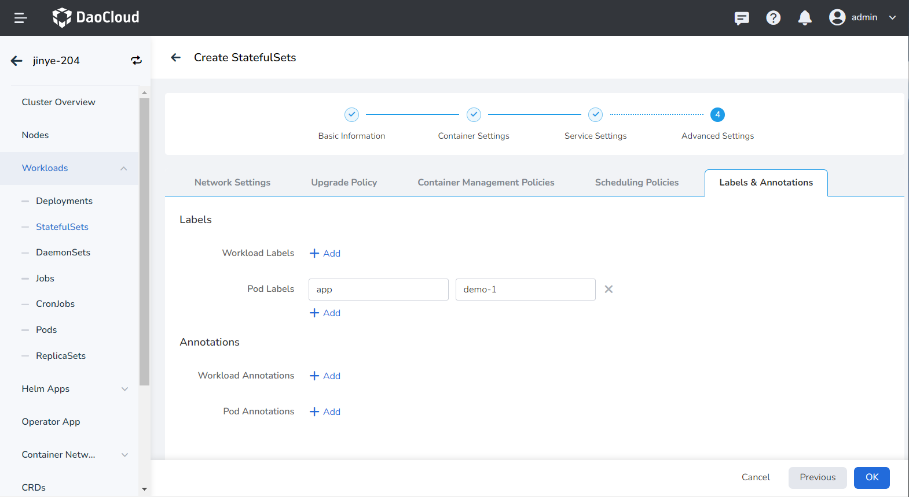

# Create StatefulSet

This page describes how to create a StatefulSet through image and YAML files.

[StatefulSet](https://kubernetes.io/docs/concepts/workloads/controllers/statefulset/) is a common resource in Kubernetes, and [Deployment](create-deployment.md), mainly used to manage the deployment and scaling of Pod collections. The main difference between the two is that Deployment is stateless and does not save data, while StatefulSet is stateful and is mainly used to manage stateful applications. In addition, Pods in a StatefulSet have a persistent ID, which makes it easy to identify the corresponding Pod when matching storage volumes.

Through the container management module of [AI platform](../../../dce/index.md), workloads on multicloud and multiclusters can be easily managed based on corresponding role permissions, including the creation of StatefulSets, update, delete, elastic scaling, restart, version rollback and other full life cycle management.

## Prerequisites

Before using image to create StatefulSets, the following prerequisites need to be met:

- In the [Container Management](../../intro/index.md) module [Access Kubernetes Cluster](../clusters/integrate-cluster.md) or [Create Kubernetes Cluster](../clusters/create-cluster.md), and can access the cluster UI interface.

- Create a [namespace](../namespaces/createns.md) and a [user](../../../ghippo/user-guide/access-control/user.md).

- The current operating user should have [NS Editor](../permissions/permission-brief.md#ns-editor) or higher permissions, for details, refer to [Namespace Authorization](../namespaces/createns.md).

- When there are multiple containers in a single instance, please make sure that the ports used by the containers do not conflict, otherwise the deployment will fail.

## Create by image

Follow the steps below to create a statefulSet using image.

1. Click __Clusters__ on the left navigation bar, then click the name of the target cluster to enter Cluster Details.

    

2. Click __Workloads__ -> __StatefulSets__ in the left navigation bar, and then click the __Create by Image__ button in the upper right corner.

    

3. Fill in [Basic Information](create-statefulset.md#basic-information), [Container Settings](create-statefulset.md#container-settings), [Service Settings](create-statefulset.md#service-settings), [Advanced Settings](create-statefulset.md#advanced-settings), click __OK__ in the lower right corner of the page to complete the creation.

    The system will automatically return to the list of __StatefulSets__ , and wait for the status of the workload to become __running__ . If the workload status is abnormal, refer to [Workload Status](../workloads/pod-config/workload-status.md) for specific exception information.

    Click __┇__ on the right side of the New Workload column to perform operations such as update, delete, elastic scaling, restart, and version rollback on the workload.

    

### Basic Information

- Workload Name: can contain up to 63 characters, can only contain lowercase letters, numbers, and a separator ("-"), and must start and end with a lowercase letter or number, such as deployment-01. The name of the same type of workload in the same namespace cannot be repeated, and the name of the workload cannot be changed after the workload is created.
- Namespace: Select the namespace where the newly created payload will be deployed. The default namespace is used by default. If you can't find the desired namespace, you can go to [Create a new namespace](../namespaces/createns.md) according to the prompt on the page.
- Pods: Enter the number of Pod instances for the load, and one Pod instance is created by default.
- Description: Enter the description information of the payload and customize the content. The number of characters cannot exceed 512.



### Container settings

Container setting is divided into six parts: basic information, life cycle, health check, environment variables, data storage, and security settings. Click the tab below to view the requirements of each part.

> Container settings is only configured for a single container. To add multiple containers to a pod, click __+__ on the right to add multiple containers.

=== "Basic information (required)"

    When configuring container-related parameters, you must correctly fill in the container name and image parameters, otherwise you will not be able to proceed to the next step. After filling in the settings with reference to the following requirements, click __OK__ .
    
    - Container Name: Up to 63 characters, lowercase letters, numbers and separators ("-") are supported. Must start and end with a lowercase letter or number, eg nginx-01.
    - Image: Enter the address or name of the image. When entering the image name, the image will be pulled from the official [DockerHub](https://hub.docker.com/) by default. After accessing the [container registry](../../../kangaroo/intro/index.md) module of AI platform, you can click __Select Image__ on the right to select an image.
    - Image Pull Policy: After checking __Always pull image__ , the image will be pulled from the registry every time the workload restarts/upgrades. If it is not checked, only the local image will be pulled, and only when the image does not exist locally, it will be re-pulled from the container registry. For more details, refer to [Image Pull Policy](https://kubernetes.io/docs/concepts/containers/images/#image-pull-policy).
    - Privileged container: By default, the container cannot access any device on the host. After enabling the privileged container, the container can access all devices on the host and enjoy all the permissions of the running process on the host.
    - CPU/Memory Quota: Requested value (minimum resource to be used) and limit value (maximum resource allowed to be used) of CPU/Memory resource. Please configure resources for containers as needed to avoid resource waste and system failures caused by excessive container resources. The default value is shown in the figure.
    - GPU Exclusive: Configure the GPU usage for the container, only positive integers are supported. The GPU quota setting supports setting exclusive use of the entire GPU card or part of the vGPU for the container. For example, for an 8-core GPU card, enter the number __8__ to let the container exclusively use the entire length of the card, and enter the number __1__ to configure a 1-core vGPU for the container.
    
    > Before setting exclusive GPU, the administrator needs to install the GPU card and driver plug-in on the cluster nodes in advance, and enable the GPU feature in [Cluster Settings](../clusterops/cluster-settings.md).

    

=== "Lifecycle (optional)"

    Set the commands that need to be executed when the container starts, after starting, and before stopping. For details, refer to [Container Lifecycle Configuration](pod-config/lifecycle.md).

    

=== "Health Check (optional)"

    Used to judge the health status of containers and applications. Helps improve app usability. For details, refer to [Container Health Check Configuration](pod-config/health-check.md).
    
    

=== "Environment Variables (optional)"

    Configure container parameters within the Pod, add environment variables or pass settings to the Pod, etc. For details, refer to [Container environment variable settings](pod-config/env-variables.md).
    
    

=== "Data Storage (optional)"

    Configure the settings for container mounting data volumes and data persistence. For details, refer to [Container Data Storage Configuration](pod-config/env-variables.md).
    
    

=== "Security Settings (optional)"

    Containers are securely isolated through Linux's built-in account authority isolation mechanism. You can limit container permissions by using account UIDs (digital identity tokens) with different permissions. For example, enter __0__ to use the privileges of the root account.
    
    

### Service settings

Configure [Service (Service)](../network/create-services.md) for the statefulset, so that the statefulset can be accessed externally.

1. Click the __Create Service__ button.

    

2. Refer to [Create Service](../network/create-services.md) to configure service parameters.

    

3. Click __OK__ and click __Next__ .

### Advanced settings

Advanced setting includes four parts: load network settings, upgrade policy, scheduling policy, label and annotation. You can click the tabs below to view the requirements of each part.

=== "Network Configuration"

    1. For container NIC settings, refer to [Workload Usage IP Pool](../../../network/config/use-ippool/usage.md)
    2. DNS settings

    In some cases, the application will have redundant DNS queries. Kubernetes provides DNS-related settings options for applications, which can effectively reduce redundant DNS queries and increase business concurrency in certain cases.
    
    - DNS Policy
    
        - Default: Make the container use the domain name resolution file pointed to by the __--resolv-conf__ parameter of kubelet. This setting can only resolve external domain names registered on the Internet, but cannot resolve cluster internal domain names, and there is no invalid DNS query.
        - ClusterFirstWithHostNet: The domain name file of the application docking host.
        - ClusterFirst: application docking with Kube-DNS/CoreDNS.
        - None: New option value introduced in Kubernetes v1.9 (Beta in v1.10). After setting to None, dnsConfig must be set. At this time, the domain name resolution file of the container will be completely generated through the settings of dnsConfig.
    
    - Nameservers: fill in the address of the domain name server, such as __10.6.175.20__ .
    - Search domains: DNS search domain list for domain name query. When specified, the provided search domain list will be merged into the search field of the domain name resolution file generated based on dnsPolicy, and duplicate domain names will be deleted. Kubernetes allows up to 6 search domains.
    - Options: Configuration options for DNS, where each object can have a name attribute (required) and a value attribute (optional). The content in this field will be merged into the options field of the domain name resolution file generated based on dnsPolicy. If some options of dnsConfig options conflict with the options of the domain name resolution file generated based on dnsPolicy, they will be overwritten by dnsConfig.
    - Host Alias: the alias set for the host.

    

=== "Upgrade Policy"

    - Upgrade Mode: __Rolling upgrade__ refers to gradually replacing instances of the old version with instances of the new version. During the upgrade process, business traffic will be load-balanced to the old and new instances at the same time, so the business will not be interrupted. __Rebuild and upgrade__ refers to deleting the workload instance of the old version first, and then installing the specified new version. During the upgrade process, the business will be interrupted.
    - Revision History Limit: Set the number of old versions retained when the version is rolled back. The default is 10.
    - Graceful Period: The execution period (0-9,999 seconds) of the command before the workload stops, the default is 30 seconds.

    

=== "Container Management Policies"

    Kubernetes v1.7 and later versions can set Pod management policies through __.spec.podManagementPolicy__ , which supports the following two methods:
    
    - __OrderedReady__ : The default Pod management policy, which means that Pods are deployed in order. Only after the deployment of the previous Pod is successfully completed, the statefulset will start to deploy the next Pod. Pods are deleted in reverse order, with the last created being deleted first.
    
    - __Parallel__ : Create or delete containers in parallel, just like Pods of the Deployment type. The StatefulSet controller starts or terminates all containers in parallel. There is no need to wait for a Pod to enter the Running and ready state or to stop completely before starting or terminating other Pods. This option only affects the behavior of scaling operations, not the order of updates.

    

=== "Scheduling Policies"

    - Tolerance time: When the node where the workload instance is located is unavailable, the time for rescheduling the workload instance to other available nodes, the default is 300 seconds.
    - Node affinity: According to the label on the node, constrain which nodes the Pod can be scheduled on.
    - Workload Affinity: Constrains which nodes a Pod can be scheduled to based on the labels of the Pods already running on the node.
    - Workload anti-affinity: Constrains which nodes a Pod cannot be scheduled to based on the labels of Pods already running on the node.
    - Topology domain: namely topologyKey, used to specify a group of nodes that can be scheduled. For example, __kubernetes.io/os__ indicates that as long as the node of an operating system meets the conditions of labelSelector, it can be scheduled to the node.
    
    > For details, refer to [Scheduling Policy](pod-config/scheduling-policy.md).

    

=== "Labels and Annotations"

    You can click the __Add__ button to add tags and annotations to workloads and pods.
    
    

## Create from YAML

In addition to image, you can also create statefulsets more quickly through YAML files.

1. Click __Clusters__ on the left navigation bar, and then click the name of the target cluster to enter the Cluster Details page.

    

2. On the cluster details page, click __Workloads__ -> __StatefulSets__ in the left navigation bar, and then click the __Create from YAML__ button in the upper right corner of the page.

    

3. Enter or paste the YAML file prepared in advance, click __OK__ to complete the creation.

    

??? note "Click to see an example YAML for creating a statefulSet"

    ```yaml
     kind: StatefulSet
     apiVersion: apps/v1
     metadata:
       name: test-mysql-123-mysql
       namespace: default
       uid: d3f45527-a0ab-4b22-9013-5842a06f4e0e
       resourceVersion: '20504385'
       generation: 1
       creationTimestamp: '2022-09-22T09:34:10Z'
       ownerReferences:
         - apiVersion: mysql.presslabs.org/v1alpha1
           kind: MysqlCluster
           name: test-mysql-123
           uid: 5e877cc3-5167-49da-904e-820940cf1a6d
           controller: true
           blockOwnerDeletion: true
     spec:
       replicas: 1
       selector:
         matchLabels:
           app.kubernetes.io/managed-by: mysql.presslabs.org
           app.kubernetes.io/name: mysql
           mysql.presslabs.org/cluster: test-mysql-123
       template:
         metadata:
           creationTimestamp: null
           labels:
             app.kubernetes.io/component: database
             app.kubernetes.io/instance: test-mysql-123
             app.kubernetes.io/managed-by: mysql.presslabs.org
             app.kubernetes.io/name: mysql
             app.kubernetes.io/version: 5.7.31
             mysql.presslabs.org/cluster: test-mysql-123
           annotations:
             config_rev: '13941099'
             prometheus.io/port: '9125'
             prometheus.io/scrape: 'true'
             secret_rev: '13941101'
         spec:
           volumes:
             -name: conf
               emptyDir: {}
             - name: init-scripts
               emptyDir: {}
             - name: config-map
               configMap:
                 name: test-mysql-123-mysql
                 defaultMode: 420
             - name: data
               persistentVolumeClaim:
                 claimName: data
           initContainers:
             -name: init
               image: docker.m.daocloud.io/bitpoke/mysql-operator-sidecar-5.7:v0.6.1
               args:
                 - clone-and-init
               envFrom:
                 - secretRef:
                     name: test-mysql-123-mysql-operated
               env:
                 - name: MY_NAMESPACE
                   valueFrom:
                     fieldRef:
                       apiVersion: v1
                       fieldPath: metadata.namespace
                 - name: MY_POD_NAME
                   valueFrom:
                     fieldRef:apiVersion: v1
                      fieldPath: metadata.name
                - name: MY_POD_IP
                  valueFrom:
                    fieldRef:
                      apiVersion: v1
                      fieldPath: status.podIP
                - name: MY_SERVICE_NAME
                  value: mysql
                - name: MY_CLUSTER_NAME
                  value: test-mysql-123
                - name: MY_FQDN
                  value: $(MY_POD_NAME).$(MY_SERVICE_NAME).$(MY_NAMESPACE)
                - name: MY_MYSQL_VERSION
                  value: 5.7.31
                - name: BACKUP_USER
                  valueFrom:
                    secretKeyRef:
                      name: test-mysql-123-mysql-operated
                      key: BACKUP_USER
                      optional: true
                - name: BACKUP_PASSWORD
                  valueFrom:
                    secretKeyRef:
                      name: test-mysql-123-mysql-operated
                      key: BACKUP_PASSWORD
                      optional: true
              resources: {}
              volumeMounts:
                - name: conf
                  mountPath: /etc/mysql
                - name: config-map
                  mountPath: /mnt/conf
                - name: data
                  mountPath: /var/lib/mysql
              terminationMessagePath: /dev/termination-log
              terminationMessagePolicy: File
              imagePullPolicy: IfNotPresent
          containers:
            - name: mysql
              image: docker.m.daocloud.io/mysql:5.7.31
              ports:
                - name: mysql
                  containerPort: 3306
                  protocol: TCP
              env:
                - name: MY_NAMESPACE
                  valueFrom:
                    fieldRef:
                      apiVersion: v1
                      fieldPath: metadata.namespace
                - name: MY_POD_NAME
                  valueFrom:
                    fieldRef:
                      apiVersion: v1
                      fieldPath: metadata.name
                - name: MY_POD_IP
                  valueFrom:
                    fieldRef:
                      apiVersion: v1
                      fieldPath: status.podIP
                - name: MY_SERVICE_NAME
                  value: mysql
                - name: MY_CLUSTER_NAME
                  value: test-mysql-123
                - name: MY_FQDN
                  value: $(MY_POD_NAME).$(MY_SERVICE_NAME).$(MY_NAMESPACE)
                - name: MY_MYSQL_VERSION
                  value: 5.7.31
                - name: ORCH_CLUSTER_ALIAS
                  value: test-mysql-123.default
                - name: ORCH_HTTP_API
                  value: http://mysql-operator.mcamel-system/api
                - name: MYSQL_ROOT_PASSWORD
                  valueFrom:
                    secretKeyRef:
                      name: test-mysql-123-secret
                      key: ROOT_PASSWORD
                      optional: false
                - name: MYSQL_USER
                  valueFrom:
                    secretKeyRef:
                      name: test-mysql-123-secret
                      key: USER
                      optional: true
                - name: MYSQL_PASSWORD
                  valueFrom:
                    secretKeyRef:
                      name: test-mysql-123-secret
                      key: PASSWORD
                      optional: true
                - name: MYSQL_DATABASE
                  valueFrom:
                    secretKeyRef:
                      name: test-mysql-123-secret
                      key: DATABASE
                      optional: true
              resources:
                limits:
                  cpu: '1'
                  memory: 1Gi
                requests:
                  cpu: 100m
                  memory: 512Mi
              volumeMounts:
                - name: conf
                  mountPath: /etc/mysql
                - name: data
                  mountPath: /var/lib/mysql
              livenessProbe:
                exec:
                  command:
                    - mysqladmin
                    - '--defaults-file=/etc/mysql/client.conf'
                    - ping
                initialDelaySeconds: 60
                timeoutSeconds: 5
                periodSeconds: 5
                successThreshold: 1
                failureThreshold: 3
              readinessProbe:
                exec:
                  command:
                    - /bin/sh
                    - '-c'
                    - >-
                      test $(mysql --defaults-file=/etc/mysql/client.conf -NB -e
                      'SELECT COUNT(*) FROM sys_operator.status WHERE
                      name="configured" AND value="1"') -eq 1
                initialDelaySeconds: 5
                timeoutSeconds: 5
                periodSeconds: 2
                successThreshold: 1
                failureThreshold: 3
              lifecycle:preStop:
                  exec:
                    command:
                      - bash
                      - /etc/mysql/pre-shutdown-ha.sh
              terminationMessagePath: /dev/termination-log
              terminationMessagePolicy: File
              imagePullPolicy: IfNotPresent
            - name: sidecar
              image: docker.m.daocloud.io/bitpoke/mysql-operator-sidecar-5.7:v0.6.1
              args:
                - config-and-serve
              ports:
                - name: sidecar-http
                  containerPort: 8080
                  protocol: TCP
              envFrom:
                - secretRef:
                    name: test-mysql-123-mysql-operated
              env:
                - name: MY_NAMESPACE
                  valueFrom:
                    fieldRef:
                      apiVersion: v1
                      fieldPath: metadata.namespace
                - name: MY_POD_NAME
                  valueFrom:
                    fieldRef:
                      apiVersion: v1
                      fieldPath: metadata.name
                - name: MY_POD_IP
                  valueFrom:
                    fieldRef:
                      apiVersion: v1
                      fieldPath: status.podIP
                - name: MY_SERVICE_NAME
                  value: mysql
                - name: MY_CLUSTER_NAME
                  value: test-mysql-123
                - name: MY_FQDN
                  value: $(MY_POD_NAME).$(MY_SERVICE_NAME).$(MY_NAMESPACE)
                - name: MY_MYSQL_VERSION
                  value: 5.7.31
                - name: XTRABACKUP_TARGET_DIR
                  value: /tmp/xtrabackup_backupfiles/
              resources:
                limits:
                  cpu: '1'
                  memory: 1Gi
                requests:
                  cpu: 10m
                  memory: 64Mi
              volumeMounts:
                - name: conf
                  mountPath: /etc/mysql
                - name: data
                  mountPath: /var/lib/mysql
              readinessProbe:
                httpGet:
                  path: /health
                  port: 8080
                  scheme: HTTP
                initialDelaySeconds: 30
                timeoutSeconds: 5
                periodSeconds: 5
                successThreshold: 1
                failureThreshold: 3
              terminationMessagePath: /dev/termination-log
              terminationMessagePolicy: File
              imagePullPolicy: IfNotPresent
            - name: metrics-exporter
              image: prom/mysqld-exporter:v0.13.0
              args:
                - '--web.listen-address=0.0.0.0:9125'
                - '--web.telemetry-path=/metrics'
                - '--collect.heartbeat'
                - '--collect.heartbeat.database=sys_operator'
              ports:
                - name: prometheus
                  containerPort: 9125
                  protocol: TCP
              env:
                - name: MY_NAMESPACE
                  valueFrom:
                    fieldRef:
                      apiVersion: v1
                      fieldPath: metadata.namespace
                - name: MY_POD_NAME
                  valueFrom:
                    fieldRef:
                      apiVersion: v1
                      fieldPath: metadata.name
                - name: MY_POD_IP
                  valueFrom:
                    fieldRef:
                      apiVersion: v1
                      fieldPath: status.podIP
                - name: MY_SERVICE_NAME
                  value: mysql
                - name: MY_CLUSTER_NAME
                  value: test-mysql-123
                - name: MY_FQDN
                  value: $(MY_POD_NAME).$(MY_SERVICE_NAME).$(MY_NAMESPACE)
                - name: MY_MYSQL_VERSION
                  value: 5.7.31
                - name: USER
                  valueFrom:
                    secretKeyRef:
                      name: test-mysql-123-mysql-operated
                      key: METRICS_EXPORTER_USER
                      optional: false
                - name: PASSWORD
                  valueFrom:
                    secretKeyRef:
                      name: test-mysql-123-mysql-operated
                      key: METRICS_EXPORTER_PASSWORD
                      optional: false
                - name: DATA_SOURCE_NAME
                  value: $(USER):$(PASSWORD)@(127.0.0.1:3306)/
              resources:
                limits:
                  cpu: 100m
                  memory: 128Mi
                requests:
                  cpu: 10m
                  memory: 32Mi
              livenessProbe:
                httpGet:
                  path: /metrics
                  port: 9125
                  scheme: HTTP
                initialDelaySeconds: 30
                timeoutSeconds: 30
                periodSeconds: 30
                successThreshold: 1
                failureThreshold: 3
              terminationMessagePath: /dev/termination-log
              terminationMessagePolicy: File
              imagePullPolicy: IfNotPresent
            - name: pt-heartbeat
              image: docker.m.daocloud.io/bitpoke/mysql-operator-sidecar-5.7:v0.6.1
              args:
                - pt-heartbeat
                - '--update'
                - '--replace'
                - '--check-read-only'
                - '--create-table'
                - '--database'
                - sys_operator
                - '--table'
                - heartbeat
                - '--utc'
                - '--defaults-file'
                - /etc/mysql/heartbeat.conf
                - '--fail-successive-errors=20'
              env:
                - name: MY_NAMESPACE
                  valueFrom:
                    fieldRef:
                      apiVersion: v1
                      fieldPath: metadata.namespace
                - name: MY_POD_NAME
                  valueFrom:
                    fieldRef:
                      apiVersion: v1
                      fieldPath: metadata.name
                - name: MY_POD_IP
                  valueFrom:
                    fieldRef:
                      apiVersion: v1
                      fieldPath: status.podIP
                - name: MY_SERVICE_NAME
                  value: mysql
                - name: MY_CLUSTER_NAME
                  value: test-mysql-123
                - name: MY_FQDN
                  value: $(MY_POD_NAME).$(MY_SERVICE_NAME).$(MY_NAMESPACE)
                - name: MY_MYSQL_VERSION
                  value: 5.7.31
              resources:
                limits:
                  cpu: 100m
                  memory: 64Mi
                requests:
                  cpu: 10m
                  memory: 32Mi
              volumeMounts:
                - name: conf
                  mountPath: /etc/mysql
              terminationMessagePath: /dev/termination-log
              terminationMessagePolicy: File
              imagePullPolicy: IfNotPresent
          restartPolicy: Always
          terminationGracePeriodSeconds: 30
          dnsPolicy: ClusterFirst
          securityContext:
            runAsUser: 999
            fsGroup: 999
          affinity:
            podAntiAffinity:
              preferredDuringSchedulingIgnoredDuringExecution:
                - weight: 100
                  podAffinityTerm:
                    labelSelector:
                      matchLabels:
                        app.kubernetes.io/component: database
                        app.kubernetes.io/instance: test-mysql-123
                        app.kubernetes.io/managed-by: mysql.presslabs.org
                        app.kubernetes.io/name: mysql
                        app.kubernetes.io/version: 5.7.31
                        mysql.presslabs.org/cluster: test-mysql-123
                    topologyKey: kubernetes.io/hostname
          schedulerName: default-scheduler
      volumeClaimTemplates:
        - kind: PersistentVolumeClaim
          apiVersion: v1
          metadata:
            name: data
            creationTimestamp: null
            ownerReferences:
              - apiVersion: mysql.presslabs.org/v1alpha1
                kind: MysqlCluster
                name: test-mysql-123
                uid: 5e877cc3-5167-49da-904e-820940cf1a6d
                controller: true
          spec:
            accessModes:
              - ReadWriteOnce
            resources:
              limits:
                storage: 1Gi
              requests:
                storage: 1Gi
            storageClassName: local-path
            volumeMode: Filesystem
          status:
            phase: Pending
      serviceName: mysql
      podManagementPolicy: OrderedReady
      updateStrategy:
        type: RollingUpdate
        rollingUpdate:
          partition: 0
      revisionHistoryLimit: 10
    status:
      observedGeneration: 1
      replicas: 1
      readyReplicas: 1
      currentReplicas: 1
      updatedReplicas: 1
      currentRevision: test-mysql-123-mysql-6b8f5577c7
      updateRevision: test-mysql-123-mysql-6b8f5577c7
      collisionCount: 0
      availableReplicas: 1
    ```
