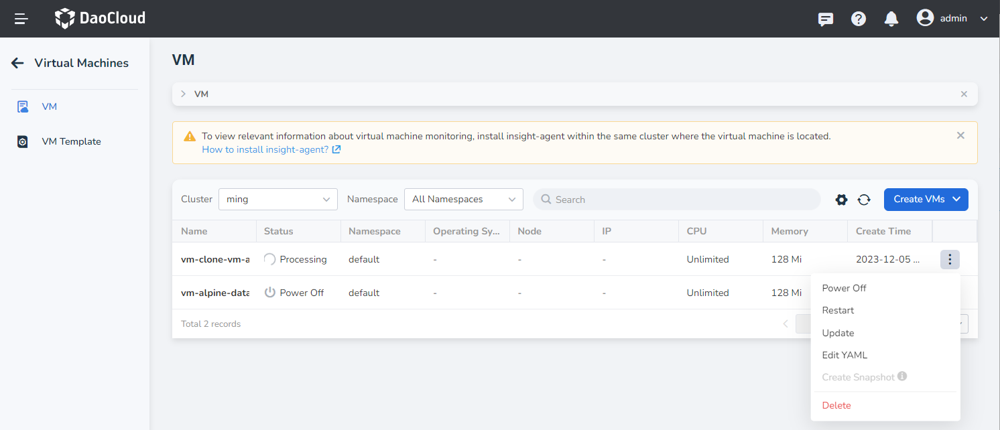
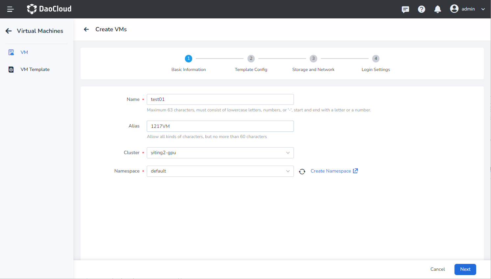
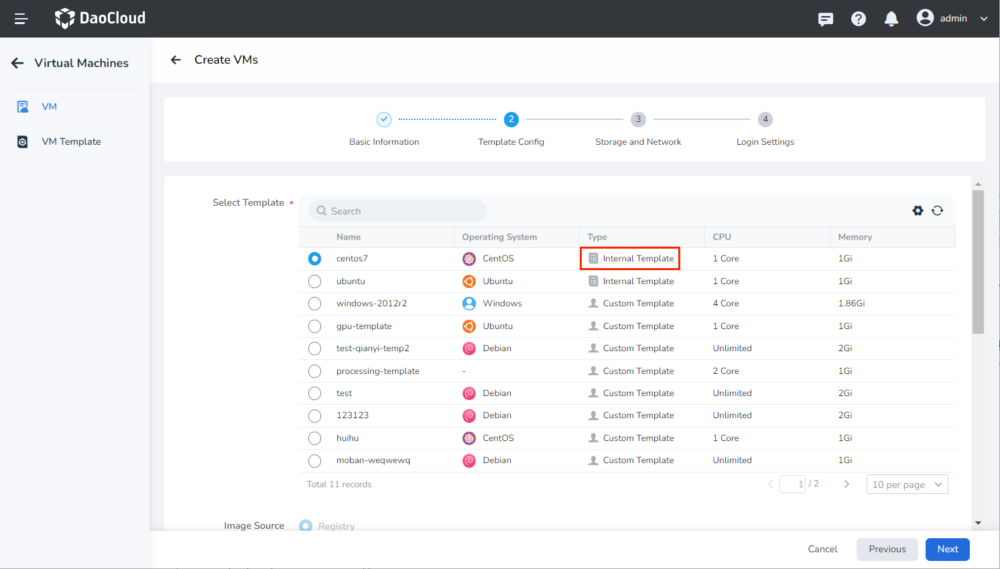
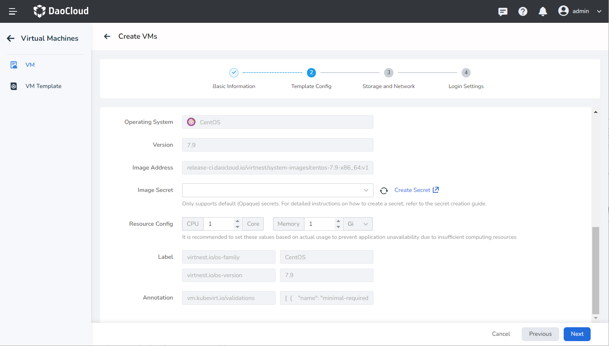
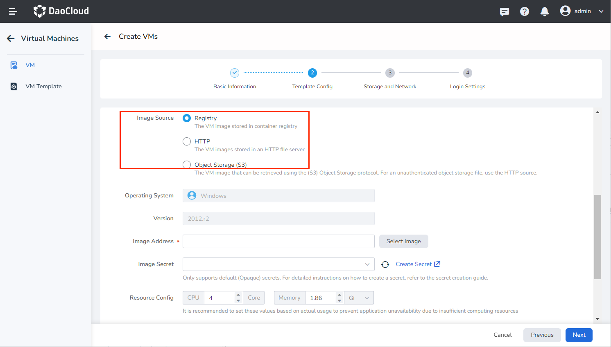
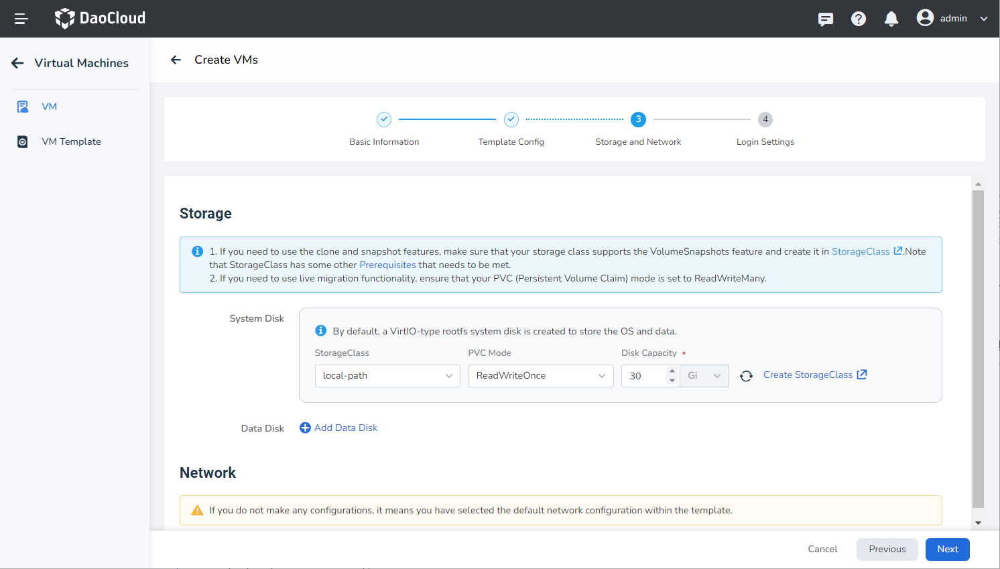

# Create Virtual Machines via Templates

This guide explains how to create virtual machines using templates.

With internal templates and custom templates, users can easily create new virtual machines. Additionally, we provide 
the ability to convert existing virtual machines into templates, allowing users to manage and utilize resources more flexibly.

## Create with Template

Follow these steps to create a virtual machine using a template.

1. Click __Container Management__ in the left navigation menu, then click __Virtual Machines__ to access 
   the __Virtual Machine Management__ page. On the virtual machine list page, click __Create Virtual Machine__ 
   and select __Create with Template__ .

    

2. On the template creation page, fill in the required information, including Basic Information, Template Config, 
   Storage and Network, and Login Settings. Then, click __OK__ in the bottom-right corner to complete the creation.

    The system will automatically return to the virtual machine list. By clicking  __┇__ on the right side of the list, 
    you can perform operations such as power off/restart, clone, update, create snapshot, convert to template, 
    console access (VNC), and delete.
    The ability to clone and create snapshots depends on the selected storage pool.

    

### Basic Information

On the Create VMs page, enter the information according to the table below and click __Next__ .

- Name: Can contain up to 63 characters and can only include lowercase letters, numbers, and hyphens ( __-__ ). The name must start and end with a lowercase letter or number.
  Names must be unique within the same namespace, and the name cannot be changed after the virtual machine is created.
- Alias: Can include any characters, up to 60 characters in length.
- Cluster: Select the cluster where the new virtual machine will be deployed.
- Namespace: Select the namespace where the new virtual machine will be deployed.
  If the desired namespace is not found, you can follow the instructions on the page to [create a new namespace](../../kpanda/user-guide/namespaces/createns.md).

### Template Config

The template list will appear, and you can choose either an internal template or a custom template based on your needs.

- Select an Internal Template: AI platform Virtual Machine provides several standard templates that cannot be edited or deleted. When selecting an internal template, the image source, operating system, image address, and other information will be based on the template and cannot be modified. GPU quota will also be based on the template but can be modified.

    

    

- Select a Custom Template: These templates are created from virtual machine configurations and can be edited or deleted. When using a custom template, you can modify the image source and other information based on your specific requirements.

    

    

### Storage and Network

- Storage: By default, the system creates a rootfs system disk of VirtIO type for storing the operating system and data. 
  Block storage is used by default. If you need to use clone and snapshot functionality, make sure your storage pool 
  supports the VolumeSnapshots feature and create it in the storage pool (SC). Please note that the storage pool (SC) 
  has additional prerequisites that need to be met.

    - Prerequisites:

        - KubeVirt utilizes the VolumeSnapshot feature of the Kubernetes CSI driver to capture the persistent state 
          of virtual machines. Therefore, you need to ensure that your virtual machine uses a StorageClass that 
          supports VolumeSnapshots and is configured with the correct VolumeSnapshotClass.
        - Check the created SnapshotClass and confirm that the provisioner property matches the Driver property in the storage pool.

    - Supports adding one system disk and multiple data disks.

- Network: If no configuration is made, the system will create a VirtIO type network by default.

### Login Settings

- Username/Password: You can log in to the virtual machine using a username and password.
- SSH: When selecting SSH login, you can bind an SSH key to the virtual machine for future login purposes.

