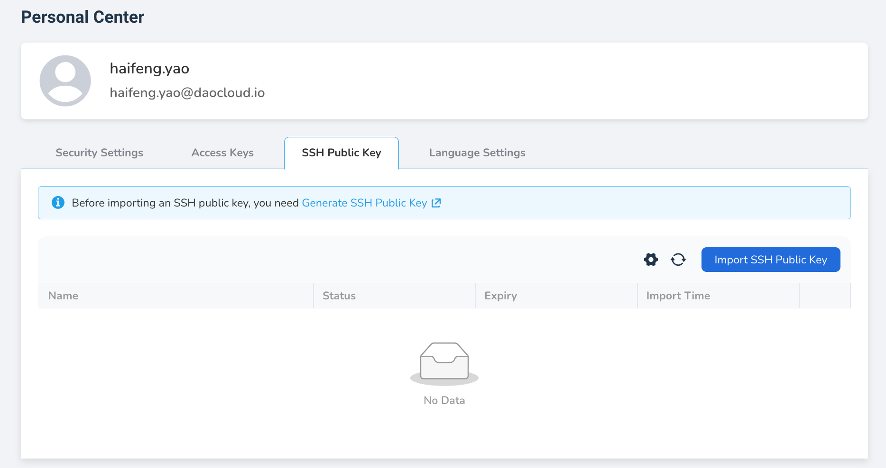

# Configuring SSH Public Key

This article explains how to configure SSH public key.

## Step 1. View Existing SSH Keys

Before generating a new SSH key, please check if you need to use an existing SSH key stored in the root directory of the local user.
For Linux and Mac, use the following command to view existing public keys. Windows users can use the
following command in WSL (requires Windows 10 or above) or Git Bash to view the generated public keys.

- **ED25519 Algorithm:**

    ```bash
    cat ~/.ssh/id_ed25519.pub
    ```

- **RSA Algorithm:**

    ```bash
    cat ~/.ssh/id_rsa.pub
    ```

If a long string starting with ssh-ed25519 or ssh-rsa is returned, it means that a local public key already exists.
You can skip [Step 2 Generate SSH Key](#step-2-generate-ssh-key) and proceed directly to [Step 3](#step-3-copy-the-public-key).

## Step 2. Generate SSH Key

If [Step 1](#step-1-view-existing-ssh-keys) does not return the specified content string, it means that
there is no available SSH key locally and a new SSH key needs to be generated. Please follow these steps:

1. Access the terminal (Windows users please use [WSL](https://docs.microsoft.com/en-us/windows/wsl/install) or [Git Bash](https://gitforwindows.org/)), and run `ssh-keygen -t`.

2. Enter the key algorithm type and an optional comment.

    The comment will appear in the .pub file and can generally use the email address as the comment content.
   
    - To generate a key pair based on the `ED25519` algorithm, use the following command:
   
        ```bash
        ssh-keygen -t ed25519 -C "<comment>"
        ```
   
    - To generate a key pair based on the `RSA` algorithm, use the following command:
   
        ```bash
        ssh-keygen -t rsa -C "<comment>"
        ```

3. Press Enter to choose the SSH key generation path.

    Taking the ED25519 algorithm as an example, the default path is as follows:
   
    ```console
    Generating public/private ed25519 key pair.
    Enter file in which to save the key (/home/user/.ssh/id_ed25519):
    ```
   
    The default key generation path is `/home/user/.ssh/id_ed25519`, and the proper public key is `/home/user/.ssh/id_ed25519.pub`.

4. Set a passphrase for the key.

    ```console
    Enter passphrase (empty for no passphrase):
    Enter same passphrase again:
    ```

    The passphrase is empty by default, and you can choose to use a passphrase to protect the private key file. 
    If you do not want to enter a passphrase every time you access the repository using the SSH protocol,
    you can enter an empty passphrase when creating the key.

5. Press Enter to complete the key pair creation.

## Step 3. Copy the Public Key

In addition to manually copying the generated public key information printed on the command line, you can use the following commands to copy the public key to the clipboard, depending on the operating system.

- Windows (in [WSL](https://docs.microsoft.com/en-us/windows/wsl/install) or [Git Bash](https://gitforwindows.org/)):

    ```bash
    cat ~/.ssh/id_ed25519.pub | clip
    ```

- Mac:

    ```bash
    tr -d '\n'< ~/.ssh/id_ed25519.pub | pbcopy
    ```

- GNU/Linux (requires xclip):

    ```bash
    xclip -sel clip < ~/.ssh/id_ed25519.pub
    ```

## Step 4. Set the Public Key on AI platform

1. Log in to the AI platform UI page and select **Profile** -> **SSH Public Key** in the upper right corner of the page.

    

2. Import the generated SSH public key.

    
