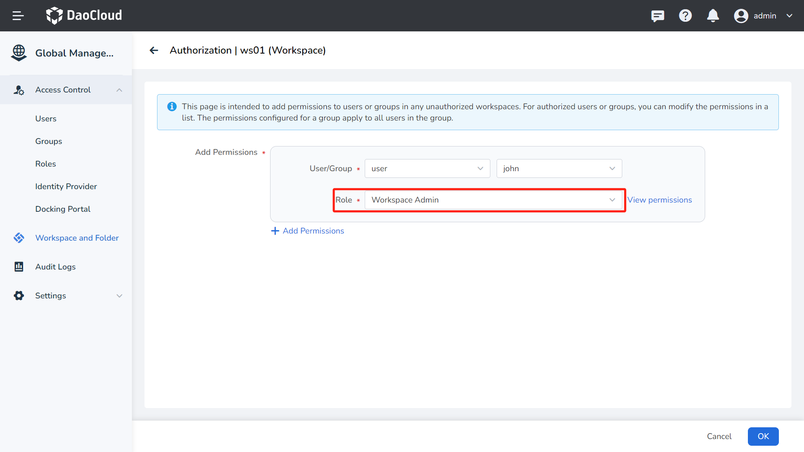
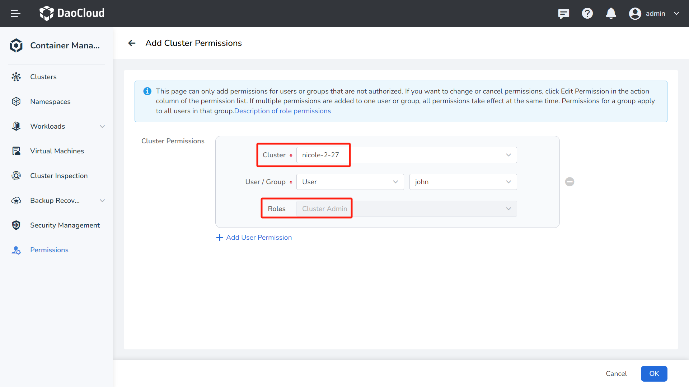
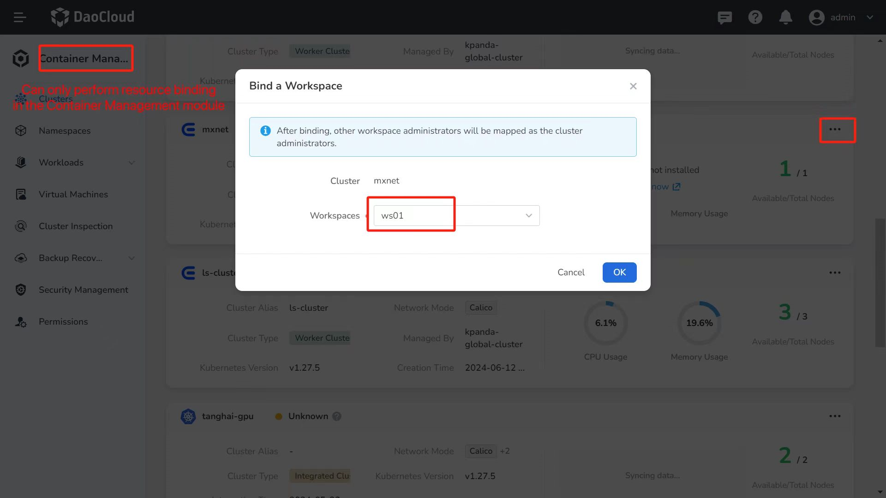

# Resource Binding Permission Instructions

If a user John ("John" represents any user who is required to bind resources) has  
the Workspace Admin role assigned or has been granted proper permissions through a custom role, 
which includes the [Workspace's "Resource Binding" Permissions](./ws-permission.md#description-of-workspace-permissions), and wants to bind a specific cluster or namespace to the workspace.

To bind cluster/namespace resources to a workspace, not only the [workspace's "Resource Binding" permissions](./ws-permission.md#description-of-workspace-permissions) are required,
but also the permissions of [Cluster Admin](../../../kpanda/permissions/permission-brief.md#cluster-admin).

## Granting Authorization to John

1. Using the Platform Admin Role,
   grant John the role of Workspace Admin on the **Workspace** -> **Authorization** page.

    

1. Then, on the **Container Management** -> **Permissions** page, authorize John as a Cluster Admin by **Add Permission**.

    

    

## Binding to Workspace

Using John's account to log in to AI platform, on the **Container Management** -> **Clusters** page, 
 John can bind the specified cluster to his own workspace by using the **Bind Workspace** button.

!!! note

    John can only bind clusters or namespaces to a specific workspace in the Container Management module, and cannot perform this operation in the Global Management module.

To bind a namespace to a workspace, you must have at least Workspace Admin and Cluster Admin permissions.

