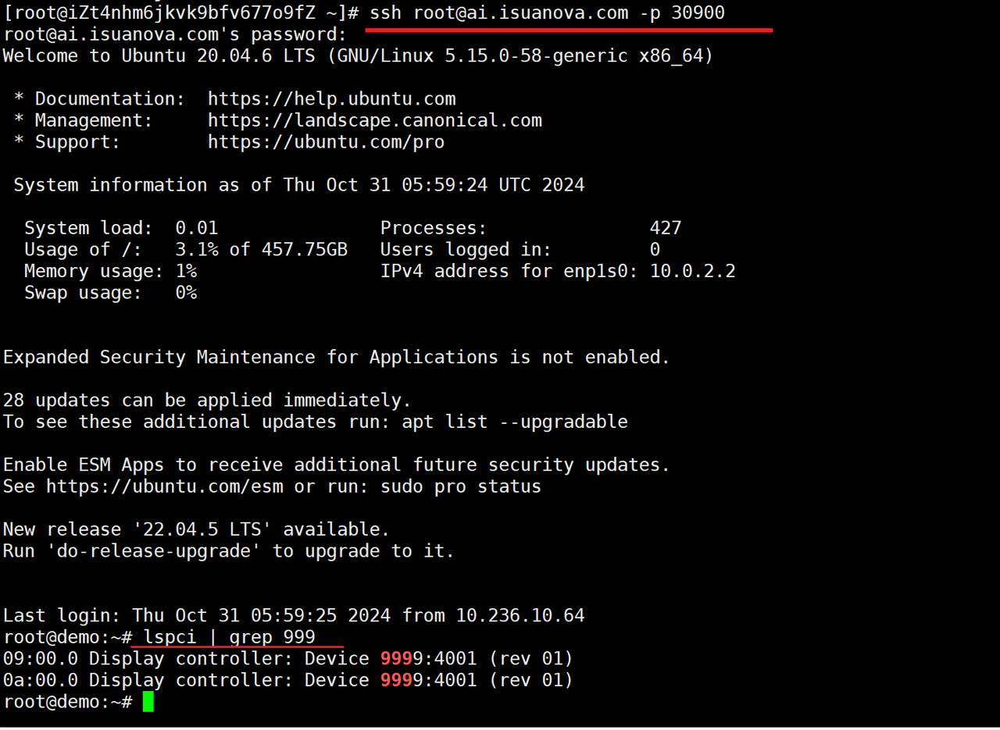

# Using the Cloud Host

After creating and starting the cloud host, the user can begin using the cloud host.

## Prerequisites

- The AI platform is installed
- [User has created and started the cloud host](./createhost.md)

## Steps to Operate

1. Log into the AI platform as an administrator.
2. Navigate to **Container Management** -> **Container Network** -> **Services**, click the service name to enter the service details page, and click **Update** in the upper right corner.

3. Change the port range to 30900-30999, ensuring there are no conflicts.

4. Log into the AI platform as an end user, navigate to the proper service, and check the access ports.

5. Use an SSH client to log into the cloud host from the external network.

    

6. At this point, you can perform various operations on the cloud host.

Next step: [Using Notebook](../share/notebook.md)
