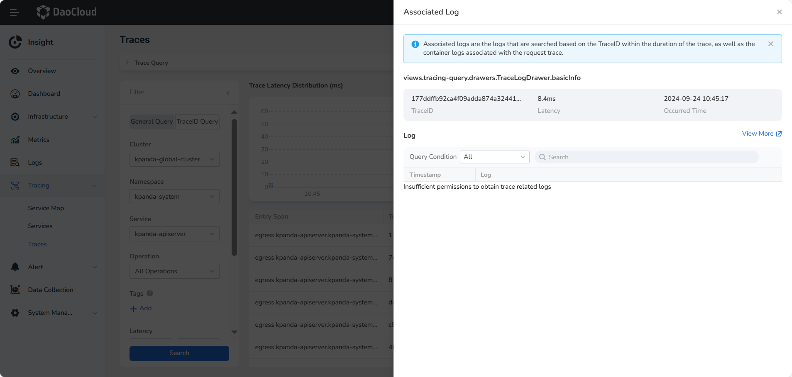

# Trace Query

On the trace query page, you can query detailed information about a call trace by TraceID or filter call traces based on various conditions.

## Glossary

- TraceID: Used to identify a complete request call trace.
- Operation: Describes the specific operation or event represented by a Span.
- Entry Span: The entry Span represents the first request of the entire call.
- Latency: The duration from receiving the request to completing the response for the entire call trace.
- Span: The number of Spans included in the entire trace.
- Start Time: The time when the current trace starts.
- Tag: A collection of key-value pairs that constitute Span tags. Tags are used to annotate and supplement Spans, and each Span can have multiple key-value tag pairs.

## Steps

Please follow these steps to search for a trace:

1. Go to the __Insight__ product module.
2. Select __Tracing__ -> __Traces__ from the left navigation bar.

    

    !!! note

        Sorting by Span, Latency, and Start At is supported in the list.

3. Click the __TraceID Query__ in the filter bar to switch to TraceID search.

   - To search using TraceID, please enter the complete TraceID.

    <!-- add image later -->

## Other Operations

### View Trace Details

1. Click the TraceID of a trace in the trace list to view its detailed call information.

    

### Associated Logs

1. Click the icon on the right side of the trace data to search for associated logs.

    - By default, it queries the log data within the duration of the trace and one minute after its completion.
    - The queried logs include those with the trace's TraceID in their log text and container logs related to the trace invocation process.
  
2. Click __View More__ to jump to the __Associated Log__ page with conditions.
3. By default, all logs are searched, but you can filter by the TraceID or the relevant container logs from the trace call process using the dropdown.

    

    !!! note

        Since trace may span across clusters or namespaces, if the user does not have sufficient permissions, they will be unable to query the associated logs for that trace.
