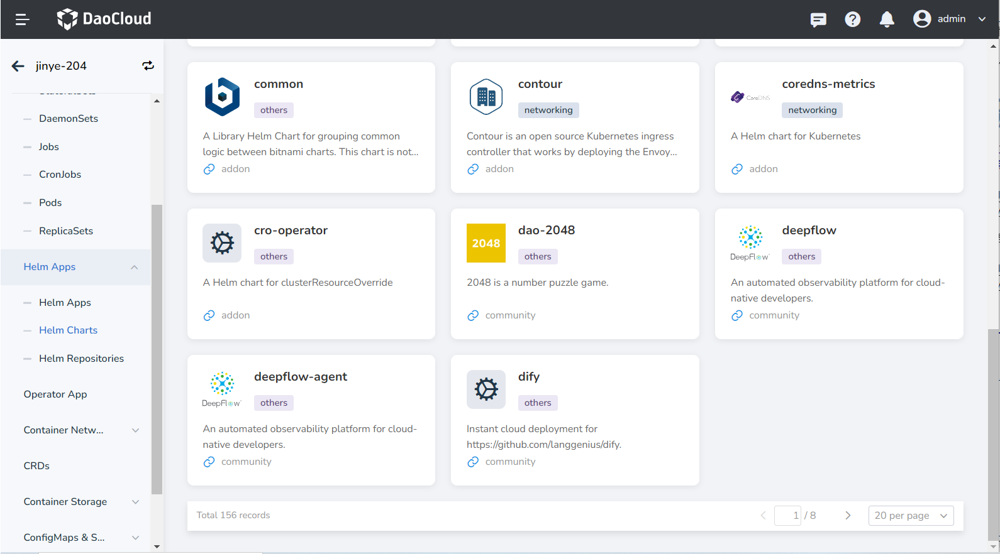

---
hide:
   - toc
---

# Helm Charts

Helm is a package management tool for Kubernetes, which makes it easy for users to quickly discover, share and use applications built with Kubernetes. Container Management provides hundreds of Helm charts, covering storage, network, monitoring, database and other main cases. With these templates, you can quickly deploy and easily manage Helm apps through the UI interface. In addition, it supports adding more personalized templates through [Add Helm repository](helm-repo.md) to meet various needs.

**Key Concepts**:

There are a few key concepts to understand when using Helm:

- Chart: A Helm installation package, which contains the images, dependencies, and resource definitions required to run an application, and may also contain service definitions in the Kubernetes cluster, similar to the formula in Homebrew, dpkg in APT, or rpm files in Yum. Charts are called __Helm Charts__ in AI platform.

- Release: A Chart instance running on the Kubernetes cluster. A Chart can be installed multiple times in the same cluster, and each installation will create a new Release. Release is called __Helm Apps__ in AI platform.

- Repository: A repository for publishing and storing Charts. Repository is called __Helm Repositories__ in AI platform.

For more details, refer to [Helm official website](https://helm.sh/).

**Related operations**:

- [Manage Helm apps](helm-app.md), including installing, updating, uninstalling Helm apps, viewing Helm operation records, etc.
- [Manage Helm repository](helm-repo.md), including installing, updating, deleting Helm repository, etc.
