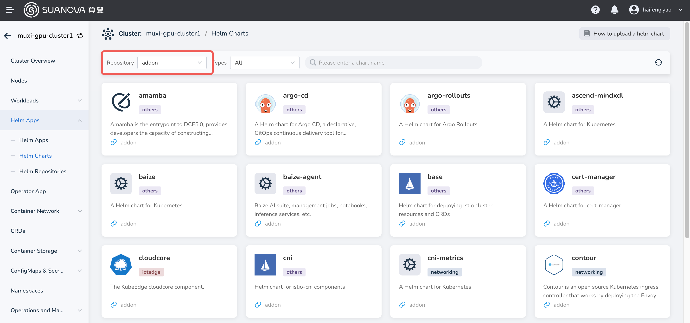
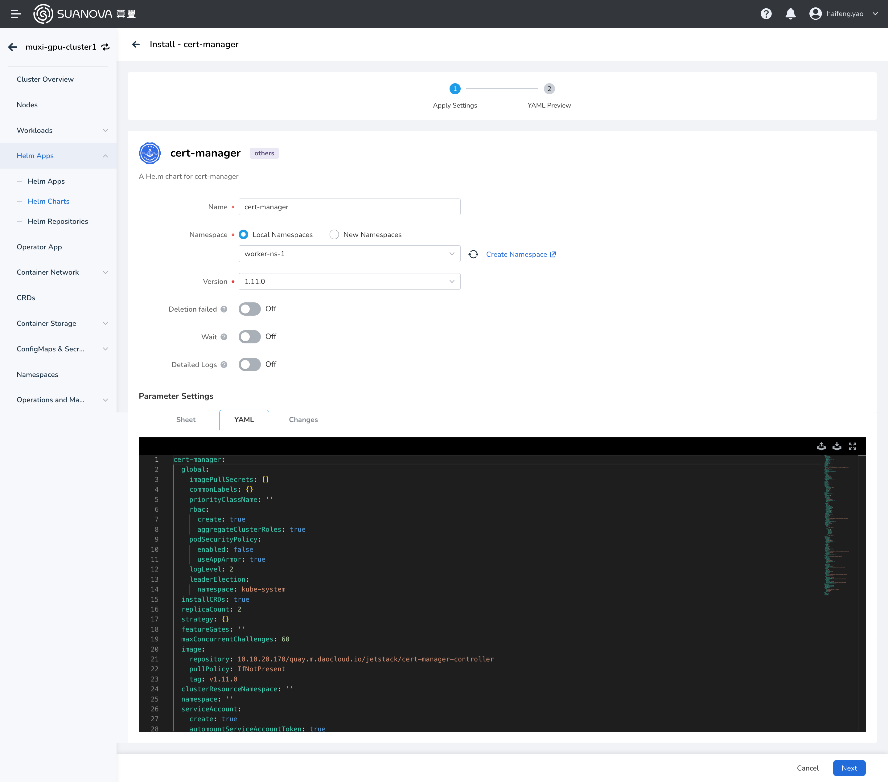
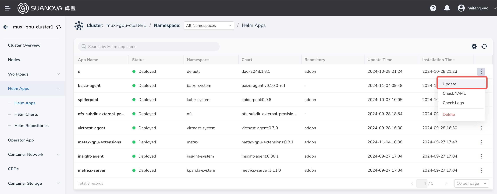
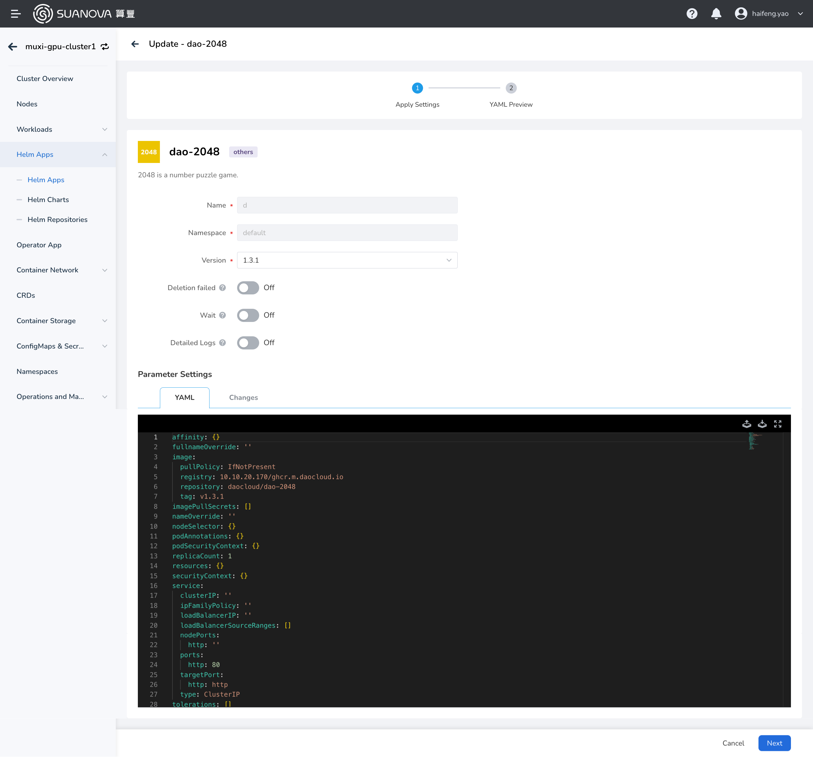
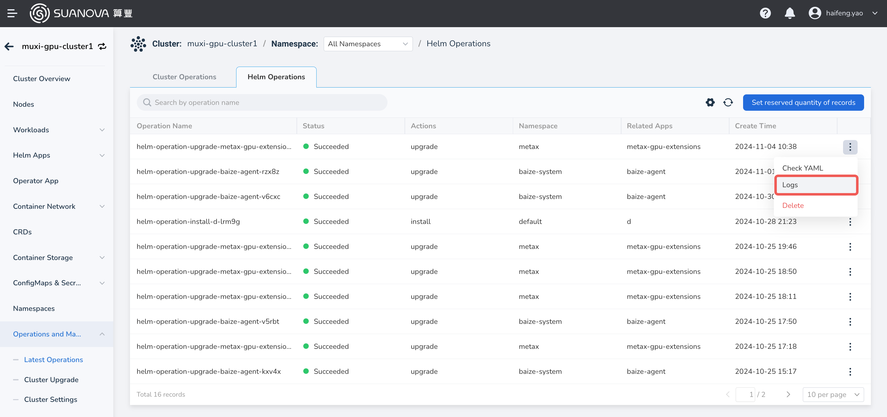
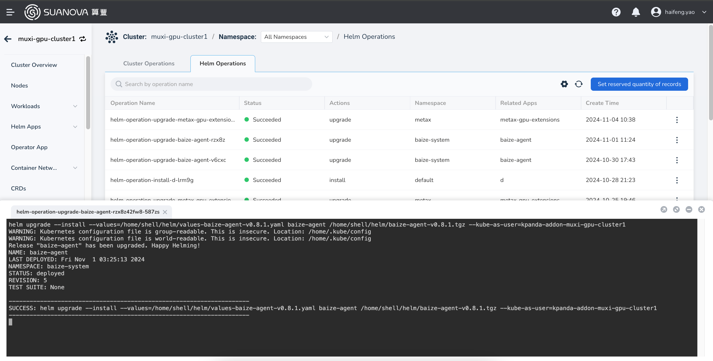
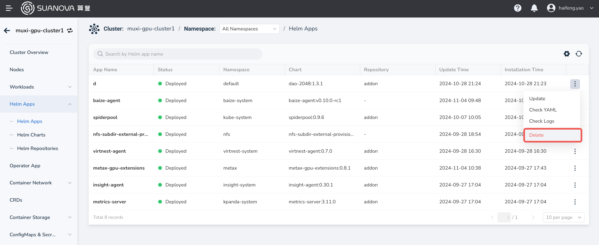
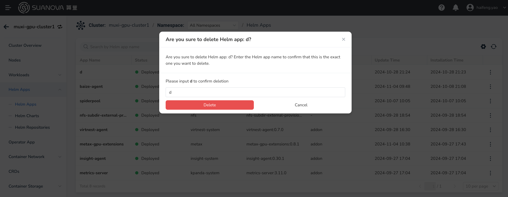

# Manage Helm Apps

The container management module supports interface-based management of Helm, including creating Helm instances using Helm charts, customizing Helm instance arguments, and managing the full lifecycle of Helm instances.

This section will take [cert-manager](https://cert-manager.io/docs/) as an example to introduce how to create and manage Helm apps through the container management interface.

## Prerequisites

- [Integrated the Kubernetes cluster](../clusters/integrate-cluster.md) or
  [created the Kubernetes cluster](../clusters/create-cluster.md),
  and you can access the UI interface of the cluster.

- Created a [namespace](../namespaces/createns.md),
  user,
  and granted [`NS Admin`](../permissions/permission-brief.md#ns-admin) or higher permissions to the user.
  For details, refer to [Namespace Authorization](../permissions/cluster-ns-auth.md).

## Install the Helm app

Follow the steps below to install the Helm app.

1. Click a cluster name to enter __Cluster Details__ .

    

2. In the left navigation bar, click __Helm Apps__ -> __Helm Charts__ to enter the Helm chart page.

     On the Helm chart page, select the [Helm repository](helm-repo.md) named __addon__ , and all the Helm chart templates under the __addon__ repository will be displayed on the interface.
     For instance, click the Chart named __cert-manager__ .

    

3. On the installation page, you can see the relevant detailed information of the Chart, select the version to be installed in the upper right corner of the interface, and click the __Install__ button. Here select v1.9.1 version for installation.

    

4. Configure __Name__ , __Namespace__ and __Version Information__ . You can also customize arguments by modifying YAML in the **argument Configuration** area below. Click __OK__ .

    

5. The system will automatically return to the list of Helm apps, and the status of the newly created Helm app is __Installing__ , and the status will change to __Running__ after a period.

## Update the Helm app

After we have completed the installation of a Helm app through the interface, we can perform an update operation on the Helm app. Note: Update operations using the UI are only supported for Helm apps installed via the UI.

Follow the steps below to update the Helm app.

1. Click a cluster name to enter __Cluster Details__

    

2. In the left navigation bar, click __Helm Apps__ to enter the Helm app list page.

     On the Helm app list page, select the Helm app that needs to be updated, click the __┇__ operation button on the right side of the list, and select the __Update__ operation in the drop-down selection.

    

3. After clicking the __Update__ button, the system will jump to the update interface, where you can update the Helm app as needed. Here we take updating the http port of the __dao-2048__ application as an example.

    

4. After modifying the proper arguments. You can click the __Change__ button under the argument configuration to compare the files before and after the modification. After confirming that there is no error, click the __OK__ button at the bottom to complete the update of the Helm app.

    

5. The system will automatically return to the Helm app list, and a pop-up message in the upper right corner will prompt __update successful__ .

## View Helm records

Every installation, update, and deletion of Helm apps has detailed operation records and logs for viewing.

1. In the left navigation bar, click __Operations and Maintenance__ -> __Latest Operations__ , and then select the __Helm Operations__ tab at the top of the page. Each record corresponds to an install/update/delete operation.

    

2. To view the detailed log of each operation: Click __┇__ on the right side of the list, and select __Logs__ from the pop-up menu.

    

3. At this point, the detailed operation log will be displayed in the form of console at the bottom of the page.

    

## Delete the Helm app

Follow the steps below to delete the Helm app.

1. Find the cluster where the Helm app to be deleted resides, click the cluster name, and enter __Cluster Details__ .

    

2. In the left navigation bar, click __Helm Apps__ to enter the Helm app list page.

     On the Helm app list page, select the Helm app you want to delete, click the __┇__ operation button on the right side of the list, and select __Delete__ from the drop-down selection.

    

3. Enter the name of the Helm app in the pop-up window to confirm, and then click the __Delete__ button.

    
