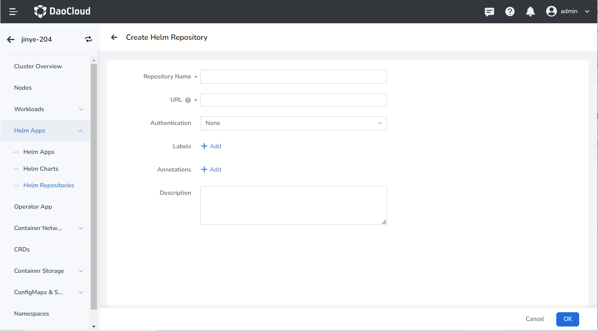
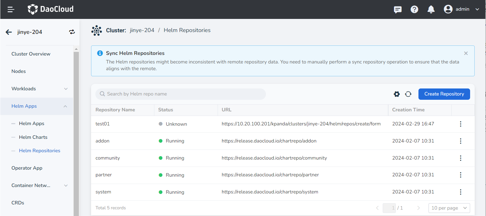
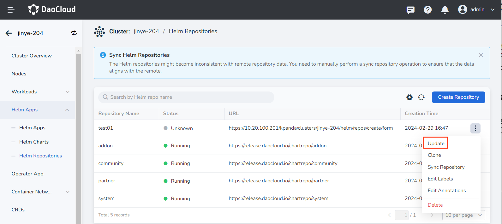
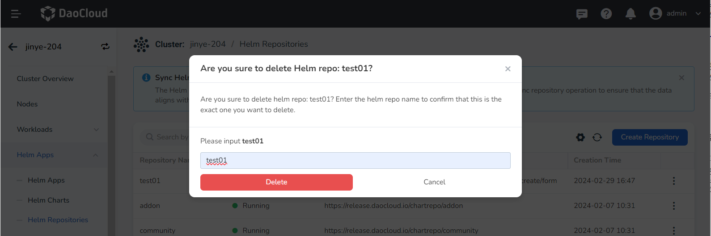

# Manage Helm Repository

The Helm repository is a repository for storing and publishing Charts. The Helm App module supports HTTP(s) protocol to access Chart packages in the repository. By default, the system has 4 built-in helm repos as shown in the table below to meet common needs in the production process of enterprises.

| Repository | Description | Example |
| --------- | ------------ | ------- |
| partner | Various high-quality features provided by ecological partners Chart | tidb |
| system | Chart that must be relied upon by system core functional components and some advanced features. For example, insight-agent must be installed to obtain cluster monitoring information | Insight |
| addon | Common Chart in business cases | cert-manager |
| community | The most popular open source components in the Kubernetes community Chart | Istio |

In addition to the above preset repositories, you can also add third-party Helm repositories yourself. This page will introduce how to add and update third-party Helm repositories.

## Prerequisites

- [Integrated the Kubernetes cluster](../clusters/integrate-cluster.md) or
  [created the Kubernetes cluster](../clusters/create-cluster.md),
  and you can access the UI interface of the cluster.

- Created a [namespace](../namespaces/createns.md),
  [user](../../ghippo/access-control/user.md),
  and granted [`NS Admin`](../permissions/permission-brief.md#ns-admin) or higher permissions to the user.
  For details, refer to [Namespace Authorization](../permissions/cluster-ns-auth.md).

- If using a private repository, you should have read and write permissions to the repository.

## Introduce third-party Helm repository

The following takes the public container repository of Kubevela as an example to introduce and manage the helm repo.

1. Find the cluster that needs to be imported into the third-party helm repo, click the cluster name, and enter cluster details.

    

2. In the left navigation bar, click __Helm Apps__ -> __Helm Repositories__ to enter the helm repo page.

    

3. Click the __Create Repository__ button on the helm repo page to enter the Create repository page, and configure relevant arguments according to the table below.

    - Repository Name: Set the repository name. It can be up to 63 characters long and may only include lowercase letters,
      numbers, and separators __-__. It must start and end with a lowercase letter or number, for example, kubevela.
    - Repository URL: The HTTP(S) address pointing to the target Helm repository. For example, <https://charts.kubevela.net/core>.
    - Skip TLS Verification: If the added Helm repository uses an HTTPS address and requires skipping TLS verification,
      you can check this option. The default is unchecked.
    - Authentication Method: The method used for identity verification after connecting to the repository URL.
      For public repositories, you can select __None__. For private repositories, you need to enter a
      username/password for identity verification.
    - Labels: Add labels to this Helm repository. For example, key: repo4; value: Kubevela.
    - Annotations: Add annotations to this Helm repository. For example, key: repo4; value: Kubevela.
    - Description: Add a description for this Helm repository. For example: This is a Kubevela public Helm repository.

    

4. Click __OK__ to complete the creation of the Helm repository. The page will automatically jump to the list of Helm repositories.

    

## Update the Helm repository

When the address information of the helm repo changes, the address, authentication method, label, annotation, and description information of the helm repo can be updated.

1. Find the cluster where the repository to be updated is located, click the cluster name, and enter cluster details .

    

2. In the left navigation bar, click __Helm Apps__ -> __Helm Repositories__ to enter the helm repo list page.

    

3. Find the Helm repository that needs to be updated on the repository list page, click the __┇__ button on the right side of the list, and click __Update__ in the pop-up menu.

    

4. Update on the __Update Helm Repository__ page, and click __OK__ when finished.

    

5. Return to the helm repo list, and the screen prompts that the update is successful.

## Delete the Helm repository

In addition to importing and updating repositorys, you can also delete unnecessary repositories, including system preset repositories and third-party repositories.

1. Find the cluster where the repository to be deleted is located, click the cluster name, and enter cluster details .

    

2. In the left navigation bar, click __Helm Apps__ -> __Helm Repositories__ to enter the helm repo list page.

    

3. Find the Helm repository that needs to be updated on the repository list page, click the __┇__ button on the right side of the list, and click __Delete__ in the pop-up menu.

    

4. Enter the repository name to confirm, and click __Delete__ .

    

5. Return to the list of Helm repositories, and the screen prompts that the deletion is successful.
