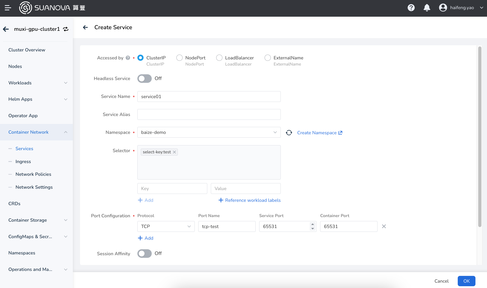
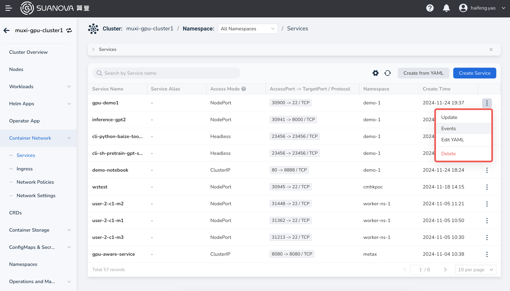

# Create a Service

In a Kubernetes cluster, each Pod has an internal independent IP address, but Pods in the workload may be created and deleted at any time, and directly using the Pod IP address cannot provide external services.

This requires creating a service through which you get a fixed IP address, decoupling the front-end and back-end of the workload, and allowing external users to access the service. At the same time, the service also provides the Load Balancer feature, enabling users to access workloads from the public network.

## Prerequisites

- You have integrated a Kubernetes Cluster in the Container Management module as described in [Integrate Kubernetes Cluster](../clusters/integrate-cluster.md) or [Create Kubernetes Cluster](../clusters/create-cluster.md), and you can access the cluster's UI interface.

- Completed a [namespace creation](../namespaces/createns.md), user creation, and authorize the user as [NS Editor](../permissions/permission-brief.md#ns-editor) role, for details, refer to [Namespace Authorization](../permissions/cluster-ns-auth.md).

- When there are multiple containers in a single instance, make sure that the ports used by the containers do not conflict, otherwise the deployment will fail.

## Create service

1. After successfully logging in as the __NS Editor__ user, click __Clusters__ in the upper left corner to enter the __Clusters__ page. In the list of clusters, click a cluster name.

    

2. In the left navigation bar, click __Container Network__ -> __Services__ to enter the service list, and click the __Create Service__ button in the upper right corner.

    

    !!! tip

        It is also possible to create a service from __YAML__

3. Open the __Create Service__ page, select an access type, and refer to the following three parameter tables for configuration.

    

### Create ClusterIP service

Click __Intra-Cluster Access (ClusterIP)__ , which refers to exposing services through the internal IP of the cluster. The services selected for this option can only be accessed within the cluster. This is the default service type. Refer to the configuration parameters in the table below.

| Parameter | Description | Example |
| --------- | ----------- | ------- |
| Access type | [Type] Required [Meaning] Specify the method of Pod service discovery, here select intra-cluster access (ClusterIP). | ClusterIP |
| Service Name | [Type] Required [Meaning] Enter the name of the new service.  [Note] Please enter a string of 4 to 63 characters, which can contain lowercase English letters, numbers and dashes (-), and start with a lowercase English letter and end with a lowercase English letter or number. | Svc-01 |
| Namespace | [Type] Required [Meaning] Select the namespace where the new service is located. For more information about namespaces, refer to [Namespace Overview](../namespaces/createns.md).  [Note] Please enter a string of 4 to 63 characters, which can contain lowercase English letters, numbers and dashes (-), and start with a lowercase English letter and end with a lowercase English letter or number. | default |
| Label selector | [Type] Required [Meaning] Add a label, the Service selects a Pod according to the label, and click "Add" after filling. You can also refer to the label of an existing workload. Click __Reference workload label__ , select the workload in the pop-up window, and the system will use the selected workload label as the selector by default. | app:job01 |
| Port configuration| [Type] Required [Meaning] To add a protocol port for a service, you need to select the port protocol type first. Currently, it supports TCP and UDP.  **Port Name**: Enter the name of the custom port.  **Service port (port)**: The access port for Pod to provide external services.  **Container port (targetport)**: The container port that the workload actually monitors, used to expose services to the cluster. | |
| Session Persistence | [Type] Optional  [Meaning] When enabled, requests from the same client will be forwarded to the same Pod | Enabled |
| Maximum session hold time | [Type] Optional  [Meaning] After session hold is enabled, the maximum hold time is 30 seconds by default | 30 seconds |
| Annotation | [Type] Optional [Meaning] Add annotation for service  | |

### Create NodePort service

Click __NodePort__ , which means exposing the service via IP and static port ( __NodePort__ ) on each node. The __NodePort__ service is routed to the automatically created __ClusterIP__ service. You can access a __NodePort__ service from outside the cluster by requesting __<Node IP>:<Node Port>__ . Refer to the configuration parameters in the table below.

| Parameter | Description | Example |
| --------- | ----------- | ------- |
| Access type | [Type] Required [Meaning] Specify the method of Pod service discovery, here select node access (NodePort). | NodePort |
| Service Name | [Type] Required [Meaning] Enter the name of the new service.  [Note] Please enter a string of 4 to 63 characters, which can contain lowercase English letters, numbers and dashes (-), and start with a lowercase English letter and end with a lowercase English letter or number. | Svc-01 |
| Namespace | [Type] Required [Meaning] Select the namespace where the new service is located. For more information about namespaces, refer to [Namespace Overview](../namespaces/createns.md).  [Note] Please enter a string of 4 to 63 characters, which can contain lowercase English letters, numbers and dashes (-), and start with a lowercase English letter and end with a lowercase English letter or number. | default |
| Label selector | [Type] Required [Meaning] Add a label, the Service selects a Pod according to the label, and click "Add" after filling. You can also refer to the label of an existing workload. Click __Reference workload label__ , select the workload in the pop-up window, and the system will use the selected workload label as the selector by default. | |
| Port configuration| [Type] Required [Meaning] To add a protocol port for a service, you need to select the port protocol type first. Currently, it supports TCP and UDP.  **Port Name**: Enter the name of the custom port.  **Service port (port)**: The access port for Pod to provide external services. *By default, the service port is set to the same value as the container port field for convenience. * **Container port (targetport)**: The container port actually monitored by the workload.  **Node port (nodeport)**: The port of the node, which receives traffic from ClusterIP transmission. It is used as the entrance for external traffic access. | |
| Session Persistence| [Type] Optional  [Meaning] When enabled, requests from the same client will be forwarded to the same Pod After enabled, __.spec.sessionAffinity__ of Service is __ClientIP__ , refer to for details : [Session Affinity for Service](https://kubernetes.io/docs/reference/networking/virtual-ips/#session-affinity) | Enabled |
| Maximum session hold time| [Type] Optional  [Meaning] After session hold is enabled, the maximum hold time, the default timeout is 30 seconds .spec.sessionAffinityConfig.clientIP.timeoutSeconds is set to 30 by default seconds | 30 seconds |
| Annotation | [Type] Optional [Meaning] Add annotation for service  | |

### Create LoadBalancer service

Click __Load Balancer__ , which refers to using the cloud provider's load balancer to expose services to the outside. External load balancers can route traffic to automatically created __NodePort__ services and __ClusterIP__ services. Refer to the configuration parameters in the table below.

| Parameter | Description | Example |
| --------- | ----------- | ------- |
| Access type | [Type] Required [Meaning] Specify the method of Pod service discovery, here select node access (NodePort). | NodePort | |
| Service Name | [Type] Required [Meaning] Enter the name of the new service.  [Note] Please enter a string of 4 to 63 characters, which can contain lowercase English letters, numbers and dashes (-), and start with a lowercase English letter and end with a lowercase English letter or number. | Svc-01 | |
| Namespace | [Type] Required [Meaning] Select the namespace where the new service is located. For more information about namespaces, refer to [Namespace Overview](../namespaces/createns.md).  [Note] Please enter a string of 4 to 63 characters, which can contain lowercase English letters, numbers and dashes (-), and start with a lowercase English letter and end with a lowercase English letter or number. | default | |
| External Traffic Policy | [Type] Required [Meaning] Set external traffic policy.  **Cluster**: Traffic can be forwarded to Pods on all nodes in the cluster.  **Local**: Traffic is only sent to Pods on this node.  [Note] Please enter a string of 4 to 63 characters, which can contain lowercase English letters, numbers and dashes (-), and start with a lowercase English letter and end with a lowercase English letter or number. | | |
| Tag selector | [Type] Required  [Meaning] Add tag, Service Select the Pod according to the label, fill it out and click "Add". You can also refer to the label of an existing workload. Click __Reference workload label__ , select the workload in the pop-up window, and the system will use the selected workload label as the selector by default. | | |
| Load balancing type | [Type] Required  [Meaning] The type of load balancing used, currently supports MetalLB and others. | | |
| MetalLB IP Pool| [Type] Required [Meaning] When the selected load balancing type is MetalLB, LoadBalancer Service will allocate IP addresses from this pool by default, and declare all IP addresses in this pool through APR | | |
| Load balancing address| [Type] Required [Meaning]  1. If you are using a public cloud CloudProvider, fill in the load balancing address provided by the cloud provider here; 2. If the above load balancing type is selected as MetalLB, the IP will be obtained from the above IP pool by default, if not filled, it will be obtained automatically. | | |
| Port configuration| [Type] Required [Meaning] To add a protocol port for a service, you need to select the port protocol type first. Currently, it supports TCP and UDP.  **Port Name**: Enter the name of the custom port.  **Service port (port)**: The access port for Pod to provide external services. By default, the service port is set to the same value as the container port field for convenience.  **Container port (targetport)**: The container port actually monitored by the workload.  **Node port (nodeport)**: The port of the node, which receives traffic from ClusterIP transmission. It is used as the entrance for external traffic access. | | |
| Annotation | [Type] Optional [Meaning] Add annotation for service  | | |

### Complete service creation

After configuring all parameters, click the __OK__ button to return to the service list automatically. On the right side of the list, click __┇__ to modify or delete the selected service.

