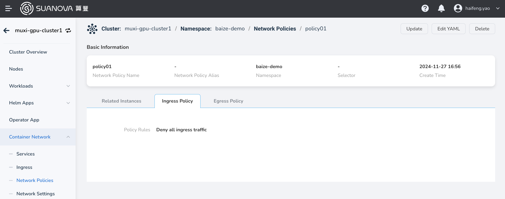

# Network Policies

Network policies in Kubernetes allow you to control network traffic at the IP address or port level (OSI layer 3 or layer 4). The container management module currently supports creating network policies based on Pods or namespaces, using label selectors to specify which traffic can enter or leave Pods with specific labels.

For more details on network policies, refer to the official Kubernetes documentation on [Network Policies](https://kubernetes.io/docs/concepts/services-networking/network-policies/).

## Creating Network Policies

Currently, there are two methods available for creating network policies: YAML and form-based creation. Each method has its advantages and disadvantages, catering to different user needs.

YAML creation requires fewer steps and is more efficient, but it has a higher learning curve as it requires familiarity with configuring network policy YAML files.

Form-based creation is more intuitive and straightforward. Users can simply fill in the proper values based on the prompts. However, this method involves more steps.

### Create from YAML

1. In the cluster list, click the name of the target cluster, then navigate to __Container Network__ -> __Network Policies__ , and click the __Create from YAML__ button.

    

2. In the pop-up dialog, enter or paste the pre-prepared YAML file, then click __OK__ at the bottom of the dialog.

Here is a YAML example for NetworkPolicy.

```yaml
kind: NetworkPolicy
apiVersion: networking.k8s.io/v1
metadata:
  name: allow-apiserver
  namespace: calico-apiserver
  uid: 1162d1c9-4225-4271-a302-062b9f06ec2c
  resourceVersion: '9960'
  generation: 1
  creationTimestamp: '2024-04-18T05:49:46Z'
  ownerReferences:
    - apiVersion: operator.tigera.io/v1
      kind: APIServer
      name: default
      uid: 2cc89f7b-e52b-4bf7-b47e-56efc8407f9a
      controller: true
      blockOwnerDeletion: true
spec:
  podSelector:
    matchLabels:
      apiserver: 'true'
  ingress:
    - ports:
        - protocol: TCP
          port: 5443
  policyTypes:
    - Ingress
```

### Create from Wizard

1. In the cluster list, click the name of the target cluster, then navigate to __Container Network__ -> __Network Policies__ , and click the __Create Policy__ button.

    

2. Fill in the basic information.

    The name and namespace cannot be changed after creation.

    

3. Fill in the policy configuration.

    The policy configuration includes ingress and egress policies. To establish a successful connection from a source Pod to a target Pod, both the egress policy of the source Pod and the ingress policy of the target Pod need to allow the connection. If either side does not allow the connection, the connection will fail.

    

## Viewing Network Policies

1. In the cluster list, click the name of the target cluster, then navigate to __Container Network__ -> __Network Policies__ . Click the name of the network policy.

    

2. View the basic configuration, instances, ingress policies, and egress policies of the policy.

    

!!! info

    Under **the Related Instances** tab, you can view instances, logs, containers, YAML files, events, and more.

## Updating Network Policies

There are two ways to update network policies. You can either update them through the form or by using a YAML file.

- On the network policy list page, find the policy you want to update, and choose __Update__ in the action column on the right to update it via the form. Choose __Edit YAML__ to update it using a YAML file.

    

- Click the name of the network policy, then choose __Update__ in the top right corner of the policy details page to update it via the form. Choose __Edit YAML__ to update it using a YAML file.

    

## Deleting Network Policies

There are two ways to delete network policies. You can delete network policies either through the form or by using a YAML file.

- On the network policy list page, find the policy you want to delete, and choose __Delete__ in the action column on the right to delete it. 

    

- Click the name of the network policy, then choose __Delete__ in the top right corner of the policy details page to delete it.

    
