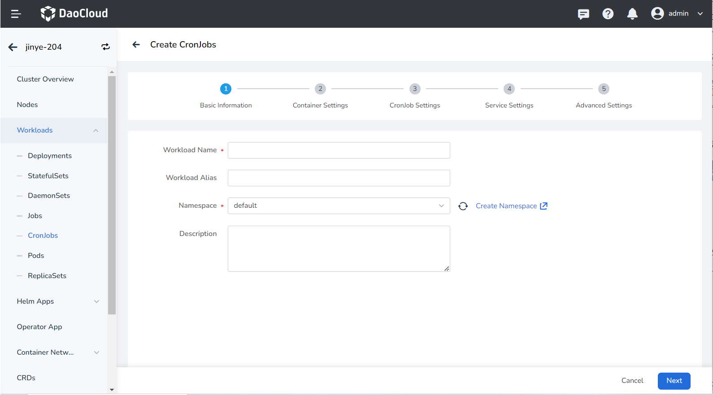
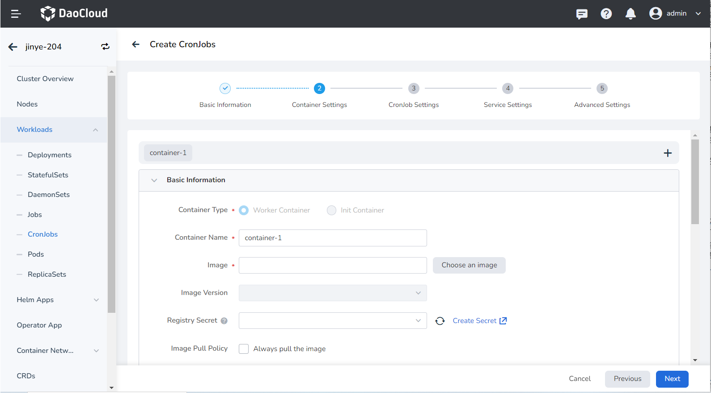
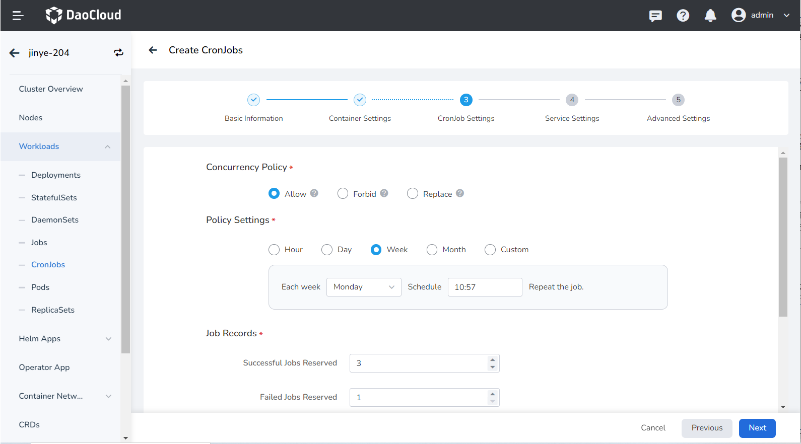
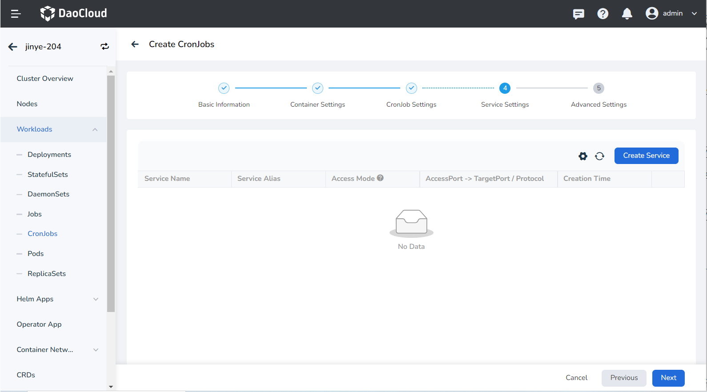
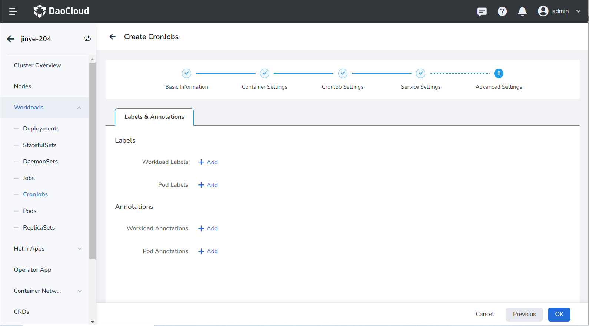
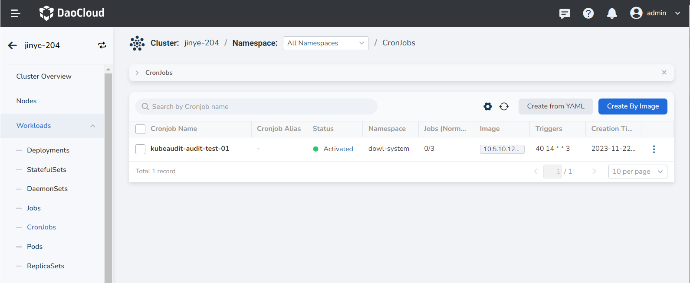

# Create CronJob

This page introduces how to create a CronJob through images and YAML files.

CronJobs are suitable for performing periodic operations, such as backup and report generation. These jobs can be configured to repeat periodically (for example: daily/weekly/monthly), and the time interval at which the job starts to run can be defined.

## Prerequisites

Before creating a CronJob, the following prerequisites need to be met:

- In the Container Management module [Integrate Kubernetes Cluster](../clusters/integrate-cluster.md) or [Create Kubernetes Cluster](../clusters/create-cluster.md), and can access the cluster UI interface.

- Create a [namespace](../namespaces/createns.md) and a user.

- The current operating user should have [NS Editor](../permissions/permission-brief.md#ns-editor) or higher permissions, for details, refer to [Namespace Authorization](../namespaces/createns.md).

- When there are multiple containers in a single instance, please make sure that the ports used by the containers do not conflict, otherwise the deployment will fail.

## Create by image

Refer to the following steps to create a CronJob using the image.

1. Click __Clusters__ on the left navigation bar, and then click the name of the target cluster to enter the cluster details page.

    

2. On the cluster details page, click __Workloads__ -> __CronJobs__ in the left navigation bar, and then click the __Create by Image__ button in the upper right corner of the page.

    

3. Fill in [Basic Information](create-cronjob.md#basic-information), [Container Settings](create-cronjob.md#container-settings), [CronJob Settings](create-cronjob.md#cronjob-settings), [Advanced Configuration](create-cronjob.md#advanced-configuration), click __OK__ in the lower right corner of the page to complete the creation.

     The system will automatically return to the __CronJobs__ list. Click __┇__ on the right side of the list to perform operations such as updating, deleting, and restarting the CronJob.

    

### Basic information

On the __Create CronJobs__ page, enter the information according to the table below, and click __Next__ .



- Workload Name: Can contain up to 63 characters, can only contain lowercase letters, numbers, and a separator ("-"), and must start and end with a lowercase letter or number. The name of the same type of workload in the same namespace cannot be repeated, and the name of the workload cannot be changed after the workload is created.
- Namespace: Select which namespace to deploy the newly created CronJob in, and the default namespace is used by default. If you can't find the desired namespace, you can go to [Create a new namespace](../namespaces/createns.md) according to the prompt on the page.
- Description: Enter the description information of the workload and customize the content. The number of characters should not exceed 512.

### Container settings

Container setting is divided into six parts: basic information, life cycle, health check, environment variables, data storage, and security settings. Click the tab below to view the requirements of each part.

> Container setting is only configured for a single container. To add multiple containers to a pod, click __+__ on the right to add multiple containers.

=== "Basic information (required)"

         

     When configuring container-related parameters, you must correctly fill in the container name and image parameters, otherwise you will not be able to proceed to the next step. After filling in the configuration with reference to the following requirements, click __OK__ .

     - Container Name: Up to 63 characters, lowercase letters, numbers and separators ("-") are supported. Must start and end with a lowercase letter or number, eg nginx-01.
     - Image: Enter the address or name of the image. When entering the image name, the image will be pulled from the official [DockerHub](https://hub.docker.com/) by default. 
     - Image Pull Policy: After checking __Always pull the image__ , the image will be pulled from the registry every time the workload restarts/upgrades. If it is not checked, only the local mirror will be pulled, and only when the mirror does not exist locally, it will be re-pulled from the container registry. For more details, refer to [Image Pull Policy](https://kubernetes.io/docs/concepts/containers/images/#image-pull-policy).
     - Privileged container: By default, the container cannot access any device on the host. After enabling the privileged container, the container can access all devices on the host and enjoy all the permissions of the running process on the host.
     - CPU/Memory Quota: Requested value (minimum resource to be used) and limit value (maximum resource allowed to be used) of CPU/Memory resource. Please configure resources for containers as needed to avoid resource waste and system failures caused by excessive container resources. The default value is shown in the figure.
     - GPU Exclusive: Configure the GPU usage for the container, only positive integers are supported. The GPU quota setting supports setting exclusive use of the entire GPU or part of the vGPU for the container. For example, for an 8-core GPU, enter the number __8__ to let the container exclusively use the entire length of the card, and enter the number __1__ to configure a 1-core vGPU for the container.

         > Before setting exclusive GPU, the administrator needs to install the GPU and driver plug-in on the cluster nodes in advance, and enable the GPU feature in [Cluster Settings](../clusterops/cluster-settings.md).

=== "Lifecycle (optional)"

     Set the commands that need to be executed when the container starts, after starting, and before stopping. For details, refer to [Container Lifecycle Configuration](pod-config/lifecycle.md).

     

=== "Health Check (optional)"

     It is used to judge the health status of containers and applications, which helps to improve the availability of applications. For details, refer to [Container Health Check Configuration](pod-config/health-check.md).

            

=== "Environment variables (optional)"

     Configure container parameters within the Pod, add environment variables or pass configuration to the Pod, etc. For details, refer to [Container environment variable configuration](pod-config/env-variables.md).

         

=== "Data storage (optional)"

     Configure the settings for container mounting data volumes and data persistence. For details, refer to [Container Data Storage Configuration](pod-config/env-variables.md).

      

=== "Security settings (optional)"

     Containers are securely isolated through Linux's built-in account authority isolation mechanism. You can limit container permissions by using account UIDs (digital identity tokens) with different permissions. For example, enter __0__ to use the privileges of the root account.

    

### CronJob Settings



- Concurrency Policy: Whether to allow multiple Job jobs to run in parallel.

     - __Allow__ : A new CronJob can be created before the previous job is completed, and multiple jobs can be parallelized. Too many jobs may occupy cluster resources.
     - __Forbid__ : Before the previous job is completed, a new job cannot be created. If the execution time of the new job is up and the previous job has not been completed, CronJob will ignore the execution of the new job.
     - __Replace__ : If the execution time of the new job is up, but the previous job has not been completed, the new job will replace the previous job.

     > The above rules only apply to multiple jobs created by the same CronJob. Multiple jobs created by multiple CronJobs are always allowed to run concurrently.

- Policy Settings: Set the time period for job execution based on minutes, hours, days, weeks, and months. Support custom Cron expressions with numbers and `*` , **after inputting the expression, the meaning of the current expression will be prompted**. For detailed expression syntax rules, refer to [Cron Schedule Syntax](https://kubernetes.io/docs/concepts/workloads/controllers/cron-jobs/#cron-schedule-syntax).
- Job Records: Set how many records of successful or failed jobs to keep. __0__ means do not keep.
- Timeout: When this time is exceeded, the job will be marked as failed to execute, and all Pods under the job will be deleted. When it is empty, it means that no timeout is set. The default is 360 s.
- Retries: the number of times the job can be retried, the default value is 6.
- Restart Policy: Set whether to restart the Pod when the job fails.

### Service settings

Configure [Service](../network/create-services.md) for the statefulset, so that the statefulset can be accessed externally.

1. Click the __Create Service__ button.

    

2. Refer to [Create Service](../network/create-services.md) to configure service parameters.

    

3. Click __OK__ and click __Next__ .

### Advanced configuration

The advanced configuration of CronJobs mainly involves labels and annotations.

You can click the __Add__ button to add labels and annotations to the workload instance Pod.



## Create from YAML

In addition to mirroring, you can also create timed jobs more quickly through YAML files.

1. Click __Clusters__ on the left navigation bar, and then click the name of the target cluster to enter the cluster details page.

    

2. On the cluster details page, click __Workloads__ -> __CronJobs__ in the left navigation bar, and then click the __Create from YAML__ button in the upper right corner of the page.

    

3. Enter or paste the YAML file prepared in advance, click __OK__ to complete the creation.

    

??? note "click to view the complete YAML"

    ```yaml
    apiVersion: batch/v1
    kind: CronJob
    metadata:
      creationTimestamp: '2022-12-26T09:45:47Z'
      generation: 1
      name: demo
      namespace: default
      resourceVersion: '92726617'
      uid: d030d8d7-a405-4dcd-b09a-176942ef36c9
    spec:
      concurrencyPolicy: Allow
      failedJobsHistoryLimit: 1
      jobTemplate:
        metadata:
          creationTimestamp: null
        spec:
          activeDeadlineSeconds: 360
          backoffLimit: 6
          template:
            metadata:
              creationTimestamp: null
            spec:
              containers:
                - image: nginx
                  imagePullPolicy: IfNotPresent
                  lifecycle: {}
                  name: container-3
                  resources:
                    limits:
                      cpu: 250m
                      memory: 512Mi
                    requests:
                      cpu: 250m
                      memory: 512Mi
                  securityContext:
                    privileged: false
                  terminationMessagePath: /dev/termination-log
                  terminationMessagePolicy: File
              dnsPolicy: ClusterFirst
              restartPolicy: Never
              schedulerName: default-scheduler
              securityContext: {}
              terminationGracePeriodSeconds: 30
      schedule: 0 0 13 * 5
      successfulJobsHistoryLimit: 3
      suspend: false
    status: {}
    ```
