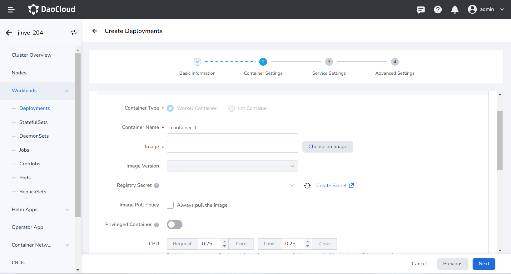
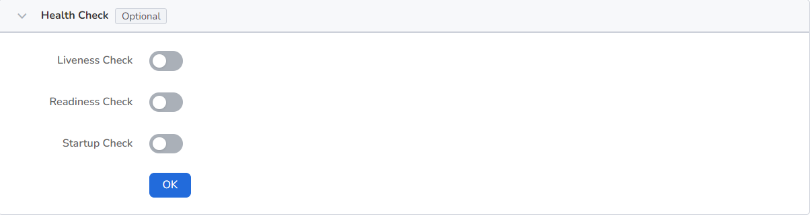
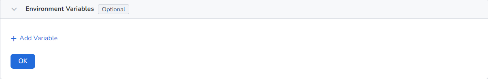
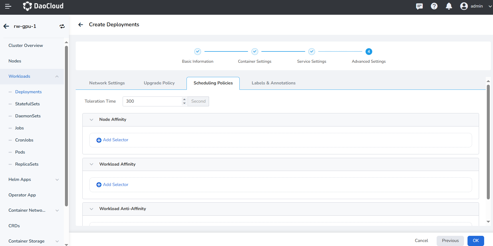
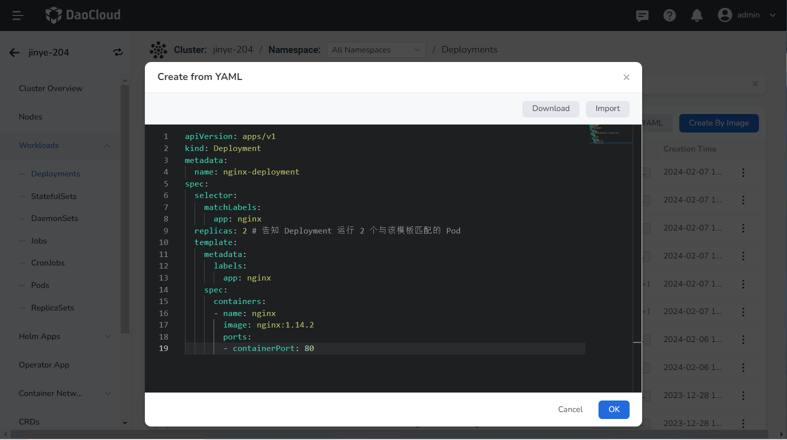

# Creating a Deployment

This page outlines how to create deployments using images and YAML files.

A [Deployment](https://kubernetes.io/docs/concepts/workloads/controllers/deployment/) is a widely used resource in Kubernetes. It primarily relies on [Pods](https://kubernetes.io/docs/concepts/workloads/pods/) and [ReplicaSets](https://kubernetes.io/docs/concepts/workloads/controllers/replicaset/) to provide declarative updates, support for elastic scaling, rolling upgrades, and version rollbacks. You specify the desired state of your Pods in the Deployment, and the Deployment Controller adjusts the current state through the ReplicaSet to achieve the desired outcome. Deployments are stateless and do not support data persistence, making them ideal for deploying stateless applications that don't need to retain data and can be restarted or rolled back at any time.

With the container management module of the AI platform, workloads across multiple clouds and clusters can be easily managed based on appropriate role permissions. This includes creating deployments and managing their full lifecycle, such as updating, deleting, scaling, restarting, and rolling back versions.

## Prerequisites

Before using an image to create deployments, ensure the following prerequisites are met:

- You have integrated a Kubernetes Cluster in the Container Management module as described in [Integrate Kubernetes Cluster](../clusters/integrate-cluster.md) or [Create Kubernetes Cluster](../clusters/create-cluster.md), and you can access the cluster's UI interface.

- Create a [namespace](../namespaces/createns.md) and [a user](../../register/index.md).

- The current user must have [NS Editor](../permissions/permission-brief.md#ns-editor) permissions or higher. For more details, refer to [Namespace Authorization](../namespaces/createns.md).

- If there are multiple containers in a single instance, ensure that the ports used by the containers do not conflict; otherwise, the deployment will fail.

## Creating a Deployment from an Image

Follow these steps to create a deployment using an image:

1. Click __Clusters__ in the left navigation bar, then select the target cluster to go to the Cluster Details page.

    

2. On the Cluster Details page, click __Workloads__ -> __Deployments__ in the left navigation bar, then click the __Create by Image__ button in the upper right corner.

    

3. Fill in the [Basic Information](create-deployment.md#basic-information), [Container Settings](create-deployment.md#container-settings), [Service Settings](create-deployment.md#service-settings), and [Advanced Settings](create-deployment.md#advanced-settings) in order. Click __OK__ in the lower right corner to complete the creation.

    The system will automatically return to the list of __Deployments__. Click __┇__ on the right side of the list to perform operations such as updating, deleting, scaling, restarting, and rolling back the workload. If the workload status is abnormal, please check the specific error information and refer to [Workload Status](../workloads/pod-config/workload-status.md).

    

### Basic Information

- **Workload Name:** Can be up to 63 characters long, can only contain lowercase letters, numbers, and the separator ("-"), and must start and end with a lowercase letter or number, such as deployment-01. Names of the same type of workload within the same namespace cannot be duplicated, and once created, the workload name cannot be changed.
- **Namespace:** Select the namespace for the new workload. By default, the default namespace is used. If you can't find the desired namespace, you can create a new one by following the prompt on the page.
- **Pods:** Specify the number of Pod instances for the workload; one Pod instance is created by default.
- **Description:** Enter a description for the workload, with a maximum of 512 characters.


### Container Settings

Container settings are divided into six sections: Basic Information, Lifecycle, Health Check, Environment Variables, Data Storage, and Security Settings. Click the tabs below to view the requirements for each section.

> Container settings are configured for a single container. To add multiple containers to a Pod, click __+__ on the right to add more containers.

=== "Basic Information (Required)"

    When configuring container parameters, it is crucial to correctly fill in the container name and image parameters; otherwise, you won't be able to proceed to the next step. After completing the configuration according to the following requirements, click __OK__.

    
    
    - **Container Type:** The default is `Work Container`. For information on init containers, see the [K8s Official Documentation](https://kubernetes.io/docs/concepts/workloads/pods/init-containers/).
    - **Container Name:** Must be no more than 63 characters and can include lowercase letters, numbers, and the separator ("-"). It must start and end with a lowercase letter or number, e.g., nginx-01.
    - **Image:**
        - **Image:** Select an appropriate image from the list. By default, the image is pulled from the official [DockerHub](https://hub.docker.com/).
        - **Image Version:** Choose the desired version from the dropdown list.
        - **Image Pull Policy:** Checking __Always pull the image__ ensures the image is pulled from the repository each time the workload restarts/upgrades. If unchecked, it will pull the local image and only pull from the repository if the local image does not exist. For more information, refer to [Image Pull Policy](https://kubernetes.io/docs/concepts/containers/images/#image-pull-policy).
        - **Registry Secret:** This is optional. If the target repository requires a secret for access, you need to [create a secret](../configmaps-secrets/create-secret.md) first.
    - **Privileged Container:** By default, containers cannot access any devices on the host. Enabling the privileged container allows access to all devices on the host and grants all privileges of running processes on the host.
    - **CPU/Memory Request:** Specify the request value (minimum resource needed) and limit value (maximum resource allowed) for CPU/memory resources. Configure resources as needed to avoid waste and system failures due to resource overages. Default values are displayed in the figure.
    - **GPU Configuration:** Configure GPU usage for the container, supporting only positive integers. The GPU quota setting allows configuring the container to use an entire GPU or part of a vGPU. For instance, entering __8__ for a GPU with 8 cores means the container uses the entire GPU, while entering __1__ configures 1 core of the vGPU for the container.
    
    > Before configuring the GPU, the administrator must pre-install the GPU and driver plugin on the cluster node and enable the GPU feature in the [Cluster Settings](../clusterops/cluster-settings.md).

=== "Lifecycle (optional)"

    Set the commands to execute when the container starts, after it starts, and before it stops. For details, refer to [Container Lifecycle Setting](pod-config/lifecycle.md).

    

=== "Health Check (optional)"

    This is used to assess the health status of containers and applications, which helps improve application availability. For details, refer to [Container Health Check Setting](pod-config/health-check.md).
    
        

=== "Environment Variables (optional)"

    Configure container parameters within the Pod, add environment variables, or pass settings to the Pod, etc. For details, refer to [Container Environment Variable Setting](pod-config/env-variables.md).

    

=== "Data Storage (optional)"

    Configure settings for mounting data volumes and ensuring data persistence. For details, refer to [Container Data Storage Setting](pod-config/env-variables.md).

    

=== "Security Settings (optional)"

    Containers are securely isolated using Linux's built-in account authority isolation mechanism. You can limit container permissions by using account UIDs (digital identity tokens) with different permissions. For example, entering __0__ gives the container the privileges of the root account.
    
    

### Service Settings

Configure a [Service](../network/create-services.md) for the deployment to allow external access.

1. Click the __Create Service__ button.

    

2. Refer to [Create Service](../network/create-services.md) to configure the service parameters.

    

3. Click __OK__ and then click __Next__.

### Advanced Settings

Advanced settings include four sections: Network Settings, Upgrade Policy, Scheduling Policies, and Labels and Annotations. Click the tabs below to view the setting requirements for each section.

=== "Network Settings"

    1. For container NIC settings, refer to [Workload Usage IP Pool](https://docs.daocloud.io/network/config/use-ippool/usage/)
    2. DNS Settings

    In some cases, applications may generate redundant DNS queries. Kubernetes offers DNS-related setting options to help reduce these queries and increase application concurrency when applicable.
    
    - **DNS Policy**
    
        - **Default:** Makes the container use the kubelet's __-resolv-conf__ parameter for domain name resolution. This setting can resolve external domain names registered on the Internet but not internal cluster domain names, and it does not generate invalid DNS queries.
        - **ClusterFirstWithHostNet:** Uses the domain name file of the host to which the application is connected.
        - **ClusterFirst:** Connects the application with Kube-DNS/CoreDNS.
        - **None:** A new option introduced in Kubernetes v1.9 (Beta in v1.10). When set to None, dnsConfig must be set. The container's domain name resolution file will be entirely generated based on the dnsConfig settings.
    
    - **Nameservers:** Enter the address of the domain name server, e.g., __10.6.175.20__.
    - **Search Domains:** List of DNS search domains for domain name queries. Specifying this will merge the provided search domain list into the search field of the domain name resolution file generated based on dnsPolicy, removing any duplicate domains. Kubernetes allows up to 6 search domains.
    - **Options:** Set options for DNS, where each object can have a name attribute (required) and a value attribute (optional). The content in this field will be merged into the options field of the domain name resolution file generated based on dnsPolicy. If any options from dnsConfig conflict with those in the resolution file, they will be overridden by dnsConfig.
    - **Host Alias:** Set the alias for the host.

    

=== "Upgrade Policy"

    - **Upgrade Mode:**
        - __Rolling upgrade__ means gradually replacing instances of the old version with instances of the new version. During this process, business traffic will be load-balanced between the old and new instances, ensuring uninterrupted service.
        - __Rebuild and upgrade__ means deleting the old version's workload instance first, followed by installing the specified new version, which will interrupt service during the upgrade.
    - **Max Unavailable:** Specify the maximum number or ratio of unavailable Pods during the workload update process, with a default of 25%. If this equals the total number of instances, there is a risk of service interruption.
    - **Max Surge:** The maximum number or ratio of Pods exceeding the desired replica count during a Pod update. Default is 25%.
    - **Revision History Limit:** Set the number of old versions retained when rolling back a version. The default is 10.
    - **Minimum Ready:** Minimum time for a Pod to be ready. Only after this time is the Pod considered available. The default is 0 seconds.
    - **Upgrade Max Duration:** If the deployment fails after the specified time, the workload will be marked as failed. The default is 600 seconds.
    - **Graceful Period:** The time (0-9,999 seconds) to execute commands before stopping the workload, with a default of 30 seconds.

    

=== "Scheduling Policies"

    - **Toleration Time:** The time allowed to reschedule the workload instance to other available nodes when the original node becomes unavailable. Default is 300 seconds.
    - **Node Affinity:** Constraints on which nodes the Pod can be scheduled based on node labels.
    - **Workload Affinity:** Constraints on which nodes a Pod can be scheduled based on the labels of Pods already running on those nodes.
    - **Workload Anti-affinity:** Constraints on which nodes a Pod cannot be scheduled based on the labels of Pods already running on those nodes.
    
    > For more details, refer to [Scheduling Policy](pod-config/scheduling-policy.md).

    

=== "Labels and Annotations"

    You can click the __Add__ button to add labels and annotations to workloads and Pods.
    
    

## Creating a Deployment from YAML

In addition to using an image, you can also create deployments quickly through YAML files.

1. Click __Clusters__ in the left navigation bar, then select the target cluster to go to the Cluster Details page.

    

2. On the Cluster Details page, click __Workloads__ -> __Deployments__ in the left navigation bar, then click the __Create from YAML__ button in the upper right corner.

    

3. Enter or paste the pre-prepared YAML file and click __OK__ to complete the creation.

    

??? note "Click to see an example YAML for creating a deployment"

    ```yaml
     apiVersion: apps/v1
     kind: Deployment
     metadata:
       name: nginx-deployment
     spec:
       selector:
         matchLabels:
           app: nginx
       replicas: 2 # (1)!
       template:
         metadata:
           labels:
             app: nginx
         spec:
           containers:
           - name: nginx
             image: nginx:1.14.2
             ports:
             - containerPort: 80
    ```

    1. This Deployment instructs Kubernetes to run 2 Pods that match the specified template.
