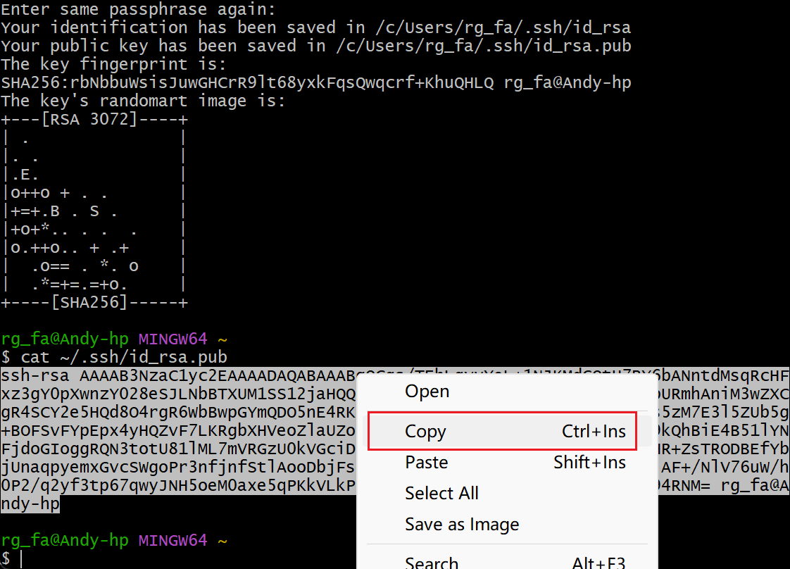

# Using Notebook

Notebook usually refers to Jupyter Notebook or similar interactive computing environments. It is a very popular tool widely used in fields such as data science, machine learning, and deep learning. This page explains how to use Notebook in the AI platform.

## Prerequisites

- The AI platform is installed
- [User has successfully registered](../register/index.md)
- The administrator has assigned a workspace to the user
- Datasets (code, data, etc.) are prepared

## Creating and Using Notebook Instances

1. Log into the AI platform as an **Administrator**.
2. Navigate to **AI Lab** -> **Operator** -> **Queue Management**, and click the **Create** button on the right.

    

3. Enter a name, select the cluster, workspace, and quota, then click **OK**.

   

4. Log into the AI platform as a **User**, navigate to **AI Lab** -> **Notebook**, and click the **Create** button on the right.

   

5. After configuring the various parameters, click **OK**.

    === "Basic Information"

        Enter a name, select the cluster, namespace, choose the queue just created, and click **One-Click Initialization**.

       

    === "Resource Configuration"

        Select the Notebook type, configure memory, CPU, enable GPU, create and configure PVC:

       

    === "Advanced Configuration"

        Enable SSH external network access:

       

6. You will be automatically redirected to the Notebook instance list, click the instance name.

    

7. Enter the Notebook instance detail page and click the **Open** button in the upper right corner.

    

8. You have entered the Notebook development environment, where a persistent volume is mounted in the `/home/jovyan` directory. You can clone code through git, upload data after connecting via SSH, etc.

## Accessing Notebook Instances via SSH

1. Generate an SSH key pair on your own computer.

    Open the command line on your computer, for example, open git bash on Windows, enter `ssh-keygen.exe -t rsa`, and press enter through the prompts.

    

2. Use commands like `cat ~/.ssh/id_rsa.pub` to view and copy the public key.

    

3. Log into the AI platform as a user, click **Personal Center** -> **SSH Public Key** -> **Import SSH Public Key** in the upper right corner.

  

4. Enter the detail page of the Notebook instance and copy the SSH link.

   

5. Use SSH to access the Notebook instance from the client.

    

Next step: [Create Training Job](../../admin/baize/developer/jobs/create.md)
