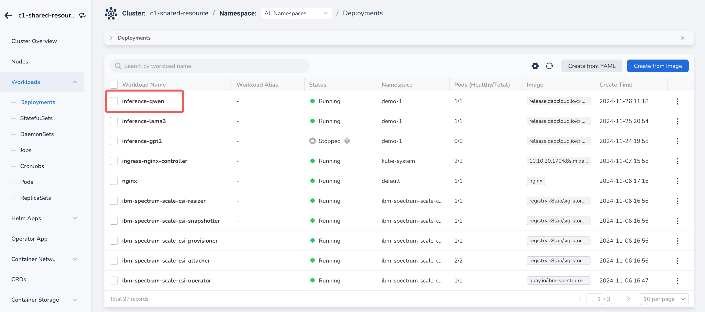

# Creating AI Workloads Using GPUs

After the administrator allocates resource quotas for the workspace, users can create AI workloads to utilize GPU computing resources.

## Prerequisites

- The AI platform is installed
- [User has successfully registered](../register/index.md)
- The administrator has assigned a workspace to the user
- The administrator has set resource quotas for the workspace
- The administrator has assigned a cluster to the user

## Steps to Create AI Workloads

1. Log into the AI platform as a user.
2. Navigate to **Container Management**, select a cluster and namespace,
   click **Workloads** -> **Deployments** , and then click the **Create Image** button on the right.

    

3. After configuring various parameters, click **OK**.

    === "Basic Information"

        Select your namespace.

        

    === "Container Configuration"

        Set the image, configure CPU, memory, GPU, and other resources, and set the startup command.

        

    === "Other"

        You can use default for service settings and advanced settings.

4. You will be automatically redirected to the stateless workload list; click the workload name.

    

5. Enter the detail page where you can see the GPU quota.

    

6. You can also access the console and run the `nvidia-smi` command to view GPU resources.

    

Next step: [Using Notebook](./notebook.md)
