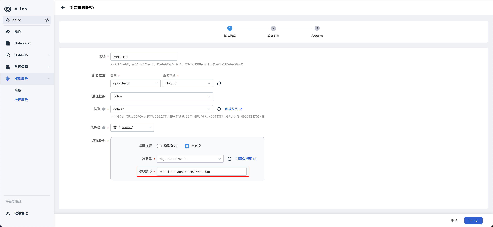
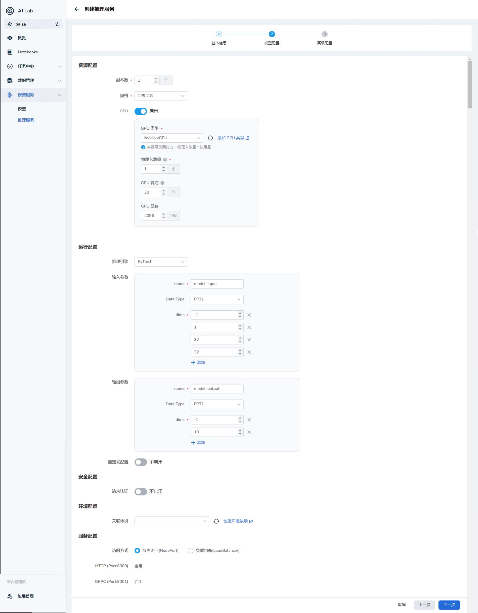
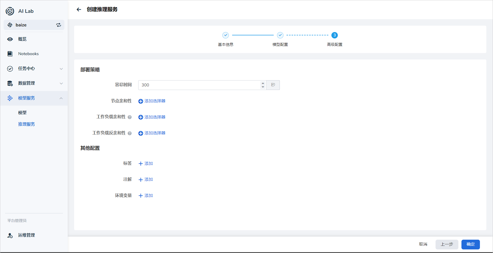
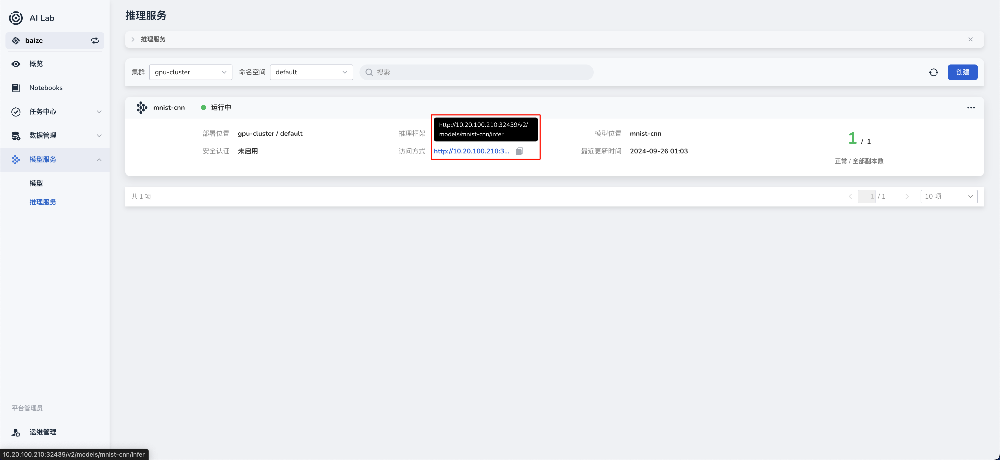

# 创建 Triton 推理服务

AI Lab 目前提供以 Triton、vLLM 作为推理框架，用户只需简单配置即可快速启动一个高性能的推理服务。

!!! danger

    使用 Triton 的 Backend vLLM 的方式已被弃用，推荐使用最新支持 vLLM 来部署您的大语言模型。

## Triton介绍

Triton 是由 NVIDIA 开发的一个开源推理服务器，旨在简化机器学习模型的部署和推理服务。它支持多种深度学习框架，包括 TensorFlow、PyTorch 等，使得用户能够轻松管理和部署不同类型的模型。

## 前提条件

准备模型数据：在数据集管理中纳管模型代码，并保证数据成功预加载，下面以 mnist 手写数字识别的 PyTorch 模型为例。

!!! note

    待推理的模型在数据集中需要遵以下目录格式：

    ```bash
      <model-repository-name>
      └── <model-name>
         └── <version>
            └── <model-definition-file>
    ```

本例中的目录格式为：

```bash
    model-repo
    └── mnist-cnn
        └── 1
            └── model.pt
```

## 创建推理服务

目前已经支持表单创建，可以界面字段提示，进行服务创建。



### 配置模型路径

模型路径 `model-repo/mnist-cnn/1/model.pt` 需要和数据集中的模型目录格式一致。

## 模型配置



### 配置输入和输出参数

!!! note

    输入和输出参数的第一个维度默认为 `batchsize` 的大小，设置为 `-1` 可以根据输入的推理数据自动计算 batchsize。参数其余维度和数据类型需要与模型输入匹配。

### 配置环境

可以导入 [环境管理](../dataset/environments.md) 中创建的环境作为推理时的运行环境。

## 高级配置



### 配置认证策略

支持 `API key` 的请求方式认证，用户可以自定义增加认证参数。

### 亲和性调度

支持 根据 GPU 资源等节点配置实现自动化的亲和性调度，同时也方便用户自定义调度策略。

## 访问



### API 访问

- Triton 提供了一个基于 REST 的 API，允许客户端通过 HTTP POST 请求进行模型推理。
- 客户端可以发送 JSON 格式的请求体，其中包含输入数据和相关的元数据。

#### HTTP 访问

1. **发送 HTTP POST 请求**：使用工具如 `curl` 或 HTTP 客户端库（如 Python 的 `requests` 库）向 Triton Server 发送 POST 请求。

2. **设置 HTTP 头**：根据用户配置项自动生成的配置，包含模型输入和输出的元数据。

3. **构建请求体**：请求体通常包含要进行推理的输入数据，以及模型特定的元数据。

##### 示例 curl 命令

```bash
  curl -X POST "http://<ip>:<port>/v2/models/<inference-name>/infer" \
  -H "Content-Type: application/json" \
  -d '{
    "inputs": [
      {
        "name": "model_input",            
        "shape": [1, 1, 32, 32],          
        "datatype": "FP32",               
        "data": [
          [0.1234, 0.5678, 0.9101, ... ]  
        ]
      }
    ]
  }'
```

- `<ip>` 是 Triton Inference Server 运行的主机地址。
- `<port>` 是 Triton Inference Server 运行的主机端口号。
- `<inference-name>` 是所创建的推理服务的名称。
- `"name"` 要与模型配置中的输入参数的 `name` 一致。
- `"shape"` 要与模型配置中的输入参数的 `dims` 一致。
- `"datatype"` 要与模型配置中的输入参数的 `Data Type` 一致。
- `"data"` 替换为实际的推理数据。

请注意，上述示例代码需要根据你的具体模型和环境进行调整，输入数据的格式和内容也需要符合模型的要求。
