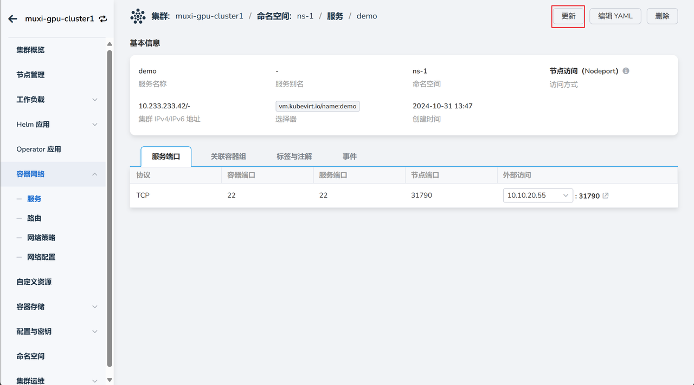
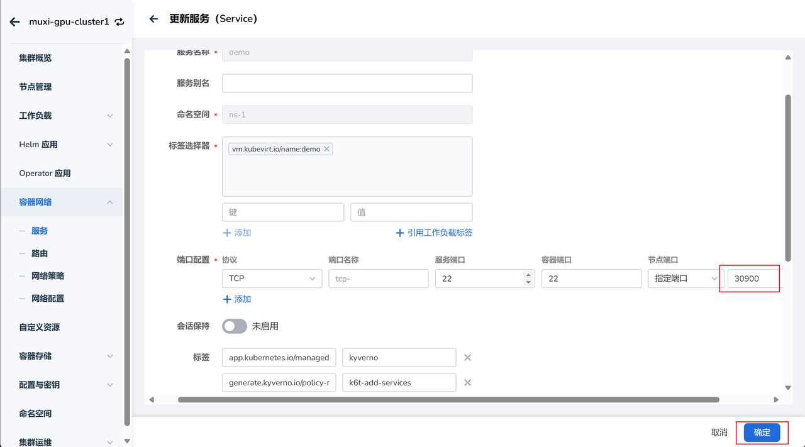
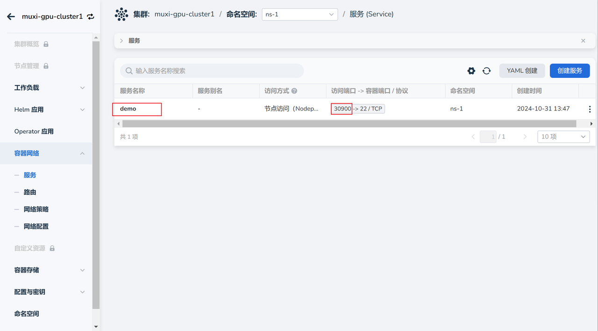

# 使用云主机

创建并启动云主机之后，用户就可以开始使用云主机。

## 前置条件

- 已安装 AI 算力平台
- [用户已创建并启动云主机](./createhost.md)

## 操作步骤

1. 以管理员身份登录 AI 算力平台
1. 导航到 **容器管理** -> **容器网络** -> **服务** ，点击服务的名称，进入服务详情页，在右上角点击 **更新**

    

1. 更改端口范围为 30900-30999，但不能冲突。

    

1. 以终端用户登录 AI 算力平台，导航到对应的服务，查看访问端口。

    

1. 在外网使用 SSH 客户端登录云主机

    

1. 至此，你可以在云主机上执行各项操作。

下一步：[使用 Notebook](../share/notebook.md)
